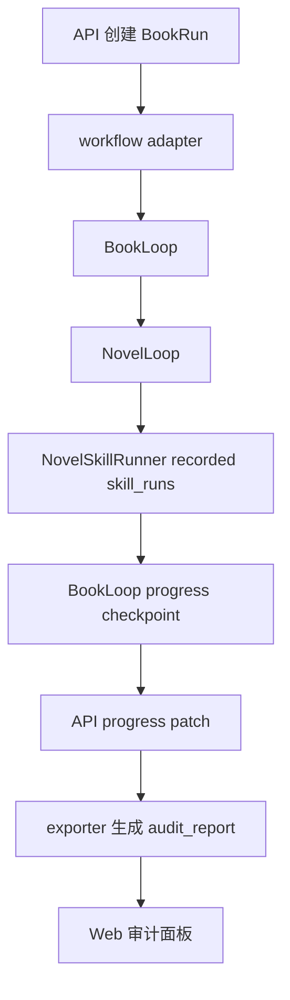

# StoryForge 项目健康评估报告

生成时间：2026-06-01 04:20:41 +08:00

## 1. 评估基线

- 分支：codex/project-health-assessment-plan。
- 代码基线：包含 944f9db 合并 BookRun workflow adapter recorded skill_runs。
- 评估方式：只读代码、运行本地验证、生成 .codex 评估文档。
- 范围：workflow、API、Web 审计、BookRun 主链路、skill_runs 审计投影。
- 非范围：不修改 apps/** 业务代码，不恢复历史 stash，不做真实生产接线。

## 2. 本地验证结果

| 验证项 | 命令 | 结果 | 结论 |
| --- | --- | --- | --- |
| workflow lint | cd D:\StoryForge\apps\workflow; uv run ruff check . | All checks passed | 通过 |
| workflow 全量测试 | cd D:\StoryForge\apps\workflow; uv run pytest -q | 156 passed | 通过 |
| API lint | cd D:\StoryForge\apps\api; uv run ruff check . | All checks passed | 通过 |
| API 全量测试 | cd D:\StoryForge\apps\api; uv run pytest -q | 326 passed, 6 warnings | 通过，warnings 非本任务阻塞 |
| Web 审计 contract | cd D:\StoryForge; pnpm --filter @storyforge/web test -- book-run-audit | 3 pass / 0 fail | 通过 |
| workflow 主链路目标测试 | cd D:\StoryForge\apps\workflow; uv run pytest tests/test_book_run_adapter.py tests/test_book_loop_three_chapters.py tests/test_skill_audit_summary.py tests/test_novel_skill_runner.py -v | 27 passed | 通过 |
| API 主链路目标测试 | cd D:\StoryForge\apps\api; uv run pytest tests/test_book_run_recorded_skill_runs_export.py tests/test_book_exporter.py tests/test_book_runs.py -v | 12 passed, 1 warning | 通过，warning 非阻塞 |

## 3. Warning 分类

### 阻塞 warning

无。

### 非阻塞 warning

1. API 全量测试中的 JWT InsecureKeyLengthWarning：来自 tests/test_api_middleware.py 使用测试密钥长度不足 32 字节。影响测试安全提示，不影响当前 BookRun 主链路评估；建议后续把测试密钥长度调整到 32 字节以上。
2. API 全量测试和目标测试中的 HTTP_422_UNPROCESSABLE_ENTITY DeprecationWarning：来自 anyio 调用栈中旧常量提示。当前断言仍通过；建议后续统一替换为 HTTP_422_UNPROCESSABLE_CONTENT。

## 4. 当前测试健康度初判

- workflow 本地门禁健康：ruff 与 156 个 pytest 均通过。
- API 本地门禁健康：ruff 与 326 个 pytest 均通过，但存在 6 个非阻塞 warning。
- Web 审计路径健康：book-run-audit contract 3 个子测试通过。
- BookRun recorded skill_runs 主链路有目标测试覆盖：workflow 27 个目标测试和 API 12 个目标测试通过。
- 当前最大测试风险不是失败，而是生产触发路径尚未有端到端真实接线测试。

## 5. 主链路数据流

### 证据路径

- API 创建 BookRun：apps/api/app/domains/book_runs/service.py:26。
- API progress patch：apps/api/app/domains/book_runs/service.py:67。
- workflow adapter：apps/workflow/storyforge_workflow/orchestrators/book_run_adapter.py:61。
- BookLoop 顺序编排：apps/workflow/storyforge_workflow/orchestrators/book_loop.py:35。
- BookLoop 写入 skill_runs：apps/workflow/storyforge_workflow/orchestrators/book_loop.py:94-107。
- NovelLoop 注入 skill_runner：apps/workflow/storyforge_workflow/orchestrators/novel_loop.py:110-190。
- SkillRunner recorded run：apps/workflow/storyforge_workflow/skills/runner.py:17、46。
- audit projection：apps/workflow/storyforge_workflow/skills/audit.py:51-78。
- API audit bridge：apps/api/app/domains/book_runs/workflow_skill_audit_bridge.py:15、23、36。
- exporter：apps/api/app/domains/exports/book_markdown_exporter.py:51-80。
- Web 审计展示：apps/web/app/book-runs/audit.tsx:85-130。

## 6. 架构边界评估

### 6.1 API 与 workflow 边界

- workflow adapter 使用 BookRunAdapterPorts 注入外部依赖，未导入 SQLAlchemy Session 或 API ORM。证据：apps/workflow/storyforge_workflow/orchestrators/book_run_adapter.py:3-9、35-41。
- API BookRun service 负责数据库真相源和 progress patch，未直接调用 run_book_run_with_skill_runner。证据：apps/api/app/domains/book_runs/service.py:26-85；`rg run_book_run_with_skill_runner apps` 仅发现 workflow tests、orchestrators __init__ 和 adapter 实现。
- API exporter 通过 workflow_skill_audit_bridge 动态加载 workflow 的 audit.py 纯函数，避免导入 workflow 顶层运行时。证据：apps/api/app/domains/book_runs/workflow_skill_audit_bridge.py:15-36。
- 边界结论：当前 API service 与 workflow 编排边界清晰；API exporter 到 workflow audit.py 的文件路径桥接是可控但需要关注的跨包复用点。

### 6.2 recorded/reconstructed 证据边界

- audit.py 定义 recorded_skill_run 与 reconstructed_from_progress 两类 provenance。证据：apps/workflow/storyforge_workflow/skills/audit.py:11-12。
- derive_skill_chain_projection 优先读取 recorded skill_runs；没有 recorded 时才使用 reconstructed 事件。证据：apps/workflow/storyforge_workflow/skills/audit.py:61-67。
- completed 状态会追加 export reconstructed 事件，因此 recorded 章节事件和 export 事件可以形成 mixed evidence。证据：apps/workflow/storyforge_workflow/skills/audit.py:69-70、232-238。
- API 与 Web 测试均断言完整提示词和完整正文不会出现在审计输出。证据：apps/api/tests/test_book_exporter.py:56-107；apps/api/tests/test_book_run_recorded_skill_runs_export.py:20-33；apps/web/tests/book-run-audit.test.tsx:149-150。

### 6.3 生产触发边界

- BookRun adapter 的公开入口已实现，但当前代码搜索显示没有生产服务调用 run_book_run_with_skill_runner。
- 现有调用点集中在 workflow tests 与 orchestrators __init__。证据：`rg run_book_run_with_skill_runner apps`。
- 结论：真实 recorded skill_runs 能本地验证，但还不是生产运行路径的默认结果；后续需要设计独立生产调度接线，不应把 API service 改成长任务执行器。

## 7. 架构风险表

| 编号 | 风险 | 证据 | 影响 | 修复成本 | 优先级 | 建议 |
| --- | --- | --- | --- | --- | --- | --- |
| R1 | BookRun adapter 尚未接入真实生产触发路径 | `rg run_book_run_with_skill_runner apps` 仅发现 tests、__init__、adapter | 高 | 中 | P0 | 下一批优先设计 workflow adapter 调度入口和 progress sink 接线。 |
| R2 | API exporter 通过文件路径动态加载 workflow audit.py，长期可能受路径布局影响 | apps/api/app/domains/book_runs/workflow_skill_audit_bridge.py:15-36 | 中 | 中 | P1 | 后续把 audit 投影抽到稳定共享包，或给 bridge 增加路径健康测试。 |
| R3 | LangGraph 节点事件与章节 skill_runs 仍需保持隔离 | apps/workflow/storyforge_workflow/orchestrators/book_run_adapter.py:61；计划明确不修改 graph.py | 中 | 中 | P1 | 若要记录 graph 节点，另建 workflow_node_run.v1，不并入章节 skill_runs。 |
| R4 | phase9b_real_llm_smoke.py 体量大且依赖 API DB/真实 provider 语义，容易被误用为主线 | apps/api/app/domains/book_runs/phase9b_real_llm_smoke.py:13-86、183-769 | 中 | 中 | P2 | 后续拆 preflight、runner、judge-repair、reporter，并明确 smoke 边界。 |
| R5 | skills/definitions.py 中 source_refs 与状态映射维护成本偏高 | apps/workflow/storyforge_workflow/skills/definitions.py:44、177-281；apps/workflow/tests/test_book_run_adapter.py:115-130 | 中 | 低 | P2 | 删除易腐烂行号型 source_refs，保留文件级引用，并保留状态词一致性测试。 |
| R6 | API pytest 有非阻塞 warning，长期会降低门禁信噪比 | API pytest 输出 326 passed, 6 warnings | 低 | 低 | P3 | 后续单独治理 JWT 测试密钥长度和 HTTP 422 deprecation。 |

## 8. 架构评估结论

当前架构的核心边界是健康的：API 保存业务真相源，workflow 执行长任务编排，audit/export 只读投影，Web 只展示投影结果。最大缺口不是 recorded skill_runs 能否产出，而是它尚未接入真实生产触发路径。下一阶段应优先做生产接线设计，而不是继续扩大静态定义或把 smoke 工具主线化。

## 9. 健康评分

| 维度 | 分值 | 得分 | 证据 | 扣分原因 |
| --- | ---: | ---: | --- | --- |
| 主链路可验证性 | 25 | 20 | workflow 主链路 27 passed；API 主链路 12 passed；Web audit 3 pass | BookRun adapter 尚未接入真实生产触发路径。 |
| 架构边界清晰度 | 20 | 17 | API service 未调用 workflow adapter；workflow adapter 未导入 API ORM | API exporter 通过文件路径动态加载 workflow audit.py，属于中期稳定性风险。 |
| 测试覆盖与本地门禁 | 20 | 18 | workflow 156 passed；API 326 passed；ruff 全通过 | API pytest 有 6 个非阻塞 warning；生产接线端到端测试缺失。 |
| 审计与数据最小暴露 | 15 | 14 | recorded/reconstructed/mixed 测试覆盖；完整提示词/正文不进入投影 | 真实 UI 上下文的人类可见性仍需周期性验真。 |
| 维护性与后续扩展成本 | 10 | 8 | ports/dataclass 边界清晰；audit 只读投影 | phase9b_real_llm_smoke.py 体量大；source_refs 维护成本偏高。 |
| 文档与操作留痕 | 10 | 9 | context-summary、operations-log、verification-report、设计和计划文件齐备 | 历史 .codex 中存在旧乱码段，但本轮新增记录清晰可读。 |

综合评分：86/100
结论：可推进小范围功能，但需先处理 Top 风险。当前最优下一步是为 BookRun workflow adapter 做真实生产调度与 progress sink 接线计划。

## 10. Top 5 架构风险

1. BookRun adapter 未接入真实生产触发路径：证据为 `rg run_book_run_with_skill_runner apps` 仅发现 tests、__init__、adapter；建议下一步设计生产调度入口和 progress sink。
2. API exporter 动态加载 workflow audit.py：证据为 apps/api/app/domains/book_runs/workflow_skill_audit_bridge.py:15-36；建议增加 bridge 健康测试或抽出稳定共享包。
3. LangGraph 节点事件与章节 skill_runs 边界需要继续隔离：证据为当前 adapter 不修改 graph.py；建议若记录节点事件，另建 workflow_node_run.v1。
4. phase9b_real_llm_smoke.py 不宜成为主线：证据为 apps/api/app/domains/book_runs/phase9b_real_llm_smoke.py 依赖 DB、provider、judge、repair 多域；建议后续拆分为 preflight、runner、judge-repair、reporter。
5. source_refs 与静态技能定义维护成本偏高：证据为 apps/workflow/storyforge_workflow/skills/definitions.py:44、177-281；建议删除行号型 source_refs，并保留状态词一致性 runtime 校验。

## 11. Top 5 测试或验证缺口

1. 生产触发端到端缺失：当前 adapter 只在 workflow 测试中执行；补偿计划是新增 API/workflow 调度接线测试，验证 BookRun 创建后能触发 adapter 并 patch progress。
2. progress sink 真实实现缺失：当前 CapturingProgressSink 仅为测试工具；补偿计划是定义 HTTP 或 service sink 契约，并用本地 fake API 验证重试和失败记录。
3. bridge 路径健康测试不足：workflow_skill_audit_bridge 动态加载 audit.py；补偿计划是增加 API 测试，断言 bridge 能定位文件并输出与 workflow audit 等价的 JSON。
4. API warning 未治理：JWT 测试密钥长度和 HTTP 422 deprecation 会降低门禁信噪比；补偿计划是单独小任务清理 warning。
5. 真实 LLM smoke 可维护性不足：phase9b 文件过大且跨域；补偿计划是维护性重构，不改变生产主链路。

## 12. 下一批任务队列

### 必做

1. BookRun workflow adapter 生产调度接线设计与测试
   - 目标：定义 API 创建 BookRun 后如何触发 workflow adapter，以及 adapter 如何安全回填 progress。
   - 验收：新增本地测试证明 created/running BookRun 经 adapter 后产生 recorded skill_runs，并通过 API progress patch 进入 audit_report。
   - 预计影响：关闭当前最大 P0 缺口，让 recorded skill_runs 不只存在于 workflow 测试路径。

2. progress sink 契约与失败语义
   - 目标：明确 sink 是 HTTP、service adapter 还是队列消费者；定义失败重试、幂等和错误留痕。
   - 验收：本地 fake sink 覆盖成功、重复提交、失败重试和不可恢复错误。
   - 预计影响：避免把长任务失败吞掉或污染 API 真相源。

### 高收益

1. workflow_skill_audit_bridge 稳定性测试
   - 目标：锁定 API 到 workflow audit.py 的动态加载边界。
   - 验收：API 单测断言 bridge 加载成功、JSON 结构稳定、recorded/reconstructed 统计一致。
   - 预计影响：降低跨包文件路径桥接的回归风险。

2. skills/definitions.py source_refs 去行号化与状态词 runtime 校验
   - 目标：减少静态行号腐烂，同时保持状态词和 runner/audit 一致。
   - 验收：相关 registry 和 adapter 状态词测试通过。
   - 预计影响：降低技能定义维护成本。

3. API warning 清理
   - 目标：消除 JWT 测试密钥和 HTTP 422 deprecation warnings。
   - 验收：API pytest 输出 326 passed 且 warning 数量下降为 0 或仅剩已记录外部 warning。
   - 预计影响：提升本地门禁信噪比。

### 可延后

1. phase9b_real_llm_smoke.py 维护性拆分
   - 延后理由：它影响可维护性，但不是 recorded skill_runs 生产接线的前置条件。

2. LangGraph 节点级 telemetry
   - 延后理由：需要另建 workflow_node_run.v1，不能混入章节 skill_runs；当前主链路更需要生产接线。

### 不建议现在做

1. 动态插件市场或多 Agent 编排平台
   - 不建议理由：当前主链路生产接线尚未闭合，过早引入平台化会放大复杂度。

2. 在 API service 内直接执行 workflow
   - 不建议理由：会破坏 API 真相源与 workflow 长任务编排边界，且不利于超时、重试和观测。

3. 把 phase9b smoke 当长期主线
   - 不建议理由：该文件跨域、重依赖真实 provider，适合烟测，不适合作为主运行架构。

## 13. 推荐决策

建议下一步直接为“BookRun workflow adapter 生产调度接线设计与测试”写 implementation plan。该任务应先设计调度边界和 progress sink 契约，再进入 TDD 实现；不建议继续做更宽泛评估。
