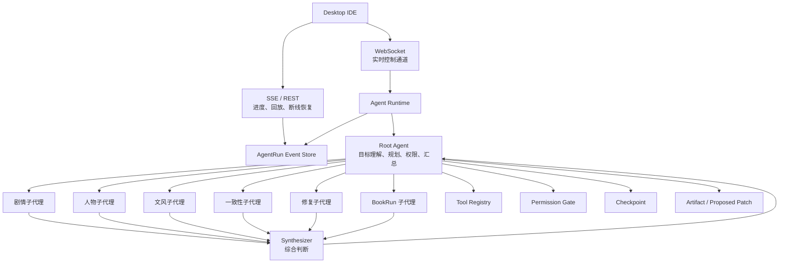

# StoryForge Agent Runtime Control Plane Plan

> **⚠️ 已归档(2026-06-29)。** 本文档不再独立维护;Agent Runtime / Harness 主题的唯一主入口是 [`pi-opencode-agent-harness-adoption-plan.md`](./pi-opencode-agent-harness-adoption-plan.md)。本文的 9 阶段骨架与「目标态」结论已并入该主入口的阶段定义,并在那里补上了与当前源码的差距。**新工作请只跟主入口;本文仅作历史背景保留。**

## 结论

StoryForge 的 Agent 架构应采用：

```text
单一 Agent 控制平面 + 多子代理执行
```

这里的“单一”不是指只能有一个模型或一个执行者，而是指只有一个主控大脑：Root Agent。Root Agent 负责理解作者目标、制定计划、控制权限、分发任务、汇总结果和产出最终 artifact。剧情、人物、文风、一致性、修复、BookRun 等能力可以作为子代理或工具被 Root Agent 调度。

目标不是搬运 `claw-code` 或 OpenCode，而是学习它们的运行时思想。`claw-code` 更适合作为 tool calling、permission profile、session replay、event log、checkpoint、hooks 和 MCP 工具接入的参考；OpenCode 更适合作为 Primary Agent / Subagent 分层、只读探索代理、手动 `@` 子代理调用和 agent skills 组织方式的参考。StoryForge 保持小说创作 IDE 的产品边界：Agent 可以自主推进创作流程，但默认不能绕过作者确认写回本地文件。

## 当前问题

现有 Desktop Agent 链路已经具备基础形态：

- Desktop ChatWindow 负责收集用户输入、当前文件和项目上下文。
- 后端 WebSocket `/api/ide/agent/sessions/{session_id}` 接收 `user_message` 和 `command`。
- IDE orchestrator 根据 intent 调用 `file.review`、`file.revise`、`chapter.review`、`bookrun.start` 等流程。
- `proposed_patch` 返回 Desktop 后，由 PatchReviewPanel 等待作者确认写回。
- SSE/REST 已用于部分运行进度和 BookRun 事件展示。

但如果未来直接新增一个 Agent Runtime，而现有 WebSocket orchestrator 继续自己判断 intent、调用工具，就会形成两个并行大脑：

```text
WebSocket orchestrator 自己决策
Agent Runtime 也自己决策
BookRun/Workflow 还各自维护状态
```

这会带来职责冲突、事件不一致、权限绕过和难以恢复的问题。

## 目标架构



核心约束：

1. 只有 Agent Runtime 是主控平面。
2. WebSocket 只做实时控制和事件推送。
3. SSE/REST 只读 AgentRun Event Store，不另建事实来源。
4. 子代理可以并行或串行执行，但最终决策回到 Root Agent。
5. 所有工具调用、子代理结果、权限请求和 artifact 都写入同一个 event store。
6. 用户可以通过 `@剧情`、`@人物`、`@文风`、`@伏笔`、`@写作任务` 等方式建议调用子代理，但不能绕过 Root Agent、Permission Gate 和 Event Store。

## 核心对象

### AgentRun

记录一次作者目标的完整运行过程。

```text
AgentRun
- id
- session_id
- goal
- scope
- permission_profile
- budget
- status
- root_plan
- current_step
- created_at
- updated_at
```

### AgentRunEvent

记录运行过程中的事件，是 WebSocket、SSE 和 REST 的共同事实来源。

```text
AgentRunEvent
- run_id
- type
- actor
- message
- payload
- created_at
```

典型事件类型：

```text
agent_run_started
agent_plan_created
subagent_started
subagent_completed
tool_trace
permission_required
agent_artifact
agent_run_completed
agent_run_failed
```

### SubagentRun

记录由 Root Agent 分发的专业子任务。

```text
SubagentRun
- run_id
- parent_run_id
- role
- input
- output
- status
```

推荐首批子代理：

- plot_reviewer：剧情、冲突、节奏。
- character_reviewer：人物动机、人设一致性。
- prose_reviewer：文风、表达、爽感。
- continuity_reviewer：设定、伏笔、前后文一致性。
- repair_agent：根据审稿结果生成 patch。
- bookrun_agent：长程生成、checkpoint、resume。
- context_explorer：只读探索项目上下文。
- external_scout：只读检索外部资料或 MCP 结果。

### ToolDefinition

统一包装现有后端能力和未来 MCP 工具。

```text
ToolDefinition
- name
- description
- input_schema
- output_schema
- permission_level
- requires_confirmation
- handler
```

首批内部工具：

- context.load
- file.review
- file.revise
- judge.run
- judge.repair
- bookrun.start
- bookrun.pause
- bookrun.resume
- bookrun.retry_from_checkpoint
- memory.update

### AgentArtifact

记录 Agent 产物。

```text
AgentArtifact
- run_id
- kind
- payload
- requires_confirmation
```

典型 artifact：

- review_report
- proposed_patch
- chapter_draft
- bookrun_checkpoint
- memory_update_proposal

## 通信职责

### WebSocket

保留现有路径：

```text
/api/ide/agent/sessions/{session_id}
```

职责调整为 AgentRun control channel：

- 接收用户目标。
- 创建或续接 AgentRun。
- 推送实时事件。
- 接收权限确认。
- 接收暂停、继续、停止命令。

入站消息：

```text
user_message
approve_permission
deny_permission
pause_run
resume_run
stop_run
command
```

出站消息：

```text
agent_run_started
agent_plan_created
subagent_started
subagent_completed
tool_trace
permission_required
agent_artifact
agent_run_completed
agent_run_failed
```

### SSE / REST

SSE 和 REST 不做决策，只读 AgentRun Event Store。

推荐接口：

```text
GET /agent-runs/{run_id}
GET /agent-runs/{run_id}/events
GET /agent-runs/{run_id}/artifacts
GET /agent-runs/{run_id}/checkpoints
```

BookRun 进度也应从 AgentRunEvent 派生，避免 BookRun 和 Agent Runtime 各自维护一套前端进度状态。

## 权限模型

IDE 只有 Agent 模式，但 Agent 模式带权限档位。

```text
step_confirm
risk_confirm
autonomous_approval
full_allow
```

默认值：

```text
risk_confirm
```

默认策略：

- 读取上下文、分析、生成建议：自动执行。
- 写回文件、长任务、高成本模型、联网、批量修改：需要确认。
- 本地文件写回默认仍走 Desktop PatchReviewPanel。
- 用户显式开启自动写入前，Agent 不能绕过确认直接改文件。

## 单章润色 MVP

第一条完整闭环选择“润色当前章”，因为它能验证 Root Agent、子代理、tool、permission、patch 和写回确认的最小闭环。

流程：

```text
用户目标：把当前章改到可发布水平
Root Agent：制定计划
plot_reviewer：检查冲突和节奏
character_reviewer：检查人物动机和人设
prose_reviewer：检查文风和表达
continuity_reviewer：检查前后文一致性
Synthesizer：汇总问题
repair_agent：生成 proposed_patch
judge.run：检查 patch 是否过关
Root Agent：输出最终 artifact
Desktop：作者确认后写回
```

停止条件：

- patch 通过 Judge。
- repair 达到最大轮次。
- 权限被拒绝。
- budget 超限。
- 上下文不足，需要作者补充。

## BookRun Agent 化

BookRun 不应作为独立控制台优先，而应成为 Agent Runtime 的 long-running 子代理。

目标：

- `bookrun.start` 创建 long-running AgentRun。
- 每章生成后写 AgentRunEvent 和 checkpoint。
- 支持 pause、resume、retry_from_checkpoint。
- 阶段性调用 Judge、Repair、Story Memory。
- Desktop 通过 WebSocket/SSE/REST 查看同一套事件。

## Skills 与 MCP

### Skills

Skills 是流程知识，不是执行工具。

首批 skills：

- chapter_polish
- short_story_draft
- long_chapter_generate
- consistency_review
- bookrun_generation

Root Agent 根据用户目标选择 skill，skill 产出 plan，Root Agent 再调度子代理和 tools。

### MCP

MCP 是外部工具扩展入口，不是主控系统。

v1 策略：

- 只接只读或分析类 MCP。
- 写入、联网、高成本 MCP 必须经过 Permission Gate。
- MCP tool 与内部 tool 进入同一个 Tool Registry。
- MCP 结果也必须写 AgentRunEvent。

## 学习 claw-code / OpenCode 的范围

需要从 `claw-code` 学习：

- Tool call / tool result 循环。
- Permission profile 与审批模式。
- Session replay 和事件记录。
- Hook 机制。
- MCP tool prompt 和权限处理。
- 任务运行中的 checkpoint / resume 思想。

需要从 OpenCode 学习：

- Primary Agent / Subagent 分层。
- 只读探索代理和外部 scout 代理。
- 手动 `@` 调用专业子代理的交互方式。
- Plan/Build 的权限分层思想，但不照搬成 StoryForge 的双模式 UI。
- Agent skills 作为流程知识，而不是执行工具本身。

不需要照搬：

- CLI 产品形态。
- 终端交互。
- 通用 coding agent 的文件语义。
- remote proxy / transport 结构。
- 以代码仓库为中心的默认工具集。

## 实施阶段

| 阶段 | 目标 | 交付 |
| --- | --- | --- |
| 1 | AgentRun 基座 | models、service、event store；所有 agent 请求产生 run id |
| 2 | WebSocket 职责调整 | WebSocket 只作为 AgentRun control channel |
| 3 | Tool Registry | review、revise、judge、repair、bookrun、context 统一成 tools |
| 4 | Permission Gate | 实现四档权限和确认事件 |
| 5 | Subagent 模型 | Root Agent 可分发剧情、人物、文风、一致性、修复子任务 |
| 6 | 单章润色 MVP | 多子代理审查、修复、Judge、proposed_patch、作者确认 |
| 7 | BookRun Agent 化 | BookRun 支持 AgentRun、checkpoint、pause/resume/retry |
| 8 | Skills v1 | 根据目标选择 skill 并生成 plan |
| 9 | MCP v1 | 只读/分析 MCP 接入 Tool Registry |

## 验收标准

- 任意用户请求都会创建或续接 AgentRun。
- Root Agent 是唯一主控，不存在 WebSocket orchestrator 和 Agent Runtime 两套判断。
- 子代理可以并行或串行执行，但结果必须回到 Root Agent。
- 所有 tool call、subagent result、permission prompt 和 artifact 都写入 AgentRunEvent。
- WebSocket 实时推送事件。
- SSE/REST 能断线后恢复同一批事件。
- 文件写回默认仍需作者确认。
- BookRun 不再是旁路系统，而是 long-running AgentRun。
- MCP 工具不能绕过 Permission Gate 和 Event Store。
