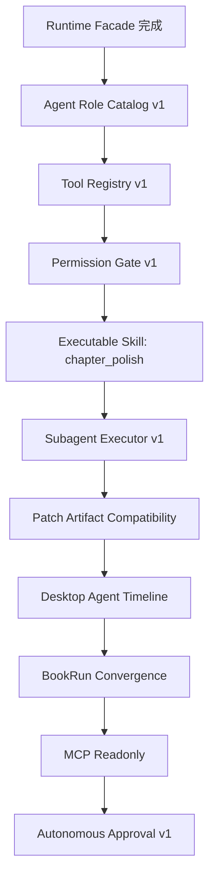

# Agent Runtime Post-Facade Master Plan

> **⚠️ 已归档(2026-06-29)。** 本文档不再独立维护;Agent Runtime / Harness 主题的唯一主入口是 [`pi-opencode-agent-harness-adoption-plan.md`](./pi-opencode-agent-harness-adoption-plan.md)。本文的阶段路线已并入该主入口的阶段定义,并在那里补上了与当前源码的差距。**新工作请只跟主入口;本文仅作历史背景保留。**

## 位置

本计划从 `AgentRun Runtime Facade` 完成之后开始。

已完成或已规划的前置文档：

- `agent-runtime-control-plane-plan.md`：总架构方向。
- `agent-run-v1-gap-plan.md`：当前实现与目标架构的差距。
- `agent-run-runtime-facade-plan.md`：第一刀，收口 WebSocket user message 入口。

后续总目标：

```text
WebSocket 只是通道
Agent Runtime 是主控
Primary / Root Agent 是唯一决策者
Tool Registry 是执行层
Permission Gate 是边界
Skill Planner 是流程知识
Subagent Executor 是专业分工
Event Store 是事实来源
```

## OpenCode 启发

OpenCode 的关键启发不是 CLI 形态，而是 agent 分层：

- Primary Agent：用户直接交互的主代理，负责目标、计划、权限和最终汇总。
- Subagent：由 Primary Agent 调度的专业代理，也可以通过 `@` 被用户显式点名。
- Plan/Build 思路：不要照搬成两个产品模式，但可以转化为 StoryForge 内部的计划权限和执行权限。
- Explore/Scout 思路：只读探索代理非常适合 StoryForge 的上下文检查、设定检查、外部资料检查。

StoryForge 的命名采用：

```text
Primary Agent = Root Agent
Subagent = 剧情 / 人物 / 文风 / 连续性 / 修复 / BookRun / 只读探索
```

用户最终仍只面对一个 Agent 模式，但可以在对话里显式调用专业代理：

```text
@剧情 看看这一章冲突够不够
@人物 检查女主动机有没有崩
@文风 按番茄短篇节奏润色
@伏笔 查前十章有没有断线
@写作任务 继续生成下一章
```

## 总路线



## 阶段 0：Agent Role Catalog v1

### 目标

先把 StoryForge 的 Primary/Subagent 角色目录固化下来，为后续 Tool Registry、Permission Gate 和 Desktop `@` 调用做统一语义。

### 首批角色

```text
root_agent
plot_reviewer
character_reviewer
prose_reviewer
continuity_reviewer
repair_agent
bookrun_agent
context_explorer
external_scout
```

### 规则

- `root_agent` 是唯一 Primary Agent。
- 其他角色都是 Subagent，不能直接写回文件。
- `context_explorer` 只读项目上下文。
- `external_scout` 只读外部资料或 MCP 检索结果。
- 用户可通过 `@角色` 显式建议 Root Agent 调用某个子代理，但最终调度权仍属于 Root Agent。

### 验收标准

- 角色目录可被 Agent Runtime 查询。
- 每个角色声明能力、默认权限、是否只读、可产出 artifact 类型。
- `@剧情`、`@人物`、`@文风`、`@伏笔`、`@写作任务` 有明确映射。
- 角色目录不执行工具，只提供调度语义。

## 阶段 1：Tool Registry v1

### 目标

把现有散落的后端能力包装为统一可执行工具，让 Agent Runtime 通过工具目录执行任务，而不是直接调用业务函数。

### 范围

首批工具：

```text
context.load
file.review
file.revise
judge.run
judge.repair
bookrun.start
bookrun.pause
bookrun.resume
bookrun.retry_from_checkpoint
```

工具必须记录默认调用者角色。例：

- `file.review` 默认由 reviewer 类子代理调用。
- `file.revise` 默认由 `repair_agent` 调用。
- `bookrun.start` 默认由 `bookrun_agent` 调用。
- `context.load` 可由 `root_agent` 或 `context_explorer` 调用。

### 关键设计

```text
ToolDefinition
- name
- description
- input_schema
- output_schema
- permission_level
- requires_confirmation
- handler
```

```text
ToolResult
- status
- summary
- payload
- artifacts
- events
```

### 验收标准

- Agent Runtime 可通过工具名查找并执行 tool。
- tool call 会写入 `tool_trace`。
- tool output 可转为 `AgentArtifact`。
- `file.revise` 仍产出兼容现有 Desktop 的 `proposed_patch`。
- 现有 orchestrator 分支可作为 tool handler 被调用。

## 阶段 2：Permission Gate v1

### 目标

让权限不再只是事件记录，而是进入 tool 执行前的硬边界。

### 权限档位

```text
step_confirm
risk_confirm
autonomous_approval
full_allow
```

### 工具风险等级

```text
read
analyze
propose_patch
write_pending
long_running
network
high_cost
dangerous
```

### 行为

- read/analyze 在 `risk_confirm` 下自动执行。
- propose_patch 可执行，但 artifact 必须标记 `requires_confirmation`。
- write_pending、long_running、network、high_cost 默认触发 `permission_required`。
- denied 后 run 进入 failed 或 waiting_for_user，按具体场景决定。
- 本地文件写回默认仍由 Desktop PatchReviewPanel 执行。

### 验收标准

- 每个 tool call 执行前经过 Permission Gate。
- 需要确认时，tool 不执行，run 写入 `permission_required`。
- WebSocket `approve_permission` 后可继续执行。
- WebSocket `deny_permission` 后 run 不继续执行高风险 tool。

## 阶段 3：Executable Skill：chapter_polish

### 目标

把 `chapter_polish` 从静态 skill 清单升级为第一条可执行写作流程。

### 流程

```text
user goal
-> select chapter_polish
-> context.load
-> file.review
-> file.revise
-> judge.run
-> judge.repair when needed
-> permission_required
-> proposed_patch
```

### 停止条件

- Judge 通过。
- repair 达到最大轮次。
- 权限被拒绝。
- 上下文不足。
- budget 超限。
- tool 失败不可恢复。

### 验收标准

- `chapter_polish` 可由 Agent Runtime 直接执行。
- 执行过程写入 plan、step、tool_trace、artifact、permission_required。
- 最终 patch 仍兼容 PatchReviewPanel。
- 失败时有清晰 `agent_run_failed` 事件。

## 阶段 4：Subagent Executor v1

### 目标

让多子代理从 trace 投影变成 Root Agent 明确分发的专业执行单元。

### 首批子代理

```text
plot_reviewer
character_reviewer
prose_reviewer
continuity_reviewer
repair_agent
synthesizer
context_explorer
external_scout
```

### v1 执行方式

- 先同步串行执行。
- 不做真实并发。
- 不做独立模型路由。
- 每个子代理输出结构化 summary。
- Synthesizer 负责合并问题和修订建议。
- `context_explorer` 和 `external_scout` 必须是只读代理。
- `@角色` 只影响 Root Agent 的调度偏好，不绕过权限系统。

### 验收标准

- Root Agent 能创建 `SubagentRun`。
- 每个子代理有 `subagent_started` 和 `subagent_completed` 事件。
- 子代理结果进入 Synthesizer。
- Synthesizer 输出驱动 repair 或 final artifact。

## 阶段 5：Patch Artifact Compatibility

### 目标

在 runtime 化过程中保持现有 Desktop 写回链路稳定。

### 要求

- `proposed_patch.kind` 保持兼容。
- `file_path`、`before`、`after`、`requires_confirmation` 保持兼容。
- Desktop 继续通过 PatchReviewPanel 确认写回。
- 后端不直接写本地文件。

### 验收标准

- 现有 file revise 测试不回归。
- Editor 仍可接收并展示 patch。
- 作者拒绝 patch 不影响 AgentRun 事件完整性。

## 阶段 6：Desktop Agent Timeline

### 目标

让用户能看懂 Agent 正在干什么，但不把中间区做成重型任务看板。

### UI 能力

- 显示当前 run。
- 显示简洁 timeline。
- 显示 tool trace 摘要。
- 显示 subagent 摘要。
- 支持用户输入 `@剧情`、`@人物`、`@文风`、`@伏笔`、`@写作任务` 等显式子代理提示。
- 显示 permission_required。
- 支持 approve / deny。
- 支持 pause / resume / stop。
- 支持断线后通过 REST/SSE 恢复事件。

### 验收标准

- ChatWindow 可展示 `agent_run_started`、`tool_trace`、`permission_required`、`agent_artifact`。
- 用户能在 IDE 设置 permission profile。
- timeline 不替代自然语言对话，只作为轻量状态反馈。

## 阶段 7：BookRun Convergence

### 目标

把 BookRun 从旁路后台能力收敛为 Agent Runtime 的 long-running tool / subagent。

### 行为

```text
bookrun.start
-> long-running AgentRun
-> chapter checkpoint
-> judge / repair / memory update events
-> pause / resume / retry_from_checkpoint
```

### 验收标准

- BookRun 启动由 Agent Runtime tool 调用。
- BookRun 进度进入 AgentRunEvent。
- checkpoint 进入 AgentArtifact。
- pause/resume/retry 统一经过 AgentRun control channel。
- `/api/ide/runs/{book_run_id}/events` 不再成为独立事实来源，只做兼容投影。

## 阶段 8：MCP Readonly

### 目标

接入只读/分析类 MCP 工具，验证 MCP 与 Tool Registry、Permission Gate、Event Store 的整合。

### 首批 MCP 类别

```text
mcp.project.search
mcp.context.inspect
```

### 规则

- MCP tool 必须注册进 Tool Registry。
- MCP tool 必须经过 Permission Gate。
- MCP result 必须写 `tool_trace`。
- v1 不开放写入型 MCP。
- v1 不开放危险 shell 类 MCP。
- MCP Readonly 优先服务 `context_explorer` 和 `external_scout`。

### 验收标准

- Agent Runtime 可列出并调用只读 MCP tool。
- MCP 调用失败不会中断整个 run，除非该步骤必需。
- MCP 权限请求可被 WebSocket 确认或拒绝。

## 阶段 9：Autonomous Approval v1

### 目标

在权限系统稳定后，开放更接近自主推进的能力。

### 行为

- 用户可在 IDE 选择 `autonomous_approval`。
- Agent 在预算内自动推进低中风险步骤。
- 高风险操作仍暂停确认。
- 每个 run 有 max steps、max repair rounds、max cost。

### 验收标准

- Agent 不会无限循环。
- Agent 超出预算自动停止。
- Agent 遇到高风险 tool 会暂停。
- 所有自动批准都有事件记录。

## 全局验收标准

全部阶段完成后，应满足：

- Primary / Root Agent 是唯一主控。
- WebSocket 只作为实时控制通道。
- SSE/REST 只从 AgentRunEvent 回放。
- Tool Registry 是唯一工具执行入口。
- Permission Gate 是所有 tool call 的前置边界。
- Skills 决定计划，Tools 执行动作，Subagents 负责专业判断。
- 用户可通过 `@角色` 建议调用子代理，但不能绕过 Root Agent 和 Permission Gate。
- 只读探索类子代理不能写入项目状态。
- proposed_patch 默认仍需作者确认。
- BookRun 是 Agent Runtime 的 long-running 能力，不是旁路控制台。
- MCP 工具不能绕过 Tool Registry、Permission Gate 和 Event Store。

## 推荐实施顺序

```text
0. Agent Role Catalog v1
1. Tool Registry v1
2. Permission Gate v1
3. chapter_polish executable skill
4. Subagent Executor v1
5. Patch artifact compatibility check
6. Desktop Agent Timeline
7. BookRun convergence
8. MCP readonly
9. Autonomous approval v1
```

优先级最高的是前四步。只要前四步完成，StoryForge 就从“AgentRun 事件投影”进入“真正可执行的 Agent Runtime”。
