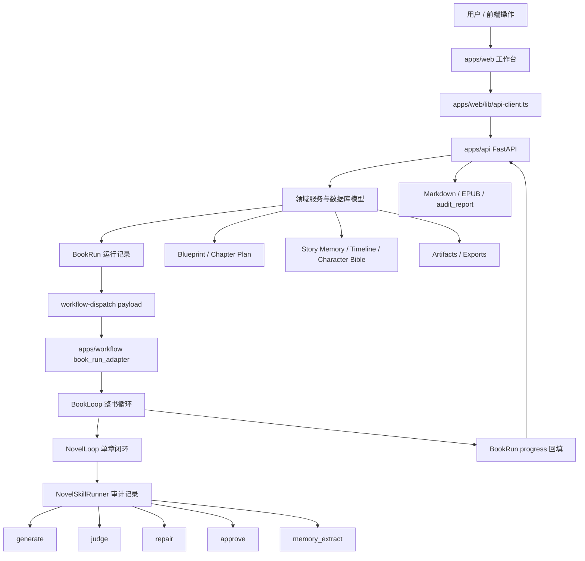

# StoryForge 当前架构地图

生成时间：2026-06-03

## 1. 一句话定位

StoryForge 当前不是单纯的 AI 小说生成器，而是面向中文长篇小说生产的可验证、可恢复、可审计创作流水线。

它的核心承诺是：

```text
从 Blueprint / 章节目标出发
-> 逐章生成、评审、修复、批准
-> 记录模型运行、技能链、checkpoint、预算和审计证据
-> 最终导出 Markdown / EPUB / audit_report
```

## 2. 五层架构

```text
apps/web
  前端工作台。负责展示、操作、诊断和控制，不保存业务真相。

apps/api
  业务真相源。负责作品、章节、Blueprint、BookRun、Scene Packet、Judge、
  Repair、Story Memory、Timeline、Artifacts 等领域模型和持久化。

apps/workflow
  隐藏编排层。负责整书和单章执行流程、模型调用边界、checkpoint、预算和技能运行记录。

packages/shared
  前后端共享契约。当前主要承载 OpenAPI 生成类型和少量共享 TypeScript 类型。

docs / .codex
  架构文档、阶段计划、验证报告和本地证据。这里是辅助事实源，不应无条件视为当前代码事实。
```

更短的心智模型：

```text
API 负责真相
Workflow 负责执行
Skill 负责审计
Web 负责展示和控制
Docs 负责解释和留证
```

## 3. 主架构图



## 4. 当前最重要的主线：BookRun 整书闭环

这是当前最应该优先理解和维护的主线。

```text
1. 前端或调用方创建 BookRun
2. apps/api 创建 BookRun 运行记录
3. apps/api 生成 workflow-dispatch payload
4. apps/workflow 消费 dispatch payload
5. BookLoop 按章节顺序循环
6. NovelLoop 执行单章生成闭环
7. NovelSkillRunner 记录每一步技能运行
8. Workflow 回填 BookRun progress
9. apps/api 更新 checkpoint、预算、timeline 和状态
10. completed 后导出 Markdown / EPUB / audit_report
```

核心文件：

| 层 | 文件 | 角色 |
| --- | --- | --- |
| API 路由 | `apps/api/app/domains/book_runs/router.py` | BookRun 创建、读取、恢复、暂停、进度回填、导出入口 |
| API 服务 | `apps/api/app/domains/book_runs/service.py` | BookRun 状态机、dispatch payload、progress 应用、checkpoint 和 timeline 同步 |
| Workflow 适配 | `apps/workflow/storyforge_workflow/orchestrators/book_run_adapter.py` | 把 API dispatch payload 转成 workflow 可执行请求 |
| 整书循环 | `apps/workflow/storyforge_workflow/orchestrators/book_loop.py` | 按章节推进、预算暂停、provider 降级暂停、checkpoint 归档 |
| 单章循环 | `apps/workflow/storyforge_workflow/orchestrators/novel_loop.py` | compile、generate、judge、repair、approve、memory_extract |
| 技能审计 | `apps/workflow/storyforge_workflow/skills/runner.py` | 记录 generate/judge/repair/approve/memory_extract 的引用化审计 payload |
| 技能定义 | `apps/workflow/storyforge_workflow/skills/definitions.py` | 静态声明小说技能契约、门禁、输入输出引用和状态映射 |
| 审计投影 | `apps/workflow/storyforge_workflow/skills/audit.py` | 把 BookRun progress 投影为 audit_report 可读的技能链 |

## 5. 单章 NovelLoop 流程

一章的核心执行顺序：

```text
compile_context
-> generate_scene
-> record_model_run
-> check_static_quality
-> judge_scene
-> repair_scene?        如果 judge 要求修复，且未超过 max_repairs
-> approve_scene        只有 judge pass 才能批准
-> extract_memory       只有 approved 内容才能进入长期记忆
```

NovelLoop 的终态目前主要是：

| 终态 | 含义 |
| --- | --- |
| `approved` | 单章通过评审并已批准写回 |
| `awaiting_review` | 静态质量门或 judge 未通过，需要人工审查 |

BookLoop 的终态目前主要是：

| 终态 | 含义 |
| --- | --- |
| `completed` | 全部章节 approved |
| `awaiting_review` | 某章阻塞在人工审查 |
| `paused_by_budget` | token、时间或章节预算触顶 |
| `paused_by_provider_degradation` | provider 连续降级达到阈值 |

## 6. Novel Skill 在这里是什么意思

项目里的 Novel Skill 不是 Codex 外部技能，也不是动态插件市场。

它当前更像一层审计契约，把 NovelLoop 的固定步骤显式命名：

```text
generate
judge
repair
approve
memory_extract
export
```

第一阶段的 Novel Skill 目标不是增加复杂调度，而是：

```text
让每一步有稳定名称
让每一步有输入引用和输出引用
让 BookRun audit_report 可以回放整本书的生产链路
让真实 LLM 和 deterministic/mock provider 都能复用同一套状态口径
```

## 7. LangGraph 的位置

仓库里仍然存在一条 LangGraph 图式工作流：

```text
book_director
-> chapter_planner
-> scene_beats
-> draft_writer
-> draft_critic
-> draft_reviser
-> human_approval
```

对应文件：

```text
apps/workflow/storyforge_workflow/graph.py
```

这条线适合理解为较早或并行的图式生成/审批能力。它有 LangGraph checkpoint、interrupt、人审节点和节点审计。

但当前项目最重要的生产主线是：

```text
BookRun -> BookLoop -> NovelLoop -> NovelSkillRunner
```

因此后续讨论“StoryForge 架构”时，除非明确说 LangGraph 图，否则默认应先看 BookRun 主线。

## 8. API 领域分组

`apps/api/app/domains` 当前包含很多领域模块。它们可以粗分为几组：

```text
创作真相源
  books, blueprints, studio, scene_packets, context_compiler

整书运行
  book_runs, jobs, model_runs, events, runtime_tools

质量闭环
  judge, repair, quality, evaluations, batch_refinery

长期记忆和连续性
  story_memory, character_bible, timeline, continuity, worldbuilding, series

资料和上下文
  retrieval, assets, prompt_packs, style_packs

制品与治理
  artifacts, exports, provider_gateway, assistant, ide, analytics, workspaces, collaboration, commercial

基础设施
  health
```

这些模块不都同等重要。理解当前主线时优先看：

```text
book_runs
blueprints
scene_packets
context_compiler
judge
repair
model_runs
artifacts
exports
story_memory
timeline
character_bible
```

## 9. 前端的位置

前端不是业务真相源。它通过统一客户端访问 API：

```text
apps/web/lib/api-client.ts
```

这个客户端负责：

```text
API base URL
X-StoryForge-API-Key
cache: no-store
JSON 读取和基础校验包装
```

前端页面更像工作台和诊断面板：

```text
首页 / Home
Studio
IDE
BookRuns
Artifacts
Evaluations
Settings / Providers
Retrieval
Worldbuilding
```

不要把某个页面当成完整业务能力。是否具备能力，要回到 API 服务、workflow 主线和测试证据判断。

## 10. 最容易混淆的边界

| 容易混的概念 | 正确理解 |
| --- | --- |
| workflow | 泛指执行层，不等于 LangGraph |
| LangGraph | 一条图式工作流能力，不是当前全部架构 |
| BookRun | API 里的整书运行记录和状态真相 |
| BookLoop | workflow 里的整书循环纯函数 |
| NovelLoop | workflow 里的单章闭环 |
| Novel Skill | NovelLoop 步骤的审计契约，不是外部插件市场 |
| Studio | 前端创作入口，不是完整全步骤编排器 |
| audit_report | 生产链路证据，不是正文质量保证书 |
| README/current-phase | 使用者和阶段摘要，需要跟当前代码同步校准 |
| .codex | 本地证据和过程产物，可能很有用，也可能已经过期 |

## 11. 当前架构痛点

### 11.1 事实源错位

README、current-phase、旧评分文档、计划文档和真实代码可能不同步。后续判断能力时应按优先级读取：

```text
当前代码和测试
-> current-phase.md
-> README.md
-> docs/architecture
-> .codex 过程记录
```

### 11.2 两条 workflow 线并存

`graph.py` 的 LangGraph 线和 BookRun 主线同时存在，容易让人以为系统有两个核心。

建议口径：

```text
BookRun 主线 = 当前生产闭环核心
LangGraph 线 = 图式生成/审批能力，除非明确接入主线，否则先视为旁路线
```

### 11.3 Context / Scene Packet / Retrieval 心智负担高

这块同时影响：

```text
生成前上下文
检索证据
token budget
Scene Packet
ModelRun prompt
审计可解释性
```

它是核心复杂度，不应继续随手加字段。后续需要单独做输入输出协议和黄金样例。

### 11.4 .codex 堆积影响判断

`.codex` 里有真实 LLM smoke、UI 截图、上下文摘要、临时脚本和验证报告。它们有证据价值，但混在一起会制造噪声。

建议只把以下内容视为高价值证据：

```text
.codex/verification-report.md
.codex/operations-log.md
.codex/real-llm-* 中明确记录的脱敏结果
.codex/project-pruning-and-improvement-dispatch.md
```

其他截图、临时脚本、context summary 应定期归档或清理，但不要自动删除。

## 12. 读代码顺序

如果以后重新进项目，建议按这个顺序看：

```text
1. current-phase.md
2. docs/architecture/current-architecture-map.md
3. apps/api/app/domains/book_runs/router.py
4. apps/api/app/domains/book_runs/service.py
5. apps/workflow/storyforge_workflow/orchestrators/book_run_adapter.py
6. apps/workflow/storyforge_workflow/orchestrators/book_loop.py
7. apps/workflow/storyforge_workflow/orchestrators/novel_loop.py
8. apps/workflow/storyforge_workflow/skills/runner.py
9. apps/workflow/storyforge_workflow/skills/definitions.py
10. apps/web/lib/api-client.ts
```

只有当你要处理图式 workflow、人审 interrupt 或节点级生成时，才优先进入：

```text
apps/workflow/storyforge_workflow/graph.py
```

## 13. 下一步建议

当前最值得做的不是继续加能力，而是把“当前事实源”固定下来。

建议下一步拆成三个小任务：

```text
1. 文档校准
   对 README.md、current-phase.md、旧架构文档做一次事实对齐，标记过期口径。

2. 主线可视化
   给 BookRun -> BookLoop -> NovelLoop -> NovelSkillRunner 画一张更细的数据流图。

3. 模块减噪
   对 .codex 和旧计划做 dry-run 分类：必须保留、建议归档、可删除、需人工确认。
```

优先级建议：

```text
先校准事实源
再处理 .codex 噪声
最后再继续新功能
```
