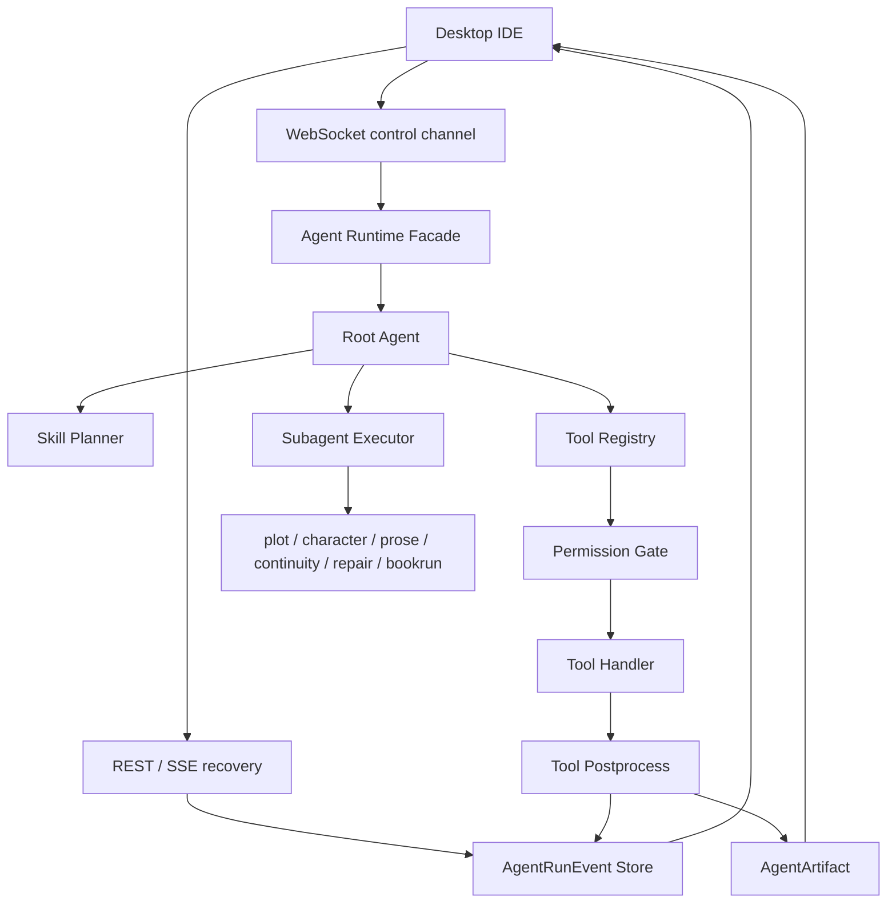

# Pi / OpenCode Agent Harness Adoption Plan

> **本文件是 StoryForge Agent Runtime / Harness 主题的唯一主入口（2026-06-29 起）。**
> 取代 `agent-runtime-control-plane-plan.md` 与 `agent-runtime-post-facade-master-plan.md`——两者已加归档横幅、不再独立维护；其骨架结论已并入本文「阶段定义」。
> 仍作为被引用子文档保留（窄主题、未重复）：`agent-run-runtime-facade-plan.md`、`agent-runtime-desktop-control-plane-plan.md`、`agent-runtime-next-session-implementation.md`、`agent-run-v1-gap-plan.md`、`agent-role-consumption-plan.md`。
>
> **编号纪律：** 全文只有一套编号——「阶段 1–9」是**稳定定义 ID**，永远指同一块工作，不随执行顺序变化。需要表达「先做什么」时一律用「执行顺序」一节，且只引用阶段 ID（如「先 阶段 2，再 阶段 3」），**不再出现第二套 1–9**。
> 最近校准：2026-06-29（对照 `agent_runs/` 当前源码、`../internal/refactor-master-plan.md` 与 `.codex/verification-report.md`）。**落地前先读「现状快照与净新增」**：主重构 E2/T5/T6 已完成到当前合理边界；Root Agent 已承接所有 supported intents，`ide/orchestrator.py` 只剩旧路径兼容 facade。阶段 2 Context Builder tracer/prompt 接线、C-a event type 常量、C-b registry 收敛、阶段 3 preflight 元数据字段、阶段 4 ToolResult/postprocess 第一刀 + BookRun checkpoint/metrics/retry metadata enrichment、阶段 5 save point projection + `/save-points` endpoint + control event projection + `tool_trace.recovery` 元数据 + runtime execution marker tracer + `file.review` 的首个 interruptible boundary、pending-call resume、control-channel resume、postprocess resume 第一刀、pending-call resume diagnostic、failure recovery projection、pending-call resolution artifact 与 `chapter.review` 的 `judge.run` 后置 no-write pending resume tracer 已完成；阶段 6 Desktop event recovery 的 API client 读取面、ChatWindow 恢复摘要 read-model/UI 第一刀、control-channel `resumed_result` UI 收口、`resume_diagnostic` UI 收口与 stale ack guard 已完成。下一批真正高成本工作转向阶段 5 更完整可恢复 run loop、阶段 6 Desktop production runtime/恢复 UI 与阶段 7 BookRun 事实源收敛。

## 用途

这份计划记录 StoryForge 从 Pi Agent Harness 和本机 OpenCode 桌面版观察到的可采纳经验，并把它们落到 StoryForge 现有 Agent Runtime、Desktop IDE 和 BookRun 收敛路线中。

它不是替换技术栈的方案。StoryForge 仍保持：

```text
StoryForge = 作者辅助写作 IDE
apps/desktop 是唯一主体验
Tauri + React + Monaco 是桌面主壳
AgentRun / AgentRunEvent / AgentArtifact 是运行事实源
BookRun 是 Agent tool / long-running subagent，不是主控制台
```

## 参照对象

### Pi Agent Harness

Pi 的主要启发不是 CLI 产品形态，而是运行时分层：

```text
LLM agent loop
-> tool calling
-> event streaming
-> AgentHarness
-> session persistence
-> hooks
-> resources
-> save points
-> abort / steer / follow-up
-> semi-durable recovery
```

对 StoryForge 有价值的部分：

- `AgentMessage -> transformContext -> convertToLlm`：UI / 审计 / artifact 消息和真正给模型的上下文分离。
- 明确的事件序列：agent、turn、message、tool execution 都有开始、更新和结束事件。
- tool preflight：工具执行前可做权限、预算、参数校验和阻断。
- tool postprocess：工具执行后可做 artifact 归档、审计、结果修正和 early termination。
- save point：每个 turn / tool batch 后形成可恢复边界。
- semi-durable harness：运行时依赖由宿主重建，session / event log 保存可恢复状态。
- 只从 durable boundary 恢复，不承诺 provider stream 级恢复。

### OpenCode 桌面版

本机 OpenCode 桌面版显示的是成熟桌面 agent 产品的工程形态：

```text
Electron app.asar
native unpacked modules
node-pty / ConPTY
file watcher
local sessions
auto update metadata
desktop process boundary
```

对 StoryForge 有价值的部分：

- 桌面应用不是浏览器壳，而是本地 agent 控制面。
- 本地进程、日志、会话、文件监听和更新需要产品化。
- Agent session、权限、patch、terminal / process 能力需要稳定边界。
- 原生依赖需要明确打包策略。

StoryForge 不采纳的部分：

- 不把主壳从 Tauri 改成 Electron。
- 不把产品改成通用 coding agent。
- 不引入终端优先交互。
- 不让后端绕过 Desktop PatchReviewPanel 直接写本地小说文件。

## 核心判断

StoryForge 当前已有正确方向：

- `AgentRun` 记录一次作者目标。
- `AgentRunEvent` 是 WebSocket、REST 和 SSE 的共同事实源。
- `AgentArtifact` 承载 review report、proposed patch、checkpoint 等产物。
- `Permission Gate`、`Tool Registry`、`SubagentRun` 已在架构计划中出现。
- Desktop 已有文件审稿、修订、diff 确认、写回和版本记录链路。

下一阶段不是重造一套 Pi，也不是照搬 OpenCode，而是把 StoryForge 已经有的控制面补成：

```text
Root Agent 唯一主控
Tool Registry 唯一执行入口
Permission Gate 前置阻断
AgentRunEvent 唯一事实源
Desktop Timeline 纯事件投影
BookRun long-running AgentRun 化
Production Desktop runtime 产品化
```

## 现状快照与净新增（2026-06-29 校准）

> 本节是其余阶段的前提。先承认代码里已经落地了什么，再决定每一刀是「新建」「行为变更」还是「文档对齐」。下表证据来自 `apps/api/app/domains/agent_runs/` 当前源码。

### 已落地，不要当成新工作

| 能力 | 现状 | 证据 |
|------|------|------|
| Tool Registry / ToolDefinition | 已有真实结构（dict 注册 + `get()` 抛错）；可执行 AgentRuntime 工具已收敛到共享 spec，并补 `allowed_roles` / `retry_safe` / `idempotent` / `execution_mode` / `artifact_kinds` | `tooling.py`、`runtime.py:_register_tools`、`runtime_tools/service.py` |
| Permission Gate + 4 档 profile + risk level | 已有，且对 read/analyze 工具在**执行前**生效 | `tooling.py:74-89`、`runtime.py:637-642` |
| SubagentExecutor + role catalog 门控 | 已有；4 个 reviewer（plot/character/prose/continuity）已接线执行 | `tooling.py:92-114`、`runtime.py:106-113` |
| 顺序化 event store + SSE/REST 回放 | 已有 per-run `sequence` 列与 `/events` + SSE | `models.py:63`、`router.py:60-103` |
| AgentRun event type 常量 | 已有当前事件名集中定义与控制消息 reducer；未引入 turn/message_delta 等新协议 | `event_types.py`、`event_sink.py`、`service.py` |
| LLM Context Builder | 已有可审计 `llm_context_snapshot`，并已接入 `file.review` / `file.revise` prompt 上下文净化 | `llm_context.py`、`runtime.py:context.load` |
| AgentArtifact + requires_confirmation | 已有 review_report / proposed_patch / bookrun_checkpoint；review/proposed patch 归档已优先通过 ToolResult artifacts postprocess | `service.py:541`、`runtime.py:_record_result_artifacts` |
| Save point projection | 已有只读 projection 与 REST endpoint，可从事件/artifact 推导 pending permission、proposed patch、BookRun checkpoint、tool_completed、runtime interruption、runtime pending call 和 failed-without-checkpoint；`tool_trace` payload 已带 recovery 元数据与 runtime execution marker | `save_points.py`、`runtime_recovery.py`、`router.py:/save-points`、`event_sink.py` |
| BookRun → AgentRun 事件镜像桥接 | 已有 `record_book_run_snapshot` 写 tool_trace / checkpoint / terminal 事件 | `service.py:387-445` |
| Root Agent supported intents | 已有；`chat.explain` / `file.review` / `file.revise` / `bookrun.start` / `chapter.review` / `chapter.repair` 都由 live `AgentRuntime` 分派，不再需要 legacy fallback | `intent.py:9-39`、`runtime.py:119-169` |
| legacy IDE orchestrator 旧路径兼容 | 已有；`ide/orchestrator.py` 只 re-export 旧符号，`orchestrate_agent_message()` 懒加载转发 `run_agent_user_message(...).result` | `ide/orchestrator.py:8-40`、`agent_runs/service.py:269-287` |
| DomainError HTTP status contract | 已扩展到 assistant、IDE command、AgentRun、BookRun lifecycle、Artifact/Export、BookGeneration 等高摩擦面 | `common/exceptions.py`、各 domain `service.py` / `errors.py` |

含义：**阶段 1 / 3 / 4 / 7 大部分已存在**。这些阶段的任务是「对齐 + 补缺口」，不是从零搭建；落地前必须先核对上述文件，避免重造轮子。

### 真正的净新增（相对已归档旧计划，本文独有的工作）

- **阶段 2 · Context Transform / LLM Context Builder**：已完成 tracer-bullet 与 prompt 接线：`llm_context.py` 生成稳定 snapshot，默认排除 permission/debug/timeline/patch 噪声，并把 snapshot 派生的干净 bundle 接入 `file.review` / `file.revise`。剩余工作是更长会话压缩策略、BookRun checkpoint 摘要细化，以及后续 save point/恢复模型接入后的上下文增量策略。
- **阶段 5 · Save Points（部分新）**：今天完整 checkpoint/resume 仍主要是 **BookRun 的**（`book_runs/service.py`）；AgentRun 已有 `file.review` 的第一条可中断边界（plan → `context.load` → 检查 `paused/stopped`）和无写入 pending-call resume 第一刀（隐藏 `runtime_pending_call` artifact → `resume_run` 后继续 reviewer），但 provider stream 恢复、写工具 pending-call resume 与跨 intent 通用 run loop 仍未做。本阶段真正的难点是「让运行时可中断/可恢复」，而非「分类 save point 名字」。
- **阶段 6 · Desktop production runtime 硬化 + 原生依赖打包审计**：Desktop event recovery 读取面已有第一刀（API client + ChatWindow 恢复摘要 read-model/UI + control-channel `resumed_result` 收口）；production runtime、原生依赖打包、进程监管、结构化日志与健康诊断仍是新料。

### 与代码直接矛盾，落地前必须先处理的现状差距

1. **写工具不是 preflight 硬阻断，而是 propose-then-confirm**：`file.revise` / `judge.repair` / `bookrun.start` 在 `runtime.py:640` **显式跳过** gate，立即执行并产出待确认补丁，确认发生在 UI 层。阶段 3 验收里「只读 subagent 无法调用写工具」「批准后继续同一 pending 调用」描述的是另一套模型。**先在文档承认现状模型，再决定保留还是替换；替换 = 行为变更，单独 PR。**
2. **`ToolDefinition` preflight 元数据字段已补，但尚未强校验**：`allowed_roles` / `retry_safe` / `idempotent` / `execution_mode` / `artifact_kinds` 已进入 `AgentRuntimeToolSpec`、执行期 `ToolDefinition` 与 `/api/runtime-tools`。剩余差距是 input schema 实体化、schema validation、budget check、retry policy check 与 pending-call resume 行为。
3. **无 turn 概念、无流式**：`turn_started` / `turn_completed` / `message_delta` / `tool_execution_started` 当前都不存在，运行时一次跑到底。加 `message_delta` = 引入流式 LLM 调用，是架构级改动，不是「集中定义 event 常量」。阶段 1 不要把它写成低成本工作。
4. **`interrupted` 是新造概念**：代码用 `paused` / `stopped` 状态 + 控制事件建模中断，无 `*_interrupted` 事件/状态。统一命名，不要两套并存。
5. **tool registry 分裂已做第一层收敛**：AgentRuntime 可执行 9 工具已从共享 `AgentRuntimeToolSpec` 生成，`/api/runtime-tools` 也暴露同一批 `origin=agent_runtime` 条目。剩余差距是 CreativeToolRegistry / MCP 与 AgentRuntime 执行器的更深统一，以及 MCP 真执行接线。

### 与已完成主重构 / E2 的关系

- `../internal/refactor-master-plan.md` 已把 **E2（legacy `ide/orchestrator.py` 收口）** 标为完成：`chapter.review` / `chapter.repair` 已迁入 live `AgentRuntime`，`legacy.orchestrator` fallback 已下线，`ide/orchestrator.py` 仅保留旧 import path facade。**「Root Agent 唯一主控」对 supported intents 已成立**，本计划不再需要等待 E2。
- 后续仍会改 `agent_runs/runtime.py`、`agent_runs/service.py`、`book_runs/service.py` 等同一批高价值文件。落地前必须先读 refactor master 当前快照和 `.codex/verification-report.md`，保留 facade / monkeypatch / 旧 import path 兼容契约。
- `_judge_run_args_from_scene_packet` 现在是 `chapter.review` native handler 的 live helper，不要按死代码删除；真正可删除的是已下线的 legacy fallback，而它已经完成。

## 设计原则

### 1. WebSocket 只做实时通道

WebSocket 可以接收用户消息、推送事件和传递控制命令，但不能成为第二个 orchestrator。

目标路径：

```text
Desktop
-> WebSocket control channel
-> Agent Runtime Facade
-> Root Agent
-> Tool Registry
-> Permission Gate
-> AgentRunEvent / AgentArtifact
```

REST 和 SSE 只从 `AgentRunEvent` 回放，不重新推断运行状态。

### 2. Harness 状态和模型上下文分离

StoryForge 需要区分三类信息：

```text
Event / UI state：timeline、permission、artifact、patch、checkpoint
Harness state：run、turn、tool call、queues、budgets、active roles
LLM context：真正传给模型的消息、检索片段、章节上下文
```

不是所有 event 都应该进入 LLM context。review report、timeline、权限记录、patch metadata 应通过 context builder 摘要或过滤。

### 3. Tool preflight 是权限硬边界

所有工具调用都必须先经过统一 preflight：

```text
schema validation
role capability check
permission profile check
budget check
risk check
idempotency / retry policy check
```

如果需要确认，工具不执行，只写入：

```text
permission_required
```

> 现状差距（必读）：今天只有 read/analyze 工具走这条硬阻断；`file.revise` / `judge.repair` / `bookrun.start` 三个写工具仍被显式跳过 gate，先执行产出待确认补丁、再由 UI 确认（propose-then-confirm）。把写工具也改成「preflight 阻断 + 批准后恢复同一 pending 调用」是**行为变更**，必须单独 PR、单独评审，不能当成本原则的自然推论。`retry_safe` / `idempotent` 等元数据字段已补，`schema validation`、预算校验、retry policy check 与 pending-call resume 仍属新增工作。

### 4. Tool postprocess 负责归档和审计

工具执行后统一做：

```text
tool_trace
AgentArtifact
summary
audit payload
retry metadata
checkpoint metadata
```

这能避免 file.review、file.revise、BookRun、MCP 各自生成不兼容的事件。

### 5. Save point 是恢复边界

StoryForge 不承诺从 provider token stream 中断位置恢复。

可恢复边界应是：

```text
AgentRun started
turn completed
tool call completed
chapter completed
BookRun checkpoint completed
artifact persisted
permission decision persisted
```

未完成的 provider request 默认标记 interrupted，不自动重放，除非工具声明 retry-safe。

> 现状差距（必读）：这些 save point 里只有 `BookRun checkpoint completed` 今天真实存在（`book_runs/service.py`）。AgentRun 本身一次同步跑到底（`runtime.py:116-202`），`turn completed` / `tool call completed` 级别的可恢复点**不存在，且依赖先把运行时改成可中断**——这是本原则的真正成本，必须在阶段 5 显式 scope。另外代码用 `paused` / `stopped` 状态 + 控制事件建模中断，无 `interrupted` 状态/事件；`interrupted` 是**新造概念**，落地前先决定统一到哪套命名，不要两套并存。

### 6. Desktop 是控制面，不是旁路执行器

Desktop 负责：

- 选择项目和文件。
- 展示 timeline。
- 展示 artifact。
- 批准或拒绝权限请求。
- 审阅 proposed patch。
- 确认后写回本地文件。
- 保存版本记录和 author-loop 记录。

Desktop 不应该独立推断 AgentRun 完成状态，也不应该绕过后端 event store。

## 目标架构



## 阶段计划

> **阶段编号 = 稳定定义 ID,不是执行顺序。** 下面 9 个阶段按主题划分,「阶段 N」永远指同一块工作(例:「阶段 2」永远是 Context Builder)。实际先做什么见「执行顺序」一节,那里只引用这些 ID、不另起编号。

## 阶段 1：Harness Event Model 对齐

> 状态：**低成本常量收敛已完成，架构级事件仍未做**。当前既有 AgentRun event type 已集中到 `event_types.py`，控制消息 reducer 保持旧名兼容。`turn_started` / `turn_completed` / `message_delta` / `tool_execution_started` / `tool_execution_updated` / `agent_run_interrupted` **均不存在**。注意：加 `message_delta` = 引入流式 LLM 调用，加 `turn_*` = 引入 turn 化，二者都是架构级改动，排在阶段 5 之后或独立立项。

### 目标

把 StoryForge 的事件模型稳定成可回放、可测试、可映射到 UI 的运行协议。

### 事件层级

保留 StoryForge 现有事件名，但补齐层级语义：

```text
agent_run_started
agent_plan_created
turn_started
message_delta
subagent_started
subagent_completed
tool_execution_started
tool_execution_updated
tool_trace
permission_required
agent_artifact
turn_completed
agent_run_completed
agent_run_failed
agent_run_interrupted
```

### 实施要点

- 在后端集中定义 event type 常量或 schema。
- `tool_trace` 继续兼容现有前端，但新增更明确的 tool execution lifecycle。
- 旧事件不立刻删除，通过 event reducer 映射。
- Desktop timeline 只消费 event，不消费业务函数返回细节。

### 验收标准

- 每个 `AgentRun` 可通过 REST 重建 timeline。
- WebSocket 断开后，SSE / REST 能补齐遗漏事件。
- 未识别事件不会让前端崩溃。
- `approve_permission` 不会被前端误判为整个 run 完成。

## 阶段 2：Context Transform / LLM Context Builder

> 状态：**tracer-bullet 与 prompt 接线已完成**。已有 `llm_context.py` 生成稳定 `llm_context_snapshot`，`context.load` 同时产出 snapshot 与干净 prompt bundle；`file.review` / `file.revise` 已改用 snapshot 派生上下文，默认排除 permission payload、UI debug JSON、timeline 原始事件和 patch metadata。剩余工作是长会话压缩策略、BookRun checkpoint 摘要细化，以及 save point/恢复模型接入后的增量上下文策略。

### 目标

借鉴 Pi 的 `transformContext` / `convertToLlm`，把 AgentRun 事件、UI 消息和模型上下文解耦。

### 设计

新增或收敛一个上下文构建边界：

```text
AgentRun state
AgentRunEvent history
selected file content
context files
role hints
artifacts
story memory
chapter packet
-> transform_context()
-> build_llm_context()
```

### 规则

- timeline 事件默认不直接进入 prompt。
- artifact 只以摘要或引用进入 prompt。
- proposed patch metadata 不直接污染小说正文上下文。
- review report 可被压缩为 issue list。
- BookRun checkpoint 以章节状态和摘要进入上下文，不塞完整 event log。

### 验收标准

- 同一个 AgentRun 可生成可审计的 LLM context snapshot。
- prompt 中不出现 permission payload、UI debug JSON、无关 timeline 噪声。
- 长会话下可压缩旧事件而不丢失关键写作事实。

## 阶段 3：Tool Preflight / Permission Gate 收口

> 状态：**字段补齐已完成，行为迁移未做**。`PermissionGate.decide` 与 4 档 profile 已在执行前对 read/analyze 生效；role↔tool 门控已在 `role_catalog.py` + `SubagentExecutor`。`ToolDefinition` / `AgentRuntimeToolSpec` 已补 `allowed_roles`、`retry_safe`、`idempotent`、`execution_mode`、`artifact_kinds`。剩余缺口是 input schema validation、budget check、retry policy check，以及是否把写工具从 propose-then-confirm 改为硬阻断（行为变更）。

### 目标

所有工具调用统一经过 preflight，避免权限只停留在 UI 层或日志层。

### ToolDefinition 扩展

> 现状：`ToolDefinition` 当前字段已包含下表目标字段；`allowed_roles` 来自 role catalog 投影并有测试守卫，`retry_safe` / `idempotent` / `execution_mode` / `artifact_kinds` 已暴露到 `/api/runtime-tools`。仍未完成的是把 `input_schema` 从空占位补成可校验实体，并在 preflight 中真正执行 schema/budget/retry policy 校验。

```text
ToolDefinition
- name
- description
- input_schema
- output_schema
- allowed_roles
- risk_level
- requires_confirmation
- retry_safe
- idempotent
- execution_mode
- artifact_kinds
- handler
```

### Preflight 顺序

```text
tool exists
input schema valid
role allowed
read_only role cannot call write tool
permission profile allows risk level
budget allows execution
requires confirmation check
```

### 验收标准

> 下列标准按「目标模型」书写。落地前先注意：`file.revise` / `judge.repair` / `bookrun.start` 当前**绕过** gate（`runtime.py:640`），采用 propose-then-confirm。把它们纳入硬阻断是行为变更，必须单列 PR。

- 只读 subagent 无法调用 `file.revise`、`judge.repair`、`bookrun.start`（**目标态**；现状是写工具绕过 gate、由 UI 确认，需先迁移）。
- `risk_confirm` 下高风险工具产生 `permission_required`。
- 权限被拒绝时工具不执行。
- 权限被批准后继续执行同一个 pending tool call，而不是新建不可追踪调用（**目标态**；现状无 pending-call 恢复机制——写工具已先执行产补丁，此项依赖前述模型迁移，不可当成已满足）。

## 阶段 4：Tool Postprocess / Artifact Pipeline

> 状态：**ToolResult 管道第一刀与 BookRun checkpoint/metrics/retry metadata 第一刀已完成**。`ToolResult` 已扩展出 `summary / payload / artifacts / metrics / retry_metadata / checkpoint_metadata`，`file.review`、`file.revise`、`judge.repair` 的 review/proposed patch 归档已优先通过 ToolResult artifacts postprocess，旧 result 字段保留 fallback。BookRun 旁路 snapshot 的 `bookrun_checkpoint` artifact 已携带 `tokens_used`、`token_budget`、`completed_count`、`checkpoint_count` 等 snapshot 指标；`retry_from_checkpoint` / `resume` 起点会进入 BookRun snapshot/checkpoint metadata；`/save-points` 会投影最新 checkpoint 章号、模型/评审/批准引用和 retry 起点。剩余缺口是把更深的 retry/checkpoint metadata 接入统一 ToolResult 管道，以及 `diagnostic_summary` / `memory_update_proposal` / `export_manifest` 三类新 artifact。

### 目标

让所有工具输出都经过统一归档，形成可解释、可恢复、可 UI 展示的 artifact。

### 输出规范

```text
ToolResult
- status
- summary
- payload
- artifacts
- metrics
- retry_metadata
- checkpoint_metadata
```

### Artifact 类型

```text
review_report
proposed_patch
chapter_draft
bookrun_checkpoint
diagnostic_summary
memory_update_proposal
export_manifest
```

### 验收标准

- `file.review` 输出 `review_report`。
- `file.revise` 输出兼容 PatchReviewPanel 的 `proposed_patch`。
- BookRun 每章 checkpoint 输出 `bookrun_checkpoint`。
- artifact 事件不塞大段 JSON 到 assistant 文本。

## 阶段 5：Agent Harness Save Points

> 状态：**读侧 projection、control event projection、tool recovery 元数据、runtime execution marker tracer、`file.review` 首个 interruptible boundary、pending-call resume、control-channel resume、postprocess resume 第一刀、pending-call resume diagnostic、failure recovery projection、pending-call resolution artifact 与 `chapter.review` 的 `judge.run` 后置 no-write pending resume tracer 已存在，完整可恢复 run loop 仍未做**。`save_points.py` 可从现有事件/artifact 推导 `run_started`、`tool_completed`（由既有 `tool_trace` 映射）、`control_message`（pause/resume/retry）、`permission_required`、`permission_decided`、`artifact_persisted`、`bookrun_checkpoint`、`runtime_pending_call`、`runtime_pending_call_resolution`、`run_completed` / `run_failed` / `run_stopped` 等边界，并识别 pending permission / proposed patch / failed-without-checkpoint / latest control / latest failure / latest interruption / latest pending call / latest pending call resolution / latest resume diagnostic。`/api/agent-runs/{run_id}/save-points` 已提供只读 projection；`tool_trace.payload.recovery.execution_marker` 已记录 after-tool 边界并投影到 `runtime_recovery`。失败 run 会在 `runtime_recovery.latest_failure` 中投影失败事件、checkpoint 缺失状态、manual restart 结论和最近已落库 execution marker，但仍不承诺 provider stream 恢复。`file.review` 现在先写 plan，再在 `context.load` 后检查现有 `paused` / `stopped` 状态；`paused` 时会写隐藏 `runtime_pending_call` artifact，`resume_run` 后可由控制通道直接从该 artifact 继续 reviewer 而不重复 `context.load`；若 reviewer 已算完但部分 trace/artifact 尚未落库，pending artifact 会保存 `review_output` 和 `next_trace_index`，resume 后只补齐剩余 trace、artifact 和 complete，不重跑 reviewer。`chapter.review` 现在可在 `judge.run` trace 落库后暂停并写隐藏 pending artifact；`resume_run` 只用已持久化 `judge_output` 收口章节审阅，不重跑 `judge.run`，也不自动进入 `judge.repair` 写工具。控制通道成功续跑后会写隐藏 `runtime_pending_call_resolution` artifact，普通 `/artifacts` 不暴露，`/save-points` 可投影，且最新 pending-related fact 为 resolution 时不会再把旧 pending 当成活跃待恢复。若 pending artifact 对当前控制通道不可恢复（如 unsupported intent、缺少 resume envelope 或缺少恢复 payload），`resume_run` 事件会携带 `runtime_recovery.resume_diagnostic` 并由 `/save-points` 投影，不会静默自动执行写工具。`turn_completed` / `run_interrupted` 级 save point、写工具 pending resume 与 provider stream 恢复仍不存在；`interrupted` 继续只是投影语义，不新增事件/状态。

### 目标

把 AgentRun 的可恢复边界明确化，为长任务和桌面断线恢复提供稳定基础。

### Save point 类型

```text
run_started
turn_completed
tool_completed
permission_decided
artifact_persisted
chapter_completed
bookrun_checkpoint
run_completed
run_failed
run_interrupted
```

### 恢复策略

- 未完成 provider request：标记 interrupted。
- 未完成非 retry-safe tool：标记 interrupted，不自动重试。
- 未完成 retry-safe tool：可由 Root Agent 决定是否重试。
- 未完成 BookRun chapter：从上一个 checkpoint 恢复。
- 已持久化 proposed patch：不重复生成，等待用户确认或拒绝。

### 验收标准

- 进程重启后可读取最近 AgentRun 状态。
- pending permission 不丢失。
- pending proposed patch 不丢失。
- BookRun 能从 chapter checkpoint 级别恢复。
- 失败恢复不会重复写本地文件。

## 阶段 6：Desktop Control Plane 产品化

### 目标

吸收 OpenCode 桌面版的产品工程启发，把 StoryForge Desktop 从 dev stack 启动器推进到稳定本地控制面。

### 范围

```text
production frontend bundle
API / runtime process supervision
structured local logs
health checks
crash / restart hints
file watcher hardening
session local storage
auto update strategy
native dependency packaging audit
```

### 当前风险点

当前 Tauri 主进程仍有较强开发态假设：

- 检查 `http://localhost:3007`。
- 依赖外部 Vite dev server。
- 启动 Docker / API / migration 的逻辑和产品运行混在一起。
- 服务日志直接继承 stdout / stderr。
- 生产安装包的 runtime 分发策略还不清晰。

### 目标形态

```text
Development mode:
  reuse Vite dev server
  start docker / api for local dev
  show verbose logs

Production mode:
  load bundled frontend dist
  manage packaged or configured runtime
  write logs to app data dir
  expose health / diagnostics panel
  never require user to manually start Vite
```

### 验收标准

- production build 打开后不依赖 `localhost:3007`。
- 桌面端可展示 API/runtime 健康状态。
- AgentRun 日志和桌面主进程日志有固定位置。
- 文件监听在 Windows 中文路径下稳定。
- 更新策略有文档，不要求本阶段必须上线自动更新。

## 阶段 7：BookRun Long-Running Harness 化

> 状态：**桥接已存在，收敛未完成**。BookRun 当前是独立的 `book_runs` background-task 管道，通过 `record_book_run_snapshot`（`service.py:387-445`）**镜像**进 AgentRun（写 tool_trace / bookrun_checkpoint / terminal 事件），并非「被 agent_runs 当作 subagent 执行」。验收里「progress 写 AgentRunEvent / checkpoint 写 AgentArtifact」已通过镜像满足；真正缺口是「BookRun 不再维护独立事实源、`/api/ide/runs/{id}/events` 退为兼容投影」——这是收敛行为变更，且与 `bookrun_agent` 当前是 catalog 角色但**未作为执行 subagent**（仅以 `bookrun.*` 工具实现）这一点耦合。本阶段与 refactor-master-plan 无直接重叠，但改的是 BookRun 控制流，需与正在进行的 B2（`book_runs/service.py` 拆分）错峰。

### 目标

让 BookRun 成为 Agent Runtime 的 long-running tool / subagent，而不是旁路后台任务。

### 行为

```text
Root Agent
-> bookrun_agent
-> bookrun.start
-> chapter loop
-> judge / repair / memory update
-> checkpoint artifact
-> pause / resume / retry_from_checkpoint
```

### 要求

- BookRun progress 写入 AgentRunEvent。
- BookRun checkpoint 写入 AgentArtifact。
- pause/resume/stop 走 AgentRun control channel。
- 旧 BookRun events 只做兼容投影。

### 验收标准

- Desktop timeline 可看见 BookRun 章节级进度。
- 断线恢复后能重建 BookRun timeline。
- retry from checkpoint 不创建第二套事实源。
- BookRun 不能绕过 Permission Gate 执行高成本或长任务。

## 阶段 8：Readonly MCP / External Scout

### 目标

在 Tool Registry 和 Permission Gate 稳定后，接入只读 MCP 和外部资料探索代理。

### 规则

- v1 只开放只读 MCP。
- MCP tool 注册进 Tool Registry。
- MCP 调用经过 Permission Gate。
- MCP 结果写入 AgentRunEvent。
- external_scout 只能返回资料摘要和引用，不能写文件。

### 验收标准

- `context_explorer` 可调用项目只读搜索工具。
- `external_scout` 可调用只读外部资料工具。
- MCP 失败有 `tool_trace` 和可读错误。
- 写入型 MCP 继续禁止。

## 阶段 9：Autonomous Approval v1

### 目标

在权限、事件、恢复和 artifact 稳定后，开放更自动的 agent 推进能力。

### 安全边界

```text
max_steps
max_turns
max_tool_calls
max_repair_rounds
max_cost
max_runtime_seconds
high_risk_requires_confirmation
writeback_requires_patch_review
```

### 验收标准

- autonomous 模式不会无限循环。
- 超预算自动停止并写 `agent_run_interrupted` 或 `agent_run_failed`。
- 高风险工具仍暂停确认。
- 所有自动批准都可回放。
- 本地文件写回仍需 PatchReviewPanel。

## 实施顺序

> 校准（2026-06-29）：本节只表达**先后顺序**，一律引用上文的稳定阶段 ID（阶段 1–9），不引入第二套编号。原文「阶段计划」按主题定义阶段；执行时不必按阶段号顺序，按下表的依赖与价值排。

**前置清理刀（C 系列，低成本、纯收敛、可立刻做、不占阶段号）：**

```text
C-a. 已完成：event type 字面量 → enum/常量 + reducer 兼容旧名（属 阶段 1 的低成本子集）
C-b. 已完成第一层：AgentRuntime 可执行工具 spec 与 /api/runtime-tools 读侧收敛
     —— 更深的 CreativeToolRegistry / MCP 执行统一留到阶段 8/后续 registry 深化
C-c. 已完成：E2 对齐（Root Agent native handlers + legacy orchestrator facade）。
     后续不要再把 E2 当成本计划 blocker；_judge_run_args_from_scene_packet 是 live helper，不按死代码删除。
```

**推荐执行顺序（按阶段 ID 排，非按阶段号）：**

```text
Done 阶段 2  Context Builder              （snapshot + prompt 接线）
Done C-a/C-b                                （event type 常量 + agent runtime registry 第一层收敛）
Done 阶段 3  Tool Preflight 补字段         （零行为元数据字段）
Done 阶段 4  Tool Postprocess 第一刀       （ToolResult artifacts 承接 review/proposed patch）
Done 阶段 4  BookRun checkpoint/metrics    （checkpoint artifact/save-point 携带 snapshot 指标）
Done 阶段 4  BookRun retry metadata         （retry/resume 起点进入 snapshot/checkpoint/save-point）
Done 阶段 5  Save Point projection         （只读 durable boundary 投影 + endpoint + tool_trace.recovery）
Done 阶段 5  Control event projection      （pause/resume/retry control save point + latest_control）
Done 阶段 5  Runtime recovery marker tracer（tool_trace.recovery.execution_marker + runtime_recovery projection）
Done 阶段 5  Interruptible boundary 第一刀  （file.review 在 context.load 后可响应 paused/stopped）
Done 阶段 5  Pending-call resume 第一刀     （file.review 从 runtime_pending_call 继续 reviewer）
Done 阶段 5  Control-channel resume 第一刀  （resume_run 直接驱动 pending file.review 续跑）
Done 阶段 5  Postprocess resume 第一刀      （reviewer 已完成后补齐剩余 trace/artifact/complete）
Done 阶段 5  Pending-call diagnostic 第一刀 （不可恢复 pending call 写入 resume_run 诊断并投影）
Done 阶段 5  Failure projection 第一刀      （failed run 投影失败事件/最近边界/manual restart）
Done 阶段 5  Pending-call resolution 第一刀 （成功续跑写隐藏 resolution artifact 并投影）
Done 阶段 5  Chapter review pending resume  （chapter.review 从 judge.run 后置边界恢复，不自动 repair）
Done 阶段 6  Desktop save-points client     （desktop API client 可读取 /save-points）
Done 阶段 6  Desktop recovery read-model    （ChatWindow 从 /save-points 构建恢复摘要并展示）
Done 阶段 6  Desktop resumed-result closeout（resume_run ack 携带结果时完成 UI 收口）
Done 阶段 6  Desktop resume diagnostic guard（resume_diagnostic 收口 + stale control ack guard）
Next 阶段 5  Run loop 恢复深化              （通用 pending resume / provider boundary 仍未做）
Then 阶段 3' 写工具权限模型迁移            （propose-then-confirm → 硬阻断，行为变更，单独 PR）
Then 阶段 6  Desktop Control Plane 产品化
Then 阶段 7  BookRun 收敛                  （退独立事实源为兼容投影）
Then 阶段 8  Readonly MCP / External Scout
Then 阶段 9  Autonomous Approval v1
（阶段 1 的 enum 收敛随 C-a 提前；阶段 1 的 turn 化/流式属架构级大改，排在 阶段 5 之后或独立立项）
```

**更短的 MVP（优先验证长程质量而非铺架构，仍只引用阶段 ID）：**

```text
Done 阶段 2  Context Builder（让真·LLM 拿到干净、可审计的上下文）
Done C-a + C-b（event type 收敛 + agent runtime registry 第一层收敛）
Done 阶段 4  tool postprocess 第一刀（review/proposed patch 归档经 ToolResult artifacts）
Done 阶段 4  BookRun checkpoint/metrics 第一刀
Done 阶段 4  BookRun retry metadata 第一刀
Done 阶段 5  save point projection + endpoint + tool_trace recovery metadata
Done 阶段 5  control event projection tracer bullet
Done 阶段 5  runtime recovery marker tracer bullet
Done 阶段 5  interruptible boundary tracer bullet
Done 阶段 5  pending-call resume tracer bullet
Done 阶段 5  control-channel resume tracer bullet
Done 阶段 5  postprocess resume tracer bullet
Done 阶段 5  pending-call diagnostic tracer bullet
Done 阶段 5  failure recovery projection tracer bullet
Done 阶段 5  pending-call resolution tracer bullet
Done 阶段 5  chapter.review pending resume tracer bullet
Done 阶段 6  desktop save-points client tracer bullet
Done 阶段 6  desktop recovery read-model/UI tracer bullet
Done 阶段 6  desktop resumed-result closeout tracer bullet
Done 阶段 6  desktop resume diagnostic/stale ack guard tracer bullet
Next 阶段 5  run loop recovery 深化
Then 阶段 6  desktop event recovery UI/production 子集
```

## 实现线程交接（下一刀）

当前线程已完成阶段 2 tracer/prompt、C-a、C-b 第一层、阶段 3 字段补齐、阶段 4 ToolResult artifacts 第一刀与 BookRun checkpoint/metrics/retry metadata 第一刀、阶段 5 save point 只读 projection、control event projection、runtime recovery marker tracer、`file.review` 首个 interruptible boundary、pending-call resume、control-channel resume、postprocess resume 第一刀、pending-call diagnostic 第一刀、failure projection 第一刀、pending-call resolution 第一刀与 `chapter.review` 的 `judge.run` 后置 no-write pending resume tracer，以及阶段 6 Desktop save-points API client、ChatWindow recovery read-model/UI 第一刀、`resumed_result` UI 收口、`resume_diagnostic` UI 收口和 stale control ack guard。下一线程不需要重新打开这些已完成项，应从 **阶段 5 · run loop recovery 深化** 做通用恢复切片，或继续阶段 6 Desktop event recovery UI/production 子集、阶段 4/7 的 BookRun 事实源收敛准备。

下一实现切片建议：

- `file.review` 已能在 `context.load` 后响应 `paused/stopped`；下一刀不要重复做同一边界。
- `file.review` 已能在 `paused` 边界写隐藏 `runtime_pending_call` artifact，并在 `resume_run` 后继续 reviewer；下一刀不要重复做同一 pending-call resume。
- WebSocket `resume_run` 已能在 ack 中携带 `resumed_result` 自动续跑 pending `file.review`，Desktop ChatWindow 也会消费该结果完成消息/steps/patch 或 review 收口；下一刀不要重复做同一 control-channel resume 或 UI closeout。
- `file.review` 已能在 reviewer 完成后、部分 trace 未落库时保存 `review_output` / `next_trace_index` 并续跑 postprocess；下一刀不要重复做同一 postprocess resume。
- `chapter.review` 已能在 `judge.run` 后暂停并从 pending artifact 收口审阅结果；恢复路径不会重跑 `judge.run`，也不会自动执行 `judge.repair`。下一刀不要把这误扩展成写工具自动恢复。
- `resume_run` 已能对不可恢复的 pending artifact 写入 `runtime_recovery.resume_diagnostic` 并由 `/save-points` 投影；下一刀不要重复做同一 unsupported/malformed pending 诊断。
- failed run 已能在 `/save-points` 的 `runtime_recovery.latest_failure` 投影失败事件、最近 execution marker 与 manual restart 结论；下一刀不要重复做同一只读失败摘要。
- 成功 control-channel resume 已写隐藏 `runtime_pending_call_resolution` artifact；普通 `/artifacts` 不暴露，`/save-points` 可投影，并阻止旧 pending 被再次当成活跃待恢复；下一刀不要重复做同一 resolution lifecycle。
- `record_book_run_snapshot()` 的 `bookrun_checkpoint` artifact 已复用 BookRun snapshot 指标（`tokens_used`、`token_budget`、`completed_count`、`checkpoint_count` 等），`/save-points` 已投影最新 checkpoint 章号和模型/评审/批准引用；下一刀不要重复做同一 checkpoint metrics enrichment。
- `retry_from_checkpoint` / `resume` 起点已进入 BookRun snapshot/checkpoint/save-point metadata（`retry_from_chapter_index`、`retry_checkpoint_chapter_index`、`resume_from_chapter_index` 等）；下一刀不要重复做同一 retry metadata projection。
- `/save-points` 已将 `pause_run` / `resume_run` / `retry_from_checkpoint` 投影为 `control_message` save point，并提供 `runtime_recovery.latest_control`；`stop_run` 继续沿旧 `run_stopped` save point 语义。下一刀不要重复做同一 control event projection。
- Desktop `api-client.ts` 已导出 `getAgentRunSavePoints()` 和 save-point projection types；`retry_from_checkpoint` 已进入 desktop control message/ack type；ChatWindow 已有纯 recovery read-model、轻量恢复摘要面板、`resumed_result`/`resume_diagnostic` 收口和 stale ack guard。下一刀不要重复做同一 API client/read-model/control closeout 读取面，后续应继续 production runtime 恢复体验或更完整 UI 恢复入口。
- 下一刀若把 pending-call resume 泛化到更多工具，仍保持旧 `AgentRunEvent` / `AgentArtifact` 事实源为主；不要另建不可回放的事实源。
- 先不要碰 `file.revise` / `judge.repair` / `bookrun.start` 的写工具确认模型；pending resume 应优先覆盖无写入路径。
- 现有 `tool_trace.payload.recovery.execution_marker` 只证明“运行到一个 after-tool boundary 后可通过 projection 看见状态”，不承诺 provider stream 级恢复，也不自动重放非 retry-safe tool。
- 明确 `paused` / `stopped` 与未来 `interrupted` 的命名关系；不要同时制造两套中断语义。
- 补测试：projection 仍能重建 pending permission/proposed patch；新增 recovery marker 不破坏 SSE/REST 回放；失败且无 retry-safe checkpoint 时仍要求 manual restart。

## 与现有文档的关系

**本文是 Agent Runtime / Harness 主题的唯一主入口。** 文档分三类:

**(1) 已被本文取代、加归档横幅、不再独立维护:**

- `agent-runtime-control-plane-plan.md` —— 总控制面方向,骨架已并入本文阶段定义。
- `agent-runtime-post-facade-master-plan.md` —— post-facade 阶段总路线,骨架已并入本文阶段定义。

> 这两份的 9 阶段骨架(event model → tool registry → permission gate → subagent → desktop timeline → bookrun 收敛 → MCP → autonomous)与本文逐条对应;它们的「目标态」描述已被本文各阶段「状态」批注吸收并补上与源码的差距。新工作只跟本文。

**(2) 窄主题、未被本文重复,保留为被引用子文档:**

- `agent-run-runtime-facade-plan.md`:WebSocket user message 收口第一刀(已完成的历史依据)。
- `agent-runtime-desktop-control-plane-plan.md`:Desktop timeline、权限和恢复体验细节(本文阶段 6 引用它)。
- `agent-runtime-next-session-implementation.md`:具体实现指南。
- `agent-run-v1-gap-plan.md`、`agent-role-consumption-plan.md`:gap 清单与 role 消费细节。

**(3) 跨主题依赖,非本主题文档但必须联动:**

- `../internal/refactor-master-plan.md`:主重构 T1-T6 已完成到当前合理边界；本文后续改 `agent_runs/runtime.py`、`agent_runs/service.py`、`book_runs/service.py` 前仍必须读其「当前状态快照」和 `.codex/verification-report.md`，因为旧路径 facade、provider parity、monkeypatch surface 与导入契约仍是硬约束。E2 不再是 blocker。

**与重构计划的关系：** 本计划现在接在 refactor master 之后执行。它不是继续拆 god-file，而是在已收口的 Root Agent / Tool Registry / Event Store 基础上补 Pi-style harness 能力：context transform、tool preflight 字段、postprocess、save point 和 desktop runtime。

本计划补充的是：

- Pi 式 harness 分层对 StoryForge 的采纳规则。
- OpenCode 桌面形态对 StoryForge Desktop 产品化的提醒。
- event / context / tool preflight / save point / desktop runtime 的统一落地路线。

## 不做事项

本计划明确不做：

- 不把 StoryForge 改成通用 coding agent。
- 不把 Tauri 改成 Electron。
- 不恢复 `apps/web` 为产品入口。
- 不新增 BookRun 控制台。
- 不让后端直接写本地小说文件。
- 不开放写入型 MCP。
- 不承诺 provider stream 级恢复。
- 不把所有 AgentRunEvent 直接塞进模型上下文。

## 最终完成定义

完成后 StoryForge 应满足：

- 任意作者目标都有 `AgentRun`。
- 任意运行变化都有 `AgentRunEvent`。
- 任意工具调用经过 Tool Registry 和 Permission Gate。
- 任意重要产物都有 `AgentArtifact`。
- Desktop timeline 可由事件完整重建。
- proposed patch 仍由作者确认写回。
- BookRun 是 long-running AgentRun。
- Desktop production build 不依赖 Vite dev server。
- 长任务从 save point 恢复，而不是从 provider stream 恢复。
- Agent 自动化能力可解释、可暂停、可拒绝、可回放。
