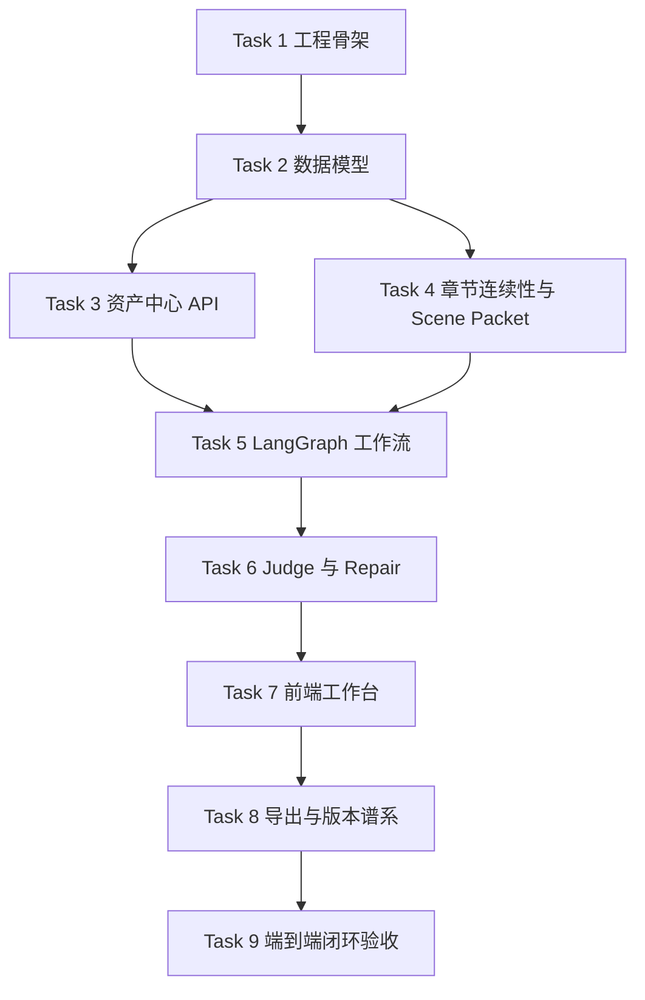

# StoryForge Phase 1 工程实施计划 Implementation Plan

> **面向代理执行者：** 实施本计划时必须使用 `superpowers:subagent-driven-development`（推荐）或 `superpowers:executing-plans` 逐任务执行。每个任务使用复选框跟踪，执行前必须重新生成 `.codex/context-summary-[任务名].md`。

**目标：** 建成 StoryForge 第一阶段闭环：用户创建作品资产，系统生成一章，执行结构化评审和定向修复，用户批准后回写资产，并让下一章继承已批准状态。

**架构：** 采用模块化单体。`apps/api` 是业务真相源和 HTTP API，`apps/workflow` 承载 LangGraph 长任务，`apps/web` 提供 Studio、Refinery、Asset Center 和 Job Center，`packages/shared` 保存跨端契约，`infra` 提供本地 PostgreSQL、Redis、MinIO 和 pgvector。第一阶段不拆微服务，不做团队协作、计费、插件市场和复杂知识图谱。

**技术栈：** Next.js + React + TypeScript、FastAPI + Pydantic + SQLAlchemy + Alembic、LangGraph、PostgreSQL + pgvector、Redis、S3 兼容对象存储、pytest、Vitest、Playwright、PowerShell 本地验证脚本。

---

## 0. 范围与前置门禁

### 0.1 本计划覆盖

- 单用户项目创建。
- 资产真相源：书、章节、场景、角色、设定、风格、伏笔、版本谱系、证据链接。
- 章节连续性：上一章摘要、状态变化、未回收问题、下一章继承约束。
- Scene Packet：为当前生成或精修片段装配上下文。
- 生成工作流：大纲、章节计划、场景 beats、场景草稿。
- 结构化 Judge：输出可执行问题单。
- 定向 Repair：只修失败片段。
- 用户批准后资产回写。
- 下一章读取已批准状态的本地端到端验证。

### 0.2 本计划不覆盖

- 多用户协作、团队工作区、计费、商业化控制。
- 插件市场、第三方扩展框架。
- 有声书、封面生成、营销落地页。
- 全量微服务、独立事件总线平台。
- 学术化重型知识图谱和完全自治 Agent 社会。

### 0.3 每次实施前必须完成

- 读取 `D:/StoryForge/AGENTS.md`。
- 读取 `D:/StoryForge/1-renovel-ai-ai-rag-tavern/docs/superpowers/specs/2026-05-12-dual-mode-ai-novel-platform-design.zh-CN.md`。
- 生成 `.codex/context-summary-[任务名].md`。
- 涉及库或框架时使用 Context7 查询官方文档。
- 涉及通用实现时优先使用 `github.search_code`；工具不可用时记录限制。
- 先写测试，确认失败，再实现，再运行本地验证。

---

## 1. 文件结构规划

后续实施会创建以下路径。当前计划阶段不创建这些代码路径。

```text
D:/StoryForge/1-renovel-ai-ai-rag-tavern/
├── package.json
├── pnpm-workspace.yaml
├── .gitignore
├── .env.example
├── docker-compose.yml
├── scripts/verify-local.ps1
├── scripts/verify-docs.ps1
├── scripts/generate-openapi.ps1
├── apps/web/
├── apps/api/
├── apps/workflow/
├── packages/shared/
├── tests/e2e/
└── docs/api/
```

---

## 2. 任务依赖图



---

### Task 1: 工程骨架与本地验证基线

**Files:**
- Create: `D:/StoryForge/1-renovel-ai-ai-rag-tavern/package.json`
- Create: `D:/StoryForge/1-renovel-ai-ai-rag-tavern/pnpm-workspace.yaml`
- Create: `D:/StoryForge/1-renovel-ai-ai-rag-tavern/.gitignore`
- Create: `D:/StoryForge/1-renovel-ai-ai-rag-tavern/.env.example`
- Create: `D:/StoryForge/1-renovel-ai-ai-rag-tavern/docker-compose.yml`
- Create: `D:/StoryForge/1-renovel-ai-ai-rag-tavern/scripts/verify-local.ps1`
- Create: `D:/StoryForge/1-renovel-ai-ai-rag-tavern/apps/web/package.json`
- Create: `D:/StoryForge/1-renovel-ai-ai-rag-tavern/apps/api/pyproject.toml`
- Create: `D:/StoryForge/1-renovel-ai-ai-rag-tavern/apps/workflow/pyproject.toml`
- Create: `D:/StoryForge/1-renovel-ai-ai-rag-tavern/packages/shared/package.json`

- [ ] **Step 1: 初始化版本控制**

Run:

```powershell
git -C D:/StoryForge/1-renovel-ai-ai-rag-tavern init
git -C D:/StoryForge/1-renovel-ai-ai-rag-tavern status --short --branch
```

Expected: 输出当前分支和未跟踪文件列表。

- [ ] **Step 2: 写本地验证脚本失败检查**

`verify-local.ps1` 必须检查 Node、pnpm、Python、Docker、PostgreSQL 容器、Redis 容器和计划文件存在性。

Run:

```powershell
powershell -ExecutionPolicy Bypass -File D:/StoryForge/1-renovel-ai-ai-rag-tavern/scripts/verify-local.ps1
```

Expected: 初次执行在缺少工作区文件时失败，并明确指出缺失文件。

- [ ] **Step 3: 创建 monorepo 基础文件**

根 `package.json` 必须包含脚本键：`verify`、`test`、`test:web`、`test:api`、`test:workflow`、`e2e`、`openapi`。`pnpm-workspace.yaml` 必须包含 `apps/*` 和 `packages/*`。

- [ ] **Step 4: 创建本地依赖编排**

`docker-compose.yml` 必须包含服务：`postgres`、`redis`、`minio`。PostgreSQL 镜像必须支持 pgvector，数据库名使用 `storyforge`。

- [ ] **Step 5: 运行基线验证**

Run:

```powershell
pnpm install
pnpm verify
```

Expected: `pnpm verify` 调用 `scripts/verify-local.ps1`，所有环境检查通过。

- [ ] **Step 6: 提交骨架**

Run:

```powershell
git -C D:/StoryForge/1-renovel-ai-ai-rag-tavern add package.json pnpm-workspace.yaml .gitignore .env.example docker-compose.yml scripts apps packages
git -C D:/StoryForge/1-renovel-ai-ai-rag-tavern commit -m "计划：建立 StoryForge 工程骨架"
```

Expected: 生成一个只包含工程骨架和验证脚本的提交。

---

### Task 2: 后端领域模型与数据库迁移

**Files:**
- Create: `D:/StoryForge/1-renovel-ai-ai-rag-tavern/apps/api/app/domains/books/models.py`
- Create: `D:/StoryForge/1-renovel-ai-ai-rag-tavern/apps/api/app/domains/assets/models.py`
- Create: `D:/StoryForge/1-renovel-ai-ai-rag-tavern/apps/api/app/domains/continuity/models.py`
- Create: `D:/StoryForge/1-renovel-ai-ai-rag-tavern/apps/api/app/domains/judge/models.py`
- Create: `D:/StoryForge/1-renovel-ai-ai-rag-tavern/apps/api/app/domains/jobs/models.py`
- Create: `D:/StoryForge/1-renovel-ai-ai-rag-tavern/apps/api/tests/test_domain_schema.py`

- [ ] **Step 1: 写领域模型失败测试**

测试必须验证以下实体存在并可建立关系：`Book`、`Chapter`、`Scene`、`Asset`、`ContinuityRecord`、`ScenePacket`、`JudgeIssue`、`RepairPatch`、`JobRun`、`EvidenceLink`。

Run:

```powershell
cd D:/StoryForge/1-renovel-ai-ai-rag-tavern/apps/api
uv run pytest tests/test_domain_schema.py -q
```

Expected: FAIL，原因是模型文件尚不存在。

- [ ] **Step 2: 实现模型与迁移**

使用 SQLAlchemy 显式建模。关系数据库是业务真相源；向量索引只作为检索加速器。每个实体必须包含 `id`、`created_at`、`updated_at`，版本类实体必须包含 `version`。

- [ ] **Step 3: 生成迁移并验证**

Run:

```powershell
cd D:/StoryForge/1-renovel-ai-ai-rag-tavern/apps/api
uv run alembic revision --autogenerate -m "创建 Phase 1 领域模型"
uv run alembic upgrade head
uv run pytest tests/test_domain_schema.py -q
```

Expected: pytest PASS，迁移后数据库包含 Phase 1 所有表。

- [ ] **Step 4: 提交领域模型**

Run:

```powershell
git -C D:/StoryForge/1-renovel-ai-ai-rag-tavern add apps/api
git -C D:/StoryForge/1-renovel-ai-ai-rag-tavern commit -m "计划：建立资产真相源数据模型"
```

Expected: 提交包含模型、迁移和测试。

---

### Task 3: 资产中心 API

**Files:**
- Create: `D:/StoryForge/1-renovel-ai-ai-rag-tavern/apps/api/app/domains/assets/router.py`
- Create: `D:/StoryForge/1-renovel-ai-ai-rag-tavern/apps/api/app/domains/assets/schemas.py`
- Create: `D:/StoryForge/1-renovel-ai-ai-rag-tavern/apps/api/app/domains/assets/service.py`
- Create: `D:/StoryForge/1-renovel-ai-ai-rag-tavern/apps/api/tests/test_assets_api.py`
- Modify: `D:/StoryForge/1-renovel-ai-ai-rag-tavern/apps/api/app/main.py`

- [ ] **Step 1: 写资产 API 失败测试**

测试必须覆盖：创建角色资产、创建地点资产、创建风格规则、查询作品资产列表、更新资产版本、读取资产变更历史。

Run:

```powershell
cd D:/StoryForge/1-renovel-ai-ai-rag-tavern/apps/api
uv run pytest tests/test_assets_api.py -q
```

Expected: FAIL，原因是 `/api/assets` 路由尚不存在。

- [ ] **Step 2: 实现 APIRouter**

路由前缀使用 `/api/assets`。响应体必须使用 Pydantic schema。每次更新资产必须新建版本记录，不覆盖历史。

- [ ] **Step 3: 更新 OpenAPI 契约**

Run:

```powershell
powershell -ExecutionPolicy Bypass -File D:/StoryForge/1-renovel-ai-ai-rag-tavern/scripts/generate-openapi.ps1
```

Expected: 生成 `D:/StoryForge/1-renovel-ai-ai-rag-tavern/packages/shared/src/contracts/storyforge.openapi.json`。

- [ ] **Step 4: 运行 API 验证**

Run:

```powershell
cd D:/StoryForge/1-renovel-ai-ai-rag-tavern/apps/api
uv run pytest tests/test_assets_api.py tests/test_domain_schema.py -q
```

Expected: 全部 PASS。

- [ ] **Step 5: 提交资产 API**

Run:

```powershell
git -C D:/StoryForge/1-renovel-ai-ai-rag-tavern add apps/api packages/shared
git -C D:/StoryForge/1-renovel-ai-ai-rag-tavern commit -m "计划：实现资产中心 API"
```

Expected: 提交包含路由、schema、服务、测试和 OpenAPI 契约。

---

### Task 4: 章节连续性与 Scene Packet

**Files:**
- Create: `D:/StoryForge/1-renovel-ai-ai-rag-tavern/apps/api/app/domains/continuity/router.py`
- Create: `D:/StoryForge/1-renovel-ai-ai-rag-tavern/apps/api/app/domains/continuity/service.py`
- Create: `D:/StoryForge/1-renovel-ai-ai-rag-tavern/apps/api/app/domains/scene_packets/router.py`
- Create: `D:/StoryForge/1-renovel-ai-ai-rag-tavern/apps/api/app/domains/scene_packets/service.py`
- Create: `D:/StoryForge/1-renovel-ai-ai-rag-tavern/apps/api/tests/test_scene_packet.py`

- [ ] **Step 1: 写 Scene Packet 失败测试**

测试输入必须包含 `book_id`、`chapter_id`、`scene_goal`、`active_asset_ids`、`token_budget`。期望输出必须包含固定槽位：章节目标、活跃角色、关系状态、未回收伏笔、风格规则、必须包含事实、必须规避事实、用户意图、证据链接。

Run:

```powershell
cd D:/StoryForge/1-renovel-ai-ai-rag-tavern/apps/api
uv run pytest tests/test_scene_packet.py -q
```

Expected: FAIL，原因是 Scene Packet 服务尚不存在。

- [ ] **Step 2: 实现章节连续性记录**

每章批准后必须记录：上一章摘要、角色状态变化、伏笔变化、风格漂移、下一章继承约束。

- [ ] **Step 3: 实现 Scene Packet 组装**

组装逻辑必须先取结构化资产和摘要，再按预算加入检索片段。超过预算时优先保留硬约束和活跃角色状态。

- [ ] **Step 4: 运行预算与证据测试**

Run:

```powershell
cd D:/StoryForge/1-renovel-ai-ai-rag-tavern/apps/api
uv run pytest tests/test_scene_packet.py -q
```

Expected: PASS，并验证输出包含证据链接和预算统计。

- [ ] **Step 5: 提交连续性与 Scene Packet**

Run:

```powershell
git -C D:/StoryForge/1-renovel-ai-ai-rag-tavern add apps/api
git -C D:/StoryForge/1-renovel-ai-ai-rag-tavern commit -m "计划：实现章节连续性和场景上下文包"
```

Expected: 提交包含连续性服务、Scene Packet 服务和测试。

---

### Task 5: LangGraph 生成工作流

**Files:**
- Create: `D:/StoryForge/1-renovel-ai-ai-rag-tavern/apps/workflow/storyforge_workflow/state.py`
- Create: `D:/StoryForge/1-renovel-ai-ai-rag-tavern/apps/workflow/storyforge_workflow/graph.py`
- Create: `D:/StoryForge/1-renovel-ai-ai-rag-tavern/apps/workflow/storyforge_workflow/nodes/director.py`
- Create: `D:/StoryForge/1-renovel-ai-ai-rag-tavern/apps/workflow/storyforge_workflow/nodes/scene_architect.py`
- Create: `D:/StoryForge/1-renovel-ai-ai-rag-tavern/apps/workflow/storyforge_workflow/nodes/draft_writer.py`
- Create: `D:/StoryForge/1-renovel-ai-ai-rag-tavern/apps/workflow/storyforge_workflow/persistence.py`
- Create: `D:/StoryForge/1-renovel-ai-ai-rag-tavern/apps/workflow/tests/test_generation_graph.py`

- [ ] **Step 1: 写工作流失败测试**

测试必须验证工作流状态从 `premise_received` 依次进入 `outline_created`、`chapter_plan_created`、`scene_beats_created`、`draft_created`，并在用户审批点暂停。

Run:

```powershell
cd D:/StoryForge/1-renovel-ai-ai-rag-tavern/apps/workflow
uv run pytest tests/test_generation_graph.py -q
```

Expected: FAIL，原因是工作流图尚不存在。

- [ ] **Step 2: 实现 LangGraph 状态和节点**

节点必须保持单一职责：Book Director 只产出全书策略，Scene Architect 只产出章节计划和场景 beats，Draft Writer 只基于 Scene Packet 生成片段。

- [ ] **Step 3: 实现 checkpoint 与 interrupt**

工作流必须保存 `thread_id`、`job_run_id`、当前节点、输入摘要、输出摘要和审批状态。人工审批点使用 LangGraph interrupt 机制。

- [ ] **Step 4: 运行恢复测试**

Run:

```powershell
cd D:/StoryForge/1-renovel-ai-ai-rag-tavern/apps/workflow
uv run pytest tests/test_generation_graph.py -q
```

Expected: PASS，并证明中断后可以用相同 `thread_id` 恢复。

- [ ] **Step 5: 提交工作流**

Run:

```powershell
git -C D:/StoryForge/1-renovel-ai-ai-rag-tavern add apps/workflow
git -C D:/StoryForge/1-renovel-ai-ai-rag-tavern commit -m "计划：实现可恢复生成工作流"
```

Expected: 提交包含工作流状态、节点、持久化和测试。

---

### Task 6: 结构化 Judge 与定向 Repair

**Files:**
- Create: `D:/StoryForge/1-renovel-ai-ai-rag-tavern/apps/api/app/domains/judge/router.py`
- Create: `D:/StoryForge/1-renovel-ai-ai-rag-tavern/apps/api/app/domains/judge/service.py`
- Create: `D:/StoryForge/1-renovel-ai-ai-rag-tavern/apps/api/app/domains/repair/router.py`
- Create: `D:/StoryForge/1-renovel-ai-ai-rag-tavern/apps/api/app/domains/repair/service.py`
- Create: `D:/StoryForge/1-renovel-ai-ai-rag-tavern/apps/api/tests/test_judge_repair.py`

- [ ] **Step 1: 写 Judge/Repair 失败测试**

测试必须提供一个包含设定冲突和文风漂移的章节片段。Judge 必须输出结构化问题单，Repair 必须只返回失败 span 的补丁。

Run:

```powershell
cd D:/StoryForge/1-renovel-ai-ai-rag-tavern/apps/api
uv run pytest tests/test_judge_repair.py -q
```

Expected: FAIL，原因是 Judge 和 Repair 服务尚不存在。

- [ ] **Step 2: 实现 JudgeIssue 契约**

问题单字段必须包含：`category`、`severity`、`span_start`、`span_end`、`summary`、`evidence_links`、`recommended_repair_mode`、`status`。

- [ ] **Step 3: 实现 RepairPatch 契约**

补丁字段必须包含：`issue_id`、`target_span`、`replacement_text`、`reason`、`requires_rejudge`。Repair 不得修改未命中的健康文本。

- [ ] **Step 4: 运行重新评审测试**

Run:

```powershell
cd D:/StoryForge/1-renovel-ai-ai-rag-tavern/apps/api
uv run pytest tests/test_judge_repair.py -q
```

Expected: PASS，并验证 Repair 后状态回到 `requires_rejudge`。

- [ ] **Step 5: 提交 Judge/Repair**

Run:

```powershell
git -C D:/StoryForge/1-renovel-ai-ai-rag-tavern add apps/api
git -C D:/StoryForge/1-renovel-ai-ai-rag-tavern commit -m "计划：实现结构化评审和定向修复"
```

Expected: 提交包含 Judge/Repair 路由、服务和测试。

---

### Task 7: 前端 Studio、Refinery、Asset Center 与 Job Center

**Files:**
- Create: `D:/StoryForge/1-renovel-ai-ai-rag-tavern/apps/web/app/studio/page.tsx`
- Create: `D:/StoryForge/1-renovel-ai-ai-rag-tavern/apps/web/app/refinery/page.tsx`
- Create: `D:/StoryForge/1-renovel-ai-ai-rag-tavern/apps/web/app/assets/page.tsx`
- Create: `D:/StoryForge/1-renovel-ai-ai-rag-tavern/apps/web/app/jobs/page.tsx`
- Create: `D:/StoryForge/1-renovel-ai-ai-rag-tavern/apps/web/components/scene-packet/ScenePacketPanel.tsx`
- Create: `D:/StoryForge/1-renovel-ai-ai-rag-tavern/apps/web/components/judge-panel/JudgeIssueList.tsx`
- Create: `D:/StoryForge/1-renovel-ai-ai-rag-tavern/apps/web/components/diff-viewer/RepairDiffViewer.tsx`
- Create: `D:/StoryForge/1-renovel-ai-ai-rag-tavern/apps/web/tests/phase1-navigation.test.tsx`

- [ ] **Step 1: 写导航失败测试**

测试必须验证首页可进入 Studio、Refinery、Asset Center、Job Center，且每页有明确中文标题。

Run:

```powershell
cd D:/StoryForge/1-renovel-ai-ai-rag-tavern/apps/web
pnpm test phase1-navigation
```

Expected: FAIL，原因是页面尚不存在。

- [ ] **Step 2: 实现页面骨架**

页面必须使用中文文案。Studio 展示生成链，Refinery 展示源文本、候选文本、问题单和补丁，Asset Center 展示资产列表和版本，Job Center 展示任务状态和恢复入口。

- [ ] **Step 3: 实现前端组件测试**

测试必须覆盖：Scene Packet 展示证据链接，JudgeIssueList 展示严重级别和位置，RepairDiffViewer 展示原文与修订文本。

- [ ] **Step 4: 运行前端验证**

Run:

```powershell
cd D:/StoryForge/1-renovel-ai-ai-rag-tavern/apps/web
pnpm test
pnpm lint
```

Expected: 全部 PASS。

- [ ] **Step 5: 提交前端工作台**

Run:

```powershell
git -C D:/StoryForge/1-renovel-ai-ai-rag-tavern add apps/web
git -C D:/StoryForge/1-renovel-ai-ai-rag-tavern commit -m "计划：实现第一阶段创作工作台界面"
```

Expected: 提交包含页面、组件和测试。

---

### Task 8: 导出、版本谱系与资产回写

**Files:**
- Create: `D:/StoryForge/1-renovel-ai-ai-rag-tavern/apps/api/app/domains/exports/router.py`
- Create: `D:/StoryForge/1-renovel-ai-ai-rag-tavern/apps/api/app/domains/exports/service.py`
- Create: `D:/StoryForge/1-renovel-ai-ai-rag-tavern/apps/api/app/domains/books/lineage_service.py`
- Create: `D:/StoryForge/1-renovel-ai-ai-rag-tavern/apps/api/tests/test_approval_writeback.py`
- Create: `D:/StoryForge/1-renovel-ai-ai-rag-tavern/apps/api/tests/test_exports.py`

- [ ] **Step 1: 写批准回写失败测试**

测试必须模拟用户批准修复后的章节文本，验证系统创建版本谱系、资产差异、章节连续性记录和证据链接。

Run:

```powershell
cd D:/StoryForge/1-renovel-ai-ai-rag-tavern/apps/api
uv run pytest tests/test_approval_writeback.py -q
```

Expected: FAIL，原因是批准回写服务尚不存在。

- [ ] **Step 2: 实现批准回写服务**

批准动作必须是事务性操作：写入最终章节版本、写入差异摘要、更新资产状态、创建 EvidenceLink、创建 ContinuityRecord。

- [ ] **Step 3: 写导出失败测试**

测试必须验证 Markdown 导出包含书名、章节标题和已批准正文。EPUB 导出可在 Phase 1 使用本地库生成最小有效文件。

Run:

```powershell
cd D:/StoryForge/1-renovel-ai-ai-rag-tavern/apps/api
uv run pytest tests/test_exports.py -q
```

Expected: 初次 FAIL，原因是导出服务尚不存在。

- [ ] **Step 4: 实现导出服务并验证**

Run:

```powershell
cd D:/StoryForge/1-renovel-ai-ai-rag-tavern/apps/api
uv run pytest tests/test_approval_writeback.py tests/test_exports.py -q
```

Expected: 全部 PASS。

- [ ] **Step 5: 提交回写和导出**

Run:

```powershell
git -C D:/StoryForge/1-renovel-ai-ai-rag-tavern add apps/api
git -C D:/StoryForge/1-renovel-ai-ai-rag-tavern commit -m "计划：实现批准回写和导出链路"
```

Expected: 提交包含回写、版本谱系、导出和测试。

---

### Task 9: 端到端闭环验收

**Files:**
- Create: `D:/StoryForge/1-renovel-ai-ai-rag-tavern/tests/e2e/phase1-closed-loop.spec.ts`
- Create: `D:/StoryForge/1-renovel-ai-ai-rag-tavern/docs/api/phase1-openapi-review.md`
- Modify: `D:/StoryForge/1-renovel-ai-ai-rag-tavern/.codex/verification-report.md`
- Modify: `D:/StoryForge/1-renovel-ai-ai-rag-tavern/.codex/operations-log.md`

- [ ] **Step 1: 写端到端失败测试**

Playwright 测试必须执行：创建作品、创建角色和风格资产、生成第一章、查看 Scene Packet、执行 Judge、应用 Repair、批准结果、生成下一章并验证继承上一章状态。

Run:

```powershell
cd D:/StoryForge/1-renovel-ai-ai-rag-tavern
pnpm e2e tests/e2e/phase1-closed-loop.spec.ts
```

Expected: 初次 FAIL，原因是端到端页面和 API 尚未全部联通。

- [ ] **Step 2: 联通 API、工作流和前端**

前端必须通过 API 启动任务、读取任务状态、显示 Scene Packet、显示 Judge 问题、显示 Repair diff、提交批准动作。

- [ ] **Step 3: 执行全量本地验证**

Run:

```powershell
cd D:/StoryForge/1-renovel-ai-ai-rag-tavern
pnpm verify
pnpm test
pnpm e2e
```

Expected: 全部 PASS，报告中必须记录测试数量和失败数量为 0。

- [ ] **Step 4: 更新验证报告**

`.codex/verification-report.md` 必须包含：需求覆盖、交付物映射、本地命令、输出摘要、技术评分、战略评分、综合评分和通过/退回/需讨论建议。

- [ ] **Step 5: 提交闭环验收**

Run:

```powershell
git -C D:/StoryForge/1-renovel-ai-ai-rag-tavern add tests docs .codex apps packages scripts
git -C D:/StoryForge/1-renovel-ai-ai-rag-tavern commit -m "计划：完成第一阶段闭环验收"
```

Expected: 提交包含端到端测试、验证报告和必要联通代码。

---

## 3. 统一验收标准

第一阶段只有在以下全部条件满足时才算完成：

- `pnpm verify` 通过。
- `pnpm test` 通过。
- `pnpm e2e` 通过。
- API OpenAPI 文件已生成并被前端契约测试使用。
- 数据库迁移可从空库执行到最新版本。
- 端到端测试证明下一章继承已批准修改。
- `.codex/verification-report.md` 综合评分不低于 90，建议为“通过”。
- `.codex/operations-log.md` 记录工具限制、偏离原因和验证结果。

---

## 4. 实施风险与控制

- **风险：第一阶段范围过大。** 控制方式：严格按 Task 1 到 Task 9 顺序推进，不提前做协作、计费、插件和复杂图谱。
- **风险：LLM 输出不可稳定复现。** 控制方式：测试环境使用固定假模型或本地 stub，真实模型只进入手工冒烟验证。
- **风险：Scene Packet 上下文膨胀。** 控制方式：每次组包记录 token 预算、丢弃原因和保留优先级。
- **风险：Judge 只输出自然语言。** 控制方式：JudgeIssue schema 作为硬约束，测试必须验证字段完整性。
- **风险：Repair 修改健康文本。** 控制方式：RepairPatch 必须绑定 span，测试必须证明健康文本不变。
- **风险：当前仓库不是 git 仓库。** 控制方式：Task 1 首步初始化 git；若用户不允许初始化，必须在 `.codex/operations-log.md` 记录并跳过提交步骤。

---

## 5. 自审结果

- 规格覆盖：本计划覆盖中文主规格中的自动成书、精修工作台、资产中心、Scene Packet、结构化评审、定向修复、可靠回写和 AGENTS 门禁。
- 外部方案吸收：已将 Sudowrite、Novelcrafter、InkOS、autonovel、NovelGenerator、Re3、DOC、DOME、StoryWriter 和 LangGraph 的可借鉴机制转成 Phase 1 工程任务。
- 类型一致性：计划中的核心实体名称在数据模型、API、工作流、前端和端到端测试中保持一致。
- 范围控制：不引入多用户协作、计费、插件市场、有声书、封面、营销页、全量微服务和复杂自治 Agent 社会。
- 验证路径：每个任务都有本地命令和预期结果，最终以 `pnpm verify`、`pnpm test`、`pnpm e2e` 收敛。

---

## 6. 执行交接

Plan complete and saved to `docs/superpowers/plans/2026-05-12-storyforge-phase1-engineering-plan.md`. Two execution options:

**1. Subagent-Driven（推荐）** - 每个任务派发独立子代理执行，任务之间做审查和验证，适合 Task 1 到 Task 9 的分阶段落地。

**2. Inline Execution** - 在当前会话中使用 `superpowers:executing-plans` 批量执行，并在每个任务后做检查点。

选择执行方式前，请先确认是否允许 Task 1 初始化 git 仓库和创建代码工程目录。
