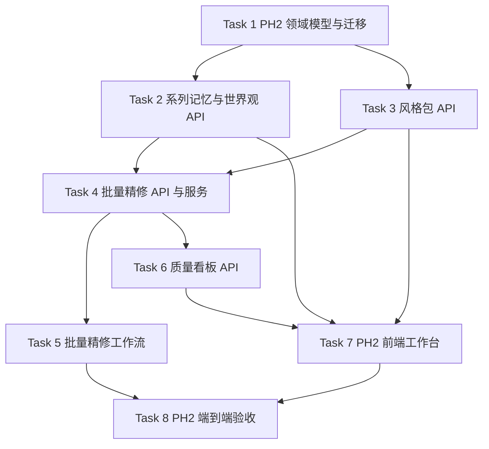

# StoryForge Phase 2 工程实施计划 Implementation Plan

> **面向代理执行者：** 实施本计划时必须使用 `superpowers:executing-plans` 逐任务执行。当前 Codex 工具约束禁止在未获用户明确授权时派生 subagent，因此默认采用当前会话内联执行。每个任务使用复选框跟踪，执行前必须重新生成对应 `.codex/context-summary-[任务名].md`。

**目标：** 在 Phase 1 强闭环基础上交付系列级记忆、完整世界观中心、批量精修、风格包复用和质量看板，并保持所有链路本地可验证。

**架构：** 继续采用模块化单体。`apps/api` 承载结构化真相源和 HTTP 契约，`apps/workflow` 承载批量精修长任务，`apps/web` 提供 PH2 工作台入口和面板，`packages/shared` 保存生成后的 OpenAPI 契约。PH2 不引入微服务、插件平台、团队协作或商业化能力。

**Tech Stack:** Next.js App Router + React + TypeScript、FastAPI + Pydantic + SQLAlchemy + Alembic、LangGraph、PostgreSQL/SQLite 测试库、pytest、Node 内置测试、PowerShell 本地验证脚本。

---

## 0. 范围、门禁与依赖图

### 0.1 本计划覆盖

- 系列级记忆：系列、系列作品归属、跨书记忆快照和下一本继承约束。
- 完整世界观中心：术语、组织、物件、地点、规则等世界观条目的结构化 API 和前端入口。
- 批量精修：按场景批量创建评审、修复补丁和任务进度，工作流可暂停可恢复。
- 风格包复用：把风格规则组合为可版本化风格包，并允许作品或场景应用风格包。
- 更丰富的质量看板：统计 Judge 失败类别、修复率、接受率、未回收 open loop 和批量任务状态。
- PH2 本地端到端验收：使用真实 FastAPI TestClient 串联世界观、风格包、批量精修和质量看板。

### 0.2 本计划不覆盖

- 多用户团队工作区、协作审批、权限体系、计费和商业化控制。
- 插件市场或第三方模型接入层。
- 真实 LLM/Embedding/Reranker 调用；所有测试使用确定性本地规则。
- 生产级异步队列部署；本阶段保留可替换的本地工作流和数据库记录边界。

### 0.3 任务依赖图



### 0.4 编码前固定检查

- 读取 `D:/StoryForge/AGENTS.md`。
- 读取 `.codex/context-summary-ph2-plan.md`。
- 执行文件名和内容检索，至少确认 3 个相似实现。
- 当前会话若仍无 `context7`、`github.search_code`、`desktop-commander`、`sequential-thinking`、`shrimp-task-manager`，必须在 `.codex/operations-log.md` 记录替代方法。
- 先写失败测试，再实现，再运行本地验证。

---

## 1. 文件结构规划

```text
apps/api/app/domains/series/
├── __init__.py
├── models.py
├── router.py
├── schemas.py
└── service.py
apps/api/app/domains/worldbuilding/
├── __init__.py
├── router.py
├── schemas.py
└── service.py
apps/api/app/domains/style_packs/
├── __init__.py
├── router.py
├── schemas.py
└── service.py
apps/api/app/domains/batch_refinement/
├── __init__.py
├── router.py
├── schemas.py
└── service.py
apps/api/app/domains/quality/
├── __init__.py
├── router.py
├── schemas.py
└── service.py
apps/api/tests/
├── test_phase2_domain_schema.py
├── test_series_worldbuilding_api.py
├── test_style_packs_api.py
├── test_batch_refinement_api.py
├── test_quality_dashboard_api.py
└── test_phase2_closed_loop_api.py
apps/workflow/storyforge_workflow/
├── batch_refinement_graph.py
└── nodes/batch_refiner.py
apps/workflow/tests/test_batch_refinement_graph.py
apps/web/app/worldbuilding/page.tsx
apps/web/app/style-packs/page.tsx
apps/web/app/batch-refinement/page.tsx
apps/web/app/quality/page.tsx
apps/web/components/phase2/SeriesMemoryPanel.tsx
apps/web/components/phase2/WorldbuildingCenter.tsx
apps/web/components/phase2/StylePackPanel.tsx
apps/web/components/phase2/BatchRefinementBoard.tsx
apps/web/components/phase2/QualityDashboard.tsx
apps/web/tests/phase2-navigation.test.tsx
```

---

## Task 1: PH2 领域模型与迁移

**Files:**
- Create: `apps/api/app/domains/series/models.py`
- Create: `apps/api/app/domains/series/__init__.py`
- Modify: `apps/api/app/domains/books/models.py`
- Modify: `apps/api/app/models.py`
- Create: `apps/api/tests/test_phase2_domain_schema.py`
- Create: `apps/api/alembic/versions/20260514_phase2_创建_phase_2_领域模型.py`

- [ ] **Step 1: 写失败测试**

创建 `apps/api/tests/test_phase2_domain_schema.py`：

```python
from __future__ import annotations

from sqlalchemy.orm import RelationshipProperty

from app.db.base import Base
from app.domains.series.models import Series, SeriesBook, SeriesMemorySnapshot, StylePackApplication

PH2_ENTITY_CLASSES = (Series, SeriesBook, SeriesMemorySnapshot, StylePackApplication)

EXPECTED_TABLES = {
    "series",
    "series_books",
    "series_memory_snapshots",
    "style_pack_applications",
}


def test_phase2_entities_are_registered() -> None:
    assert {entity.__name__ for entity in PH2_ENTITY_CLASSES} == {
        "Series",
        "SeriesBook",
        "SeriesMemorySnapshot",
        "StylePackApplication",
    }
    assert EXPECTED_TABLES.issubset(set(Base.metadata.tables))


def test_phase2_entities_have_common_columns() -> None:
    for entity in PH2_ENTITY_CLASSES:
        columns = entity.__table__.columns
        assert "id" in columns, entity.__name__
        assert "created_at" in columns, entity.__name__
        assert "updated_at" in columns, entity.__name__


def test_phase2_versioned_entities_have_version_column() -> None:
    assert "version" in SeriesMemorySnapshot.__table__.columns
    assert "version" in StylePackApplication.__table__.columns


def test_series_relationship_chain() -> None:
    assert isinstance(Series.__mapper__.relationships["books"], RelationshipProperty)
    assert isinstance(SeriesBook.__mapper__.relationships["series"], RelationshipProperty)
    assert isinstance(SeriesBook.__mapper__.relationships["book"], RelationshipProperty)
    assert isinstance(SeriesMemorySnapshot.__mapper__.relationships["series"], RelationshipProperty)
    assert isinstance(StylePackApplication.__mapper__.relationships["style_pack_asset"], RelationshipProperty)


def test_phase2_domain_modules_configure_mappers_independently() -> None:
    import subprocess
    import sys

    modules = [
        "app.domains.series.models",
    ]
    for module_name in modules:
        script = (
            "from sqlalchemy.orm import configure_mappers\\n"
            f"__import__({module_name!r})\\n"
            "configure_mappers()\\n"
            f"print('已完成独立映射配置: {module_name}')\\n"
        )
        completed = subprocess.run([sys.executable, "-c", script], check=True, capture_output=True, text=True)
        assert module_name in completed.stdout
```

Run:

```powershell
cd C:/Users/kanye/.config/superpowers/worktrees/1-renovel-ai-ai-rag-tavern/ph2-plan/apps/api
uv run pytest tests/test_phase2_domain_schema.py -q
```

Expected: FAIL，原因是 `app.domains.series.models` 尚不存在。

- [ ] **Step 2: 实现模型**

创建 `apps/api/app/domains/series/models.py`，模型必须包含：

```python
from __future__ import annotations

from typing import TYPE_CHECKING

from sqlalchemy import ForeignKey, Integer, JSON, String, Text, UniqueConstraint
from sqlalchemy.orm import Mapped, mapped_column, relationship

from app.db.base import Base, IdMixin, TimestampMixin, VersionMixin

if TYPE_CHECKING:
    from app.domains.assets.models import Asset
    from app.domains.books.models import Book
    from app.domains.continuity.models import ContinuityRecord
    from app.domains.jobs.models import JobRun


class Series(IdMixin, TimestampMixin, Base):
    """系列根实体，承载跨作品记忆、世界观约束和风格复用边界。"""

    __tablename__ = "series"

    title: Mapped[str] = mapped_column(String(255), nullable=False)
    status: Mapped[str] = mapped_column(String(50), nullable=False, default="active", server_default="active")
    premise: Mapped[str | None] = mapped_column(Text)
    payload: Mapped[dict] = mapped_column(JSON, nullable=False, default=dict)

    books: Mapped[list[SeriesBook]] = relationship(back_populates="series", cascade="all, delete-orphan")
    memory_snapshots: Mapped[list[SeriesMemorySnapshot]] = relationship(back_populates="series", cascade="all, delete-orphan")
    style_pack_applications: Mapped[list[StylePackApplication]] = relationship(back_populates="series")


class SeriesBook(IdMixin, TimestampMixin, Base):
    """记录作品在系列中的顺序和继承策略。"""

    __tablename__ = "series_books"
    __table_args__ = (UniqueConstraint("series_id", "book_id", name="uq_series_books_series_book"),)

    series_id: Mapped[int] = mapped_column(ForeignKey("series.id", ondelete="CASCADE"), index=True, nullable=False)
    book_id: Mapped[int] = mapped_column(ForeignKey("books.id", ondelete="CASCADE"), index=True, nullable=False)
    ordinal: Mapped[int] = mapped_column(Integer, nullable=False)
    inheritance_policy: Mapped[str] = mapped_column(String(80), nullable=False, default="inherit_active", server_default="inherit_active")
    payload: Mapped[dict] = mapped_column(JSON, nullable=False, default=dict)

    series: Mapped[Series] = relationship(back_populates="books")
    book: Mapped[Book] = relationship(back_populates="series_links")


class SeriesMemorySnapshot(IdMixin, TimestampMixin, VersionMixin, Base):
    """系列记忆快照保存跨作品事实摘要，来源仍需指向结构化资产或连续性记录。"""

    __tablename__ = "series_memory_snapshots"

    series_id: Mapped[int] = mapped_column(ForeignKey("series.id", ondelete="CASCADE"), index=True, nullable=False)
    book_id: Mapped[int | None] = mapped_column(ForeignKey("books.id", ondelete="SET NULL"), index=True)
    source_continuity_record_id: Mapped[int | None] = mapped_column(ForeignKey("continuity_records.id", ondelete="SET NULL"), index=True)
    job_run_id: Mapped[int | None] = mapped_column(ForeignKey("job_runs.id", ondelete="SET NULL"), index=True)
    snapshot_type: Mapped[str] = mapped_column(String(80), nullable=False)
    subject: Mapped[str] = mapped_column(String(255), nullable=False)
    status: Mapped[str] = mapped_column(String(50), nullable=False, default="active", server_default="active")
    payload: Mapped[dict] = mapped_column(JSON, nullable=False, default=dict)

    series: Mapped[Series] = relationship(back_populates="memory_snapshots")
    book: Mapped[Book | None] = relationship(back_populates="series_memory_snapshots")
    source_continuity_record: Mapped[ContinuityRecord | None] = relationship()
    job_run: Mapped[JobRun | None] = relationship()


class StylePackApplication(IdMixin, TimestampMixin, VersionMixin, Base):
    """记录风格包应用到系列、作品或场景后的版本化约束。"""

    __tablename__ = "style_pack_applications"

    style_pack_asset_id: Mapped[int] = mapped_column(ForeignKey("assets.id", ondelete="CASCADE"), index=True, nullable=False)
    series_id: Mapped[int | None] = mapped_column(ForeignKey("series.id", ondelete="SET NULL"), index=True)
    book_id: Mapped[int | None] = mapped_column(ForeignKey("books.id", ondelete="SET NULL"), index=True)
    scene_id: Mapped[int | None] = mapped_column(ForeignKey("scenes.id", ondelete="SET NULL"), index=True)
    status: Mapped[str] = mapped_column(String(50), nullable=False, default="active", server_default="active")
    payload: Mapped[dict] = mapped_column(JSON, nullable=False, default=dict)

    style_pack_asset: Mapped[Asset] = relationship()
    series: Mapped[Series | None] = relationship(back_populates="style_pack_applications")
    book: Mapped[Book | None] = relationship(back_populates="style_pack_applications")


from app.domains import assets as _assets_domain  # noqa: E402,F401
from app.domains import books as _books_domain  # noqa: E402,F401
from app.domains import continuity as _continuity_domain  # noqa: E402,F401
from app.domains import jobs as _jobs_domain  # noqa: E402,F401
```

同时修改 `Book`，新增 `series_links`、`series_memory_snapshots`、`style_pack_applications` 关系。

- [ ] **Step 3: 注册模型导出**

修改 `apps/api/app/domains/series/__init__.py`：

```python
from app.domains.series.models import Series, SeriesBook, SeriesMemorySnapshot, StylePackApplication

__all__ = ["Series", "SeriesBook", "SeriesMemorySnapshot", "StylePackApplication"]
```

修改 `apps/api/app/models.py`，导入并加入 `__all__`。

- [ ] **Step 4: 生成迁移并验证**

Run:

```powershell
cd C:/Users/kanye/.config/superpowers/worktrees/1-renovel-ai-ai-rag-tavern/ph2-plan/apps/api
uv run alembic revision --autogenerate -m "创建 Phase 2 领域模型"
Rename-Item apps/api/alembic/versions/*_创建_phase_2_领域模型.py 20260514_phase2_创建_phase_2_领域模型.py
uv run alembic upgrade head
uv run pytest tests/test_phase2_domain_schema.py -q
```

Expected: pytest PASS，数据库包含 `series`、`series_books`、`series_memory_snapshots`、`style_pack_applications`。

- [ ] **Step 5: 提交模型任务**

Run:

```powershell
git -C C:/Users/kanye/.config/superpowers/worktrees/1-renovel-ai-ai-rag-tavern/ph2-plan add apps/api/app apps/api/tests apps/api/alembic
git -C C:/Users/kanye/.config/superpowers/worktrees/1-renovel-ai-ai-rag-tavern/ph2-plan commit -m "计划：建立 Phase 2 系列记忆领域模型"
```

---

## Task 2: 系列记忆与世界观 API

**Files:**
- Create: `apps/api/app/domains/series/schemas.py`
- Create: `apps/api/app/domains/series/service.py`
- Create: `apps/api/app/domains/series/router.py`
- Create: `apps/api/app/domains/worldbuilding/__init__.py`
- Create: `apps/api/app/domains/worldbuilding/schemas.py`
- Create: `apps/api/app/domains/worldbuilding/service.py`
- Create: `apps/api/app/domains/worldbuilding/router.py`
- Modify: `apps/api/app/main.py`
- Create: `apps/api/tests/test_series_worldbuilding_api.py`

- [ ] **Step 1: 写失败测试**

`apps/api/tests/test_series_worldbuilding_api.py` 必须覆盖：创建系列、绑定作品、创建世界观条目、更新世界观条目产生新版本、创建系列记忆快照、查询系列记忆摘要。

Run:

```powershell
cd C:/Users/kanye/.config/superpowers/worktrees/1-renovel-ai-ai-rag-tavern/ph2-plan/apps/api
uv run pytest tests/test_series_worldbuilding_api.py -q
```

Expected: FAIL，原因是 `/api/series` 与 `/api/worldbuilding` 路由尚不存在。

- [ ] **Step 2: 实现 Pydantic 契约**

契约字段必须包含：

```python
class SeriesCreate(BaseModel):
    title: str = Field(min_length=1, max_length=255)
    premise: str | None = None
    payload: dict[str, Any] = Field(default_factory=dict)

class SeriesBookAttach(BaseModel):
    book_id: int = Field(gt=0)
    ordinal: int = Field(gt=0)
    inheritance_policy: str = Field(default="inherit_active", min_length=1, max_length=80)
    payload: dict[str, Any] = Field(default_factory=dict)

class SeriesMemorySnapshotCreate(BaseModel):
    series_id: int = Field(gt=0)
    book_id: int | None = Field(default=None, gt=0)
    source_continuity_record_id: int | None = Field(default=None, gt=0)
    snapshot_type: str = Field(min_length=1, max_length=80)
    subject: str = Field(min_length=1, max_length=255)
    payload: dict[str, Any] = Field(default_factory=dict)

class WorldbuildingEntryCreate(BaseModel):
    book_id: int = Field(gt=0)
    entry_type: str = Field(min_length=1, max_length=80)
    name: str = Field(min_length=1, max_length=255)
    payload: dict[str, Any] = Field(default_factory=dict)
```

世界观条目落到 `Asset.asset_type`，允许的 `entry_type` 至少包括 `world_rule`、`term`、`organization`、`object`、`location`、`subplot`。

- [ ] **Step 3: 实现服务层**

服务层必须复用 `Asset` 作为世界观真相源：

- `create_series()`：创建 `Series`。
- `attach_book_to_series()`：校验 `Book` 存在后创建 `SeriesBook`。
- `create_series_memory_snapshot()`：校验系列存在，写入 `SeriesMemorySnapshot`。
- `get_series_memory_summary()`：返回系列、作品列表、最新记忆快照和活跃世界观条目。
- `create_worldbuilding_entry()`：调用或复刻 `create_asset()` 的版本化资产创建模式，`asset_type` 使用 `worldbuilding:{entry_type}`。
- `update_worldbuilding_entry()`：复用 `update_asset()`，确保新版本继承谱系。

- [ ] **Step 4: 实现路由并注册**

路由：

- `POST /api/series`
- `POST /api/series/{series_id}/books`
- `POST /api/series/{series_id}/memory-snapshots`
- `GET /api/series/{series_id}/memory-summary`
- `POST /api/worldbuilding/entries`
- `PATCH /api/worldbuilding/entries/{asset_id}`
- `GET /api/worldbuilding/entries?book_id=...`

修改 `apps/api/app/main.py` 注册 `series_router` 和 `worldbuilding_router`。

- [ ] **Step 5: 运行验证并提交**

Run:

```powershell
cd C:/Users/kanye/.config/superpowers/worktrees/1-renovel-ai-ai-rag-tavern/ph2-plan/apps/api
uv run pytest tests/test_series_worldbuilding_api.py tests/test_assets_api.py -q
cd C:/Users/kanye/.config/superpowers/worktrees/1-renovel-ai-ai-rag-tavern/ph2-plan
pnpm openapi
git add apps/api packages/shared/src/contracts/storyforge.openapi.json
git commit -m "计划：实现系列记忆与世界观中心 API"
```

Expected: API 测试 PASS，OpenAPI 出现 `series` 和 `worldbuilding` 标签。

---

## Task 3: 风格包复用 API

**Files:**
- Create: `apps/api/app/domains/style_packs/__init__.py`
- Create: `apps/api/app/domains/style_packs/schemas.py`
- Create: `apps/api/app/domains/style_packs/service.py`
- Create: `apps/api/app/domains/style_packs/router.py`
- Modify: `apps/api/app/main.py`
- Create: `apps/api/tests/test_style_packs_api.py`

- [ ] **Step 1: 写失败测试**

测试覆盖：创建风格包、追加风格规则版本、应用到系列、应用到作品、读取生效规则。

Run:

```powershell
cd C:/Users/kanye/.config/superpowers/worktrees/1-renovel-ai-ai-rag-tavern/ph2-plan/apps/api
uv run pytest tests/test_style_packs_api.py -q
```

Expected: FAIL，原因是 `/api/style-packs` 路由尚不存在。

- [ ] **Step 2: 实现契约**

风格包本体复用 `Asset`，`asset_type="style_pack"`，payload 固定包含：

```python
{
  "rules": ["保持克制", "减少解释性旁白"],
  "voice": "冷静、具画面感",
  "banned_phrases": ["作者直接解释"],
  "preferred_patterns": ["动作承载情绪"]
}
```

`StylePackApplyCreate` 必须要求 `style_pack_asset_id`，并允许 `series_id`、`book_id`、`scene_id` 三者至少一个存在。

- [ ] **Step 3: 实现服务和路由**

路由：

- `POST /api/style-packs`
- `PATCH /api/style-packs/{asset_id}`
- `POST /api/style-packs/{asset_id}/applications`
- `GET /api/style-packs/effective-rules?book_id=...&scene_id=...`

服务层必须：

- 校验资产类型为 `style_pack`。
- 应用记录写入 `StylePackApplication`。
- 生效规则按场景 > 作品 > 系列顺序合并，去重后返回。

- [ ] **Step 4: 验证并提交**

Run:

```powershell
cd C:/Users/kanye/.config/superpowers/worktrees/1-renovel-ai-ai-rag-tavern/ph2-plan/apps/api
uv run pytest tests/test_style_packs_api.py tests/test_series_worldbuilding_api.py -q
cd C:/Users/kanye/.config/superpowers/worktrees/1-renovel-ai-ai-rag-tavern/ph2-plan
pnpm openapi
git add apps/api packages/shared/src/contracts/storyforge.openapi.json
git commit -m "计划：实现可复用风格包"
```

---

## Task 4: 批量精修 API 与服务

**Files:**
- Create: `apps/api/app/domains/batch_refinement/__init__.py`
- Create: `apps/api/app/domains/batch_refinement/schemas.py`
- Create: `apps/api/app/domains/batch_refinement/service.py`
- Create: `apps/api/app/domains/batch_refinement/router.py`
- Modify: `apps/api/app/main.py`
- Create: `apps/api/tests/test_batch_refinement_api.py`

- [ ] **Step 1: 写失败测试**

测试必须准备一本书、两章、三个场景、一个风格包和一个必含事实；调用批量精修 API 后验证：

- 创建一个 `JobRun(job_type="batch_refinement")`。
- 每个场景生成 JudgeIssue。
- 有问题的场景生成 RepairPatch。
- JobRun `progress` 记录 total、processed、issue_count、patch_count。

Run:

```powershell
cd C:/Users/kanye/.config/superpowers/worktrees/1-renovel-ai-ai-rag-tavern/ph2-plan/apps/api
uv run pytest tests/test_batch_refinement_api.py -q
```

Expected: FAIL，原因是 `/api/batch-refinement/jobs` 路由尚不存在。

- [ ] **Step 2: 实现契约**

`BatchRefinementCreate` 包含：

```python
book_id: int
scene_ids: list[int]
mode: Literal["rewrite", "expand", "polish", "continuity_fix", "style_fix"]
required_facts: list[str]
style_rules: list[str]
```

响应 `BatchRefinementJobRead` 展开 `job_run_id`、`status`、`progress`、`issue_ids`、`patch_ids`。

- [ ] **Step 3: 实现服务层**

服务层复用 `create_judge_issues()` 和 `create_repair_patch()`：

- 为每个 scene 创建或读取最新 Scene Packet。
- 对每个 scene content 执行 Judge。
- 对每个 open issue 创建 RepairPatch。
- 更新 `JobRun.progress`，失败时写 `error_message`。

- [ ] **Step 4: 实现路由并提交**

路由：

- `POST /api/batch-refinement/jobs`
- `GET /api/batch-refinement/jobs/{job_run_id}`

Run:

```powershell
cd C:/Users/kanye/.config/superpowers/worktrees/1-renovel-ai-ai-rag-tavern/ph2-plan/apps/api
uv run pytest tests/test_batch_refinement_api.py tests/test_judge_repair.py -q
cd C:/Users/kanye/.config/superpowers/worktrees/1-renovel-ai-ai-rag-tavern/ph2-plan
pnpm openapi
git add apps/api packages/shared/src/contracts/storyforge.openapi.json
git commit -m "计划：实现批量精修 API"
```

---

## Task 5: 批量精修工作流

**Files:**
- Create: `apps/workflow/storyforge_workflow/nodes/batch_refiner.py`
- Create: `apps/workflow/storyforge_workflow/batch_refinement_graph.py`
- Modify: `apps/workflow/storyforge_workflow/__init__.py`
- Create: `apps/workflow/tests/test_batch_refinement_graph.py`

- [ ] **Step 1: 写失败测试**

测试要求：批量精修图按 `load_batch -> judge_scenes -> propose_repairs -> human_approval` 推进，在审批点暂停；恢复后状态为 approved，并记录检查点。

Run:

```powershell
cd C:/Users/kanye/.config/superpowers/worktrees/1-renovel-ai-ai-rag-tavern/ph2-plan/apps/workflow
uv run pytest tests/test_batch_refinement_graph.py -q
```

Expected: FAIL，原因是 `create_batch_refinement_graph` 尚不存在。

- [ ] **Step 2: 实现状态和节点**

批量状态必须是 JSON 可序列化 dict，字段包含：

```python
thread_id: str
job_run_id: str
book_id: int
scene_ids: list[int]
mode: str
required_facts: list[str]
style_rules: list[str]
current_status: str
status_history: list[str]
scene_results: list[dict[str, object]]
approval_status: str
```

节点必须确定性输出，不调用外部 LLM。

- [ ] **Step 3: 实现 LangGraph 图**

图结构：

```text
START -> load_batch -> judge_scenes -> propose_repairs -> human_approval -> END
```

复用 `InMemoryWorkflowStore` 和 `_approval_status` 的语义，人工审批 payload 必须包含 `job_run_id`、`scene_count`、`issue_count`、`patch_count`。

- [ ] **Step 4: 验证并提交**

Run:

```powershell
cd C:/Users/kanye/.config/superpowers/worktrees/1-renovel-ai-ai-rag-tavern/ph2-plan/apps/workflow
uv run pytest tests/test_batch_refinement_graph.py tests/test_generation_graph.py -q
uv run python -m compileall storyforge_workflow tests
git -C C:/Users/kanye/.config/superpowers/worktrees/1-renovel-ai-ai-rag-tavern/ph2-plan add apps/workflow
git -C C:/Users/kanye/.config/superpowers/worktrees/1-renovel-ai-ai-rag-tavern/ph2-plan commit -m "计划：实现批量精修工作流"
```

---

## Task 6: 质量看板 API

**Files:**
- Create: `apps/api/app/domains/quality/__init__.py`
- Create: `apps/api/app/domains/quality/schemas.py`
- Create: `apps/api/app/domains/quality/service.py`
- Create: `apps/api/app/domains/quality/router.py`
- Modify: `apps/api/app/main.py`
- Create: `apps/api/tests/test_quality_dashboard_api.py`

- [ ] **Step 1: 写失败测试**

测试准备 JudgeIssue、RepairPatch、JobRun、ContinuityRecord 后，调用 `GET /api/quality/books/{book_id}/dashboard`，验证返回：

- `issue_count_by_category`
- `repair_success_rate`
- `user_acceptance_rate`
- `open_loop_count`
- `batch_job_status_counts`
- `latest_quality_events`

Run:

```powershell
cd C:/Users/kanye/.config/superpowers/worktrees/1-renovel-ai-ai-rag-tavern/ph2-plan/apps/api
uv run pytest tests/test_quality_dashboard_api.py -q
```

Expected: FAIL，原因是质量看板路由尚不存在。

- [ ] **Step 2: 实现聚合服务**

质量看板只读聚合现有表，不新增指标表：

- Judge 失败类别：按 `JudgeIssue.issue_type` 分组。
- 修复率：`RepairPatch.status in ("accepted", "requires_rejudge")` / 全部 patch。
- 接受率：批准章节数量 / 有正文场景数量。
- Open loop：`ContinuityRecord.record_type="next_chapter_constraints"` 且状态 active 的数量。
- 批量任务：按 `JobRun.job_type="batch_refinement"` 和 status 分组。

- [ ] **Step 3: 实现路由、OpenAPI 与提交**

Run:

```powershell
cd C:/Users/kanye/.config/superpowers/worktrees/1-renovel-ai-ai-rag-tavern/ph2-plan/apps/api
uv run pytest tests/test_quality_dashboard_api.py tests/test_batch_refinement_api.py -q
cd C:/Users/kanye/.config/superpowers/worktrees/1-renovel-ai-ai-rag-tavern/ph2-plan
pnpm openapi
git add apps/api packages/shared/src/contracts/storyforge.openapi.json
git commit -m "计划：实现质量看板 API"
```

---

## Task 7: PH2 前端工作台

**Files:**
- Modify: `apps/web/app/page.tsx`
- Create: `apps/web/app/worldbuilding/page.tsx`
- Create: `apps/web/app/style-packs/page.tsx`
- Create: `apps/web/app/batch-refinement/page.tsx`
- Create: `apps/web/app/quality/page.tsx`
- Create: `apps/web/components/phase2/SeriesMemoryPanel.tsx`
- Create: `apps/web/components/phase2/WorldbuildingCenter.tsx`
- Create: `apps/web/components/phase2/StylePackPanel.tsx`
- Create: `apps/web/components/phase2/BatchRefinementBoard.tsx`
- Create: `apps/web/components/phase2/QualityDashboard.tsx`
- Create: `apps/web/tests/phase2-navigation.test.tsx`
- Modify: `apps/web/scripts/phase1-contract-test.mjs`

- [ ] **Step 1: 写失败测试**

新增测试断言首页包含 `/worldbuilding`、`/style-packs`、`/batch-refinement`、`/quality`，并检查组件源码包含关键中文标题和字段名。

Run:

```powershell
cd C:/Users/kanye/.config/superpowers/worktrees/1-renovel-ai-ai-rag-tavern/ph2-plan/apps/web
pnpm test
```

Expected: FAIL，原因是 PH2 页面和组件尚不存在。

- [ ] **Step 2: 新增页面与组件**

页面标题：

- `Worldbuilding Center 世界观中心`
- `Style Pack 风格包`
- `Batch Refinement 批量精修`
- `Quality Dashboard 质量看板`

组件必须显示：系列记忆、世界观条目、风格规则、批量任务进度、Judge 失败类别、修复率、接受率、未回收伏笔。

- [ ] **Step 3: 扩展测试 runner**

修改 `apps/web/scripts/phase1-contract-test.mjs`，同时转译并执行 `tests/phase1-navigation.test.tsx` 与 `tests/phase2-navigation.test.tsx`。

- [ ] **Step 4: 验证并提交**

Run:

```powershell
cd C:/Users/kanye/.config/superpowers/worktrees/1-renovel-ai-ai-rag-tavern/ph2-plan/apps/web
pnpm test
pnpm lint
git -C C:/Users/kanye/.config/superpowers/worktrees/1-renovel-ai-ai-rag-tavern/ph2-plan add apps/web
git -C C:/Users/kanye/.config/superpowers/worktrees/1-renovel-ai-ai-rag-tavern/ph2-plan commit -m "计划：实现 Phase 2 前端工作台"
```

---

## Task 8: PH2 端到端验收与报告

**Files:**
- Create: `apps/api/tests/test_phase2_closed_loop_api.py`
- Modify: `scripts/run-e2e.mjs`
- Create: `docs/api/phase2-openapi-review.md`
- Modify: `.codex/verification-report.md`

- [ ] **Step 1: 写 PH2 真实 API 闭环测试**

测试必须串联：

1. 创建 Book、Chapter、Scene。
2. 创建 Series 并绑定 Book。
3. 创建世界观条目和风格包。
4. 应用风格包到作品。
5. 创建系列记忆快照。
6. 对两个场景执行批量精修。
7. 查询质量看板。
8. 断言下一章 Scene Packet 能继承世界观、风格包和系列记忆。

Run:

```powershell
cd C:/Users/kanye/.config/superpowers/worktrees/1-renovel-ai-ai-rag-tavern/ph2-plan/apps/api
uv run pytest tests/test_phase2_closed_loop_api.py -q
```

Expected: 首次 FAIL，直到前序任务完成后 PASS。

- [ ] **Step 2: 扩展 e2e runner**

`scripts/run-e2e.mjs` 必须继续运行 Phase1 契约和真实 API 闭环，并新增 Phase2 API pytest：

```text
uv run pytest tests/test_phase1_closed_loop_api.py tests/test_phase2_closed_loop_api.py -q
```

- [ ] **Step 3: OpenAPI 审查文档**

`docs/api/phase2-openapi-review.md` 必须列出并确认以下端点存在：

- `/api/series`
- `/api/worldbuilding/entries`
- `/api/style-packs`
- `/api/batch-refinement/jobs`
- `/api/quality/books/{book_id}/dashboard`

- [ ] **Step 4: 最终验证**

Run:

```powershell
cd C:/Users/kanye/.config/superpowers/worktrees/1-renovel-ai-ai-rag-tavern/ph2-plan
pnpm verify
pnpm test
pnpm e2e
```

Expected: 三个命令全部 PASS。若 pnpm 版本不匹配，先使用项目声明版本 `pnpm@9.15.4` 重新执行，不允许跳过验证。

- [ ] **Step 5: 生成验证报告并提交**

`.codex/verification-report.md` 必须包含：

- 技术维度评分：代码质量、测试覆盖、规范遵循。
- 战略维度评分：需求匹配、架构一致、风险评估。
- 综合评分与建议。
- 本地命令和输出摘要。

Run:

```powershell
git -C C:/Users/kanye/.config/superpowers/worktrees/1-renovel-ai-ai-rag-tavern/ph2-plan add apps scripts docs .codex packages/shared/src/contracts/storyforge.openapi.json
git -C C:/Users/kanye/.config/superpowers/worktrees/1-renovel-ai-ai-rag-tavern/ph2-plan commit -m "计划：完成 Phase 2 端到端验收"
```

---

## 2. 计划自审

### 2.1 规格覆盖

- 系列级记忆：Task 1、Task 2、Task 8 覆盖。
- 完整世界观中心：Task 2、Task 7、Task 8 覆盖。
- 批量精修：Task 4、Task 5、Task 7、Task 8 覆盖。
- 风格包复用：Task 1、Task 3、Task 7、Task 8 覆盖。
- 更丰富的质量看板：Task 6、Task 7、Task 8 覆盖。

### 2.2 占位扫描

本计划不使用占位式表述。所有任务均给出目标文件、失败测试、实现边界、验证命令和提交命令。

### 2.3 类型一致性

- 风格包本体统一使用 `Asset(asset_type="style_pack")`。
- 世界观条目统一使用 `Asset(asset_type="worldbuilding:{entry_type}")`。
- 系列记忆快照统一使用 `SeriesMemorySnapshot`。
- 风格包应用统一使用 `StylePackApplication`。
- 批量精修任务统一使用 `JobRun(job_type="batch_refinement")`。

### 2.4 已知执行风险

- 当前隔离 worktree 基线 `pnpm install --frozen-lockfile` 失败，原因是本机 pnpm 版本 11.0.9 与项目声明 9.15.4 不一致；实施前必须修正本地 pnpm 版本后再运行根验证。
- 主工作区存在未提交规格文件，隔离 worktree 只包含已提交 Phase1 计划；本 PH2 计划已在隔离 worktree 中重新生成，不依赖主工作区未提交文件。
- 当前工具缺少 `context7` 与 `github.search_code`，本计划使用官方网页文档和本地实现作为替代证据；实施阶段如工具恢复，必须补做查询并记录。
