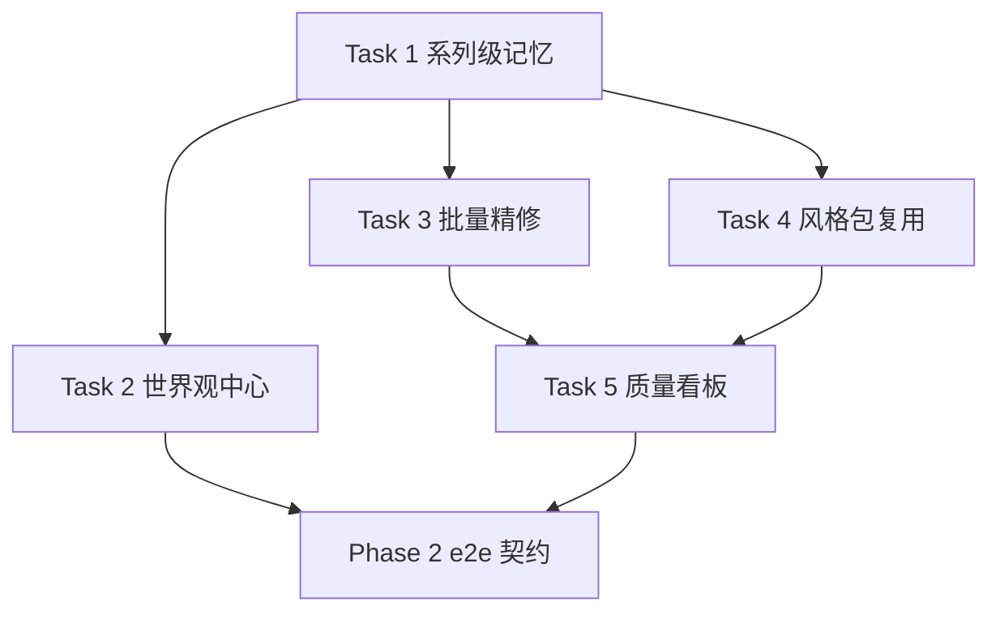

# StoryForge Phase 2 Implementation Plan

> **For agentic workers:** REQUIRED SUB-SKILL: Use superpowers:subagent-driven-development (recommended) or superpowers:executing-plans to implement this plan task-by-task. Steps use checkbox (`- [ ]`) syntax for tracking.

**Goal:** 在 Phase 1 强闭环基础上交付系列级记忆、完整世界观中心、批量精修、风格包复用和质量看板。

**Architecture:** Phase 2 延续现有 monorepo 与 FastAPI 领域分层：ORM 模型定义真相源，Pydantic schema 定义契约，service 承担领域规则和事务，router 暴露 API，pytest 与 node:test 提供本地验证。前端继续使用 Next.js App Router 的轻量页面和源码契约测试，不新增图表库或浏览器测试依赖。

**Tech Stack:** FastAPI、Pydantic、SQLAlchemy 2.0、pytest、Next.js App Router、React、TypeScript、Node `node:test`、pnpm、uv。

---

## 1. 文件结构与责任边界

- `apps/api/app/domains/series/`：系列、系列级记忆、跨书证据和版本化服务。
- `apps/api/app/domains/worldbuilding/`：只读聚合世界观中心，不直接写资产。
- `apps/api/app/domains/batch_refinery/`：批量调用 Judge 与 Repair 的任务编排层。
- `apps/api/app/domains/style_packs/`：风格包创建、版本化和应用到作品资产。
- `apps/api/app/domains/quality/`：只读质量指标聚合服务。
- `apps/web/app/world/page.tsx`：世界观中心入口。
- `apps/web/app/quality/page.tsx`：质量看板入口。
- `tests/e2e/phase2-contract.spec.ts`：Phase 2 OpenAPI 与源码证据契约。

## 2. 实施顺序



---

### Task 1: 系列级记忆模型与 API

**Files:**
- Create: `apps/api/tests/test_series_memory.py`
- Create: `apps/api/app/domains/series/__init__.py`
- Create: `apps/api/app/domains/series/models.py`
- Create: `apps/api/app/domains/series/schemas.py`
- Create: `apps/api/app/domains/series/service.py`
- Create: `apps/api/app/domains/series/router.py`
- Modify: `apps/api/app/models.py`
- Modify: `apps/api/app/main.py`

- [ ] **Step 1: 写失败测试**

在 `apps/api/tests/test_series_memory.py` 中建立 SQLite 内存库和 TestClient，测试以下行为：

```python
# 关键断言：创建系列、创建记忆、更新记忆、读取最新版本、读取历史、跨系列隔离。
assert response.status_code == 201
assert created_memory["memory_type"] == "world_rule"
assert created_memory["version"] == 1
assert latest[0]["version"] == 2
assert other_series_response.json() == []
```

- [ ] **Step 2: 验证红灯**

Run: `cd apps/api; uv run pytest tests/test_series_memory.py -q`
Expected: FAIL，原因是 `app.domains.series` 或 `/api/series` 路由尚不存在。
- [ ] **Step 3: 实现 ORM 模型**

`Series` 保存系列根实体，`SeriesMemory` 保存版本化记忆，字段遵循现有 `Asset` 与 `ContinuityRecord` 风格：

```python
class Series(IdMixin, TimestampMixin, Base):
    __tablename__ = "series"
    title: Mapped[str] = mapped_column(String(255), nullable=False)
    status: Mapped[str] = mapped_column(String(50), nullable=False, default="active", server_default="active")
    description: Mapped[str | None] = mapped_column(Text)

class SeriesMemory(IdMixin, TimestampMixin, VersionMixin, Base):
    __tablename__ = "series_memories"
    series_id: Mapped[int] = mapped_column(ForeignKey("series.id", ondelete="CASCADE"), index=True, nullable=False)
    memory_type: Mapped[str] = mapped_column(String(80), nullable=False)
    lineage_key: Mapped[str] = mapped_column(String(80), index=True, nullable=False)
    subject: Mapped[str] = mapped_column(String(255), nullable=False)
    status: Mapped[str] = mapped_column(String(50), nullable=False, default="active", server_default="active")
    payload: Mapped[dict] = mapped_column(JSON, nullable=False, default=dict)
```

- [ ] **Step 4: 实现 schema、service、router**

Service 必须提供 `create_series`、`create_series_memory`、`list_series_memories`、`update_series_memory`、`get_series_memory_history`。Router 前缀使用 `/api/series`，标签使用 `系列级记忆`。

- [ ] **Step 5: 注册并验证**

Run: `cd apps/api; uv run pytest tests/test_series_memory.py -q`
Expected: PASS。

Run: `cd apps/api; uv run python -m compileall app tests`
Expected: PASS。

Run: `pnpm openapi`
Expected: OpenAPI 中包含 `/api/series` 与 `/api/series/{series_id}/memories`。

---
### Task 2: 完整世界观中心聚合

**Files:**
- Create: `apps/api/tests/test_worldbuilding_center.py`
- Create: `apps/api/app/domains/worldbuilding/__init__.py`
- Create: `apps/api/app/domains/worldbuilding/schemas.py`
- Create: `apps/api/app/domains/worldbuilding/service.py`
- Create: `apps/api/app/domains/worldbuilding/router.py`
- Create: `apps/web/app/world/page.tsx`
- Modify: `apps/web/app/page.tsx`
- Modify: `apps/web/tests/phase1-navigation.test.tsx`
- Modify: `apps/api/app/main.py`

- [ ] **Step 1: 写聚合 API 测试**

测试准备一个系列、两部作品、角色资产、地点资产、伏笔资产、连续性记录和系列记忆；请求 `/api/worldbuilding/center?series_id=<id>` 后断言：

```python
assert result["series"]["title"] == "星海纪元"
assert [item["name"] for item in result["characters"]] == ["林岚"]
assert result["world_rules"][0]["source"] == "series_memory"
assert result["unresolved_foreshadowing"]
```

- [ ] **Step 2: 实现只读聚合服务**

`build_worldbuilding_center(session, series_id)` 只读取 `SeriesMemory`、`Asset`、`ContinuityRecord`，按 `id` 稳定排序，返回角色、地点、组织、规则、伏笔和跨书约束。

- [ ] **Step 3: 增加前端世界观页面**

`apps/web/app/world/page.tsx` 展示“World Center 世界观中心”、“角色与关系”、“世界规则”、“未回收伏笔”、“跨书约束”。首页新增 `/world` 导航。

- [ ] **Step 4: 验证**

Run: `cd apps/api; uv run pytest tests/test_worldbuilding_center.py -q`
Expected: PASS。

Run: `pnpm --filter @storyforge/web test && pnpm --filter @storyforge/web lint`
Expected: PASS。

---
### Task 3: 批量精修任务编排

**Files:**
- Create: `apps/api/tests/test_batch_refinery.py`
- Create: `apps/api/app/domains/batch_refinery/__init__.py`
- Create: `apps/api/app/domains/batch_refinery/schemas.py`
- Create: `apps/api/app/domains/batch_refinery/service.py`
- Create: `apps/api/app/domains/batch_refinery/router.py`
- Modify: `apps/api/app/main.py`

- [ ] **Step 1: 写批量精修测试**

测试包含两个场景：一个存在设定冲突，一个满足约束。请求 `/api/batch-refinery/runs` 后断言 `JobRun.status == "completed"`，进度中有 `total`、`succeeded`、`failed`、`items`。

```python
assert result["progress"]["total"] == 2
assert result["progress"]["succeeded"] == 2
assert result["progress"]["items"][0]["repair_patch_id"] is not None
```

- [ ] **Step 2: 实现编排服务**

`run_batch_refinery(session, payload)` 创建 `JobRun(job_type="batch_refinery")`，逐项调用 `create_judge_issues` 和 `create_repair_patch`，把每项结果写入 `progress["items"]`。

- [ ] **Step 3: 处理可恢复状态**

当单项失败时，记录 `status="partial_failed"` 与 `error_message`，保留已成功项目，不回滚整批结果。

- [ ] **Step 4: 验证**

Run: `cd apps/api; uv run pytest tests/test_batch_refinery.py tests/test_judge_repair.py -q`
Expected: PASS。

Run: `cd apps/api; uv run python -m compileall app tests`
Expected: PASS。

---
### Task 4: 风格包复用

**Files:**
- Create: `apps/api/tests/test_style_packs.py`
- Create: `apps/api/app/domains/style_packs/__init__.py`
- Create: `apps/api/app/domains/style_packs/schemas.py`
- Create: `apps/api/app/domains/style_packs/service.py`
- Create: `apps/api/app/domains/style_packs/router.py`
- Modify: `apps/api/app/main.py`

- [ ] **Step 1: 写风格包测试**

测试创建风格包、更新版本、应用到作品，并通过 `assemble_scene_packet` 证明风格规则进入 `packet["风格规则"]`。

```python
assert style_pack["version"] == 1
assert updated["version"] == 2
assert applied_asset["asset_type"] == "style_rule"
assert packet["packet"]["风格规则"][0]["rule"] == "保持克制而具画面感"
```

- [ ] **Step 2: 实现服务**

风格包自身可用 `Asset.asset_type == "style_pack"` 表达，应用到作品时生成 `Asset.asset_type == "style_rule"` 的新资产，`payload` 保留 `style_pack_id`、`规则`、`禁用表达`、`示例句`。

- [ ] **Step 3: 实现路由**

新增 `/api/style-packs`、`/api/style-packs/{asset_id}`、`/api/style-packs/{asset_id}/apply`，路由标签为 `风格包`。

- [ ] **Step 4: 验证**

Run: `cd apps/api; uv run pytest tests/test_style_packs.py tests/test_scene_packet.py -q`
Expected: PASS。

---
### Task 5: 质量看板聚合

**Files:**
- Create: `apps/api/tests/test_quality_dashboard.py`
- Create: `apps/api/app/domains/quality/__init__.py`
- Create: `apps/api/app/domains/quality/schemas.py`
- Create: `apps/api/app/domains/quality/service.py`
- Create: `apps/api/app/domains/quality/router.py`
- Create: `apps/web/app/quality/page.tsx`
- Modify: `apps/web/app/page.tsx`
- Modify: `apps/web/tests/phase1-navigation.test.tsx`
- Create: `tests/e2e/phase2-contract.spec.ts`
- Modify: `scripts/run-e2e.mjs`

- [ ] **Step 1: 写质量看板 API 测试**

测试准备开放问题、已修复补丁、失败任务、成功任务、系列记忆，调用 `/api/quality/dashboard?book_id=<id>&series_id=<id>` 后断言：

```python
assert result["open_issue_count"] == 1
assert result["repair_acceptance_rate"] == 0.5
assert result["job_success_rate"] == 0.5
assert result["series_memory_count"] == 2
```

- [ ] **Step 2: 实现聚合服务和路由**

服务只读聚合 `JudgeIssue`、`RepairPatch`、`JobRun`、`SeriesMemory`，输出稳定数字和中文说明。

- [ ] **Step 3: 增加前端质量看板**

`apps/web/app/quality/page.tsx` 展示“Quality Dashboard 质量看板”、“开放问题”、“修复采纳率”、“任务成功率”、“系列记忆覆盖”。首页新增 `/quality` 导航。

- [ ] **Step 4: 增加 Phase 2 e2e 契约**

`tests/e2e/phase2-contract.spec.ts` 读取 OpenAPI 和关键测试源码，确认 `/api/series`、`/api/worldbuilding/center`、`/api/batch-refinery/runs`、`/api/style-packs`、`/api/quality/dashboard` 均存在。

- [ ] **Step 5: 验证**

Run: `cd apps/api; uv run pytest tests/test_quality_dashboard.py -q`
Expected: PASS。

Run: `pnpm --filter @storyforge/web test && pnpm --filter @storyforge/web lint`
Expected: PASS。

Run: `pnpm e2e`
Expected: Phase 1 与 Phase 2 契约均通过。

---

## 3. 全量本地验证门禁

Phase 2 每完成一个任务后至少执行：

```powershell
pnpm test
pnpm e2e
cd apps/api; uv run python -m compileall app tests
```

涉及 OpenAPI 的任务必须额外执行：

```powershell
pnpm openapi
```

编码扫描必须确认目标文件无 UTF-8 BOM、无连续问号异常、无替换字符，并包含真实简体中文说明或测试标题。

## 4. 风险与控制

- **风险：系列级记忆与资产中心重复。** 控制方式：系列记忆只保存跨作品事实，作品内素材继续由 `Asset` 承担。
- **风险：批量精修状态过早复杂。** 控制方式：先用 `JobRun.progress` 保存确定性明细，不新增队列系统。
- **风险：质量看板查询过重。** 控制方式：看板 API 必须按 `book_id` 或 `series_id` 过滤，并使用稳定聚合。
- **风险：前端契约不足以覆盖交互。** 控制方式：Phase 2 先保持只读页面，后续若引入交互再增加浏览器验证。

Plan complete and saved to `docs/superpowers/plans/2026-05-15-storyforge-phase2-engineering-plan.md`.
