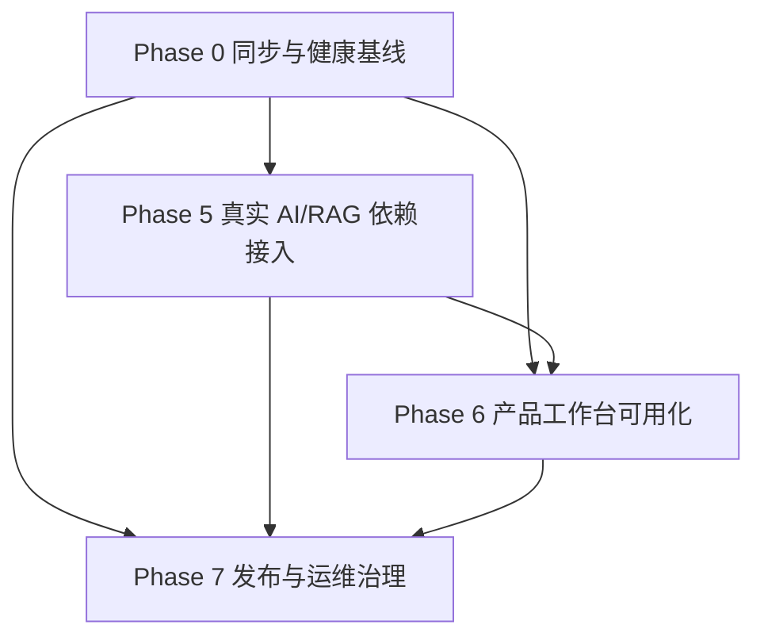

# StoryForge 总重规划与执行恢复计划

> **面向代理执行者：** REQUIRED SUB-SKILL: 使用 `superpowers:subagent-driven-development`（推荐）或 `superpowers:executing-plans` 按任务执行。任何实现前必须重新生成对应 `.codex/context-summary-[任务名].md`，并把验证结果追加到 `.codex/verification-report.md`。

**目标：** 在确认 GitHub 与本地仓库状态一致后，停止重复执行 Phase 1~4，转向真实 AI/RAG 接入、产品工作台可用化和发布治理。

**架构：** 继续采用模块化单体。`apps/api` 是业务真相源与控制面 API，`apps/workflow` 承载长任务和 checkpoint，`apps/web` 提供连续操作工作台，`packages/shared` 保存 OpenAPI 契约，`tests/e2e` 负责阶段契约验证。后续阶段不拆微服务，不让向量索引替代结构化真相源。

**技术栈：** Next.js App Router、React、TypeScript、FastAPI、Pydantic、SQLAlchemy 2.0、Alembic、LangGraph 或本地兼容 runtime、PostgreSQL + pgvector、Redis、MinIO、pnpm、uv、pytest、Node `node:test`、PowerShell。

---

## 1. 当前事实基线

### 1.1 仓库与 GitHub

- 实际仓库：`D:/StoryForge/1-renovel-ai-ai-rag-tavern`。
- GitHub 远程：`https://github.com/XZZKANY/StoryForge.git`。
- 当前分支：`master` 跟踪 `origin/master`。
- 当前提交：`95f3642 feat: complete phase4 engineering and verification`。
- 远程 `refs/heads/master`：`95f364221ce8ae541d05a42a3b5bc2a6a7f709eb`。
- 当前待纳入版本控制的计划文件：`docs/superpowers/plans/2026-05-17-storyforge-master-replan.md`。

### 1.2 已完成能力

- Phase 1：作品资产、章节生成、Scene Packet、Judge、Repair、批准回写、下一章继承。
- Phase 2：系列级记忆、世界观中心、批量精修、风格包、质量看板。
- Phase 3：团队工作区、协作审批、商业化控制、Provider Gateway、事件流、分析扩展。
- Phase 4：检索中心、Scene Packet 自动检索、Prompt Pack、模型运行日志、持久化 workflow runtime、制品中心、评测系统。

### 1.3 当前未关闭风险

1. 计划文件未提交时，后续代理可能继续读取旧路线。
2. 当前环境 FastAPI `TestClient` 曾阻塞，HTTP route pytest 需要正常开发环境复跑。
3. Phase 4 检索和 provider 仍以确定性占位或本地 shim 为主，真实 AI/RAG 尚未闭环。
4. 前端页面偏能力展示，缺少从创作到评测的连续操作体验。
5. 新机器启动、迁移、Docker、OpenAPI 刷新和统一验证仍需发布治理补强。

---

## 2. 每次执行前门禁

### 2.1 GitHub 同步门禁

```powershell
git -C D:/StoryForge/1-renovel-ai-ai-rag-tavern fetch origin --prune
git -C D:/StoryForge/1-renovel-ai-ai-rag-tavern status --short --branch
git -C D:/StoryForge/1-renovel-ai-ai-rag-tavern log --oneline --decorate -5
git -C D:/StoryForge/1-renovel-ai-ai-rag-tavern ls-remote --heads origin
```

通过条件：`master...origin/master` 不显示 ahead/behind，远程 `master` 与本地 HEAD 指向同一提交。

如果显示 `behind`，只允许执行：

```powershell
git -C D:/StoryForge/1-renovel-ai-ai-rag-tavern pull --ff-only origin master
```

如果显示 `ahead` 或存在未提交业务代码，先停止规划，整理变更范围后再继续。

### 2.2 上下文门禁

每个任务开始前必须读取：

- `D:/StoryForge/AGENTS.md`
- `.codex/context-summary-storyforge-master-replan.md`
- `.codex/verification-report.md`
- 当前任务相关的最近 Phase 计划、源码和测试文件
- Context7 中对应库的官方文档要点

### 2.3 本地验证优先级

优先级从高到低：

1. `pnpm e2e`：根级契约和补偿验证。
2. API：`python -m compileall apps/api/app apps/api/tests` 与阶段服务层 pytest。
3. Workflow：`python -m compileall apps/workflow/storyforge_workflow apps/workflow/tests` 与 runtime pytest。
4. Web：`pnpm --filter @storyforge/web test` 与 `pnpm --filter @storyforge/web exec tsc --noEmit`。
5. 环境：`pnpm verify`，用于 Docker、路径和基础工具检查。

---

## 3. 能力地图与责任边界

| 边界 | 当前职责 | 后续重点 |
| --- | --- | --- |
| `apps/api` | 领域模型、服务、router、OpenAPI、业务真相源 | 真实 provider 配置、真实检索、迁移治理、错误可观测性 |
| `apps/workflow` | 章节生成图、runtime、checkpoint、JobRun 桥接 | 真实 LangGraph 依赖复跑、恢复语义、provider 调度 |
| `apps/web` | 首页和各能力入口页 | Studio 连续操作、检索/运行/制品/评测交互闭环 |
| `packages/shared` | OpenAPI 契约快照 | 自动刷新、契约差异审查 |
| `tests/e2e` | Phase 1~4 源码和 OpenAPI 证据契约 | 新阶段契约、跨页面与跨模块闭环 |
| `.codex` | 上下文、操作日志、验证报告 | 每阶段审计和质量评分留痕 |

---

## 4. 总依赖图



执行原则：Phase 0 必须先完成；Phase 5 和 Phase 6 可局部交错，但真实 provider 与检索结果进入工作台前必须先有离线模拟测试；Phase 7 贯穿但最终收尾。

---

## 5. Phase 0：同步与健康基线

**目标：** 建立可复现的当前状态，避免继续旧计划或重复实现 Phase 1~4。

**文件范围：**

- Modify: `docs/superpowers/plans/2026-05-17-storyforge-master-replan.md`
- Modify: `.codex/operations-log.md`
- Modify: `.codex/verification-report.md`
- Reference: `scripts/run-e2e.mjs`
- Reference: `scripts/verify-local.ps1`

### Task 0.1：确认 GitHub 与本地一致

- [ ] 运行 GitHub 同步门禁命令。
- [ ] 确认 `master...origin/master` 无 ahead/behind。
- [ ] 将未跟踪总计划加入后续提交清单，避免计划只留在本地。

验收命令：

```powershell
git -C D:/StoryForge/1-renovel-ai-ai-rag-tavern status --short --branch
git -C D:/StoryForge/1-renovel-ai-ai-rag-tavern log --oneline --decorate -3
```

### Task 0.2：复跑当前稳定验证链

- [ ] 运行 `pnpm e2e`。
- [ ] 运行 Web test 与 TypeScript 检查。
- [ ] 运行 API compileall 与 Phase 1~4 服务层补偿验收。
- [ ] 运行 workflow compileall 与 runtime pytest。
- [ ] 若 Docker 可用，补跑 `pnpm verify`。

验收命令：

```powershell
cd D:/StoryForge/1-renovel-ai-ai-rag-tavern
pnpm e2e
pnpm --filter @storyforge/web test
pnpm --filter @storyforge/web exec tsc --noEmit
cd apps/api
python -m compileall app tests
python -m pytest tests/test_phase1_service_acceptance.py tests/test_phase2_service_acceptance.py tests/test_phase3_service_acceptance.py tests/test_phase4_service_acceptance.py -q
cd ../workflow
python -m compileall storyforge_workflow tests
python -m pytest tests/test_generation_graph.py tests/test_runtime_runner.py -q
```

关闭条件：验证结果写入 `.codex/verification-report.md`，且失败项都有明确环境原因或修复任务。

---

## 6. Phase 5：真实 AI/RAG 依赖接入

**目标：** 把 Phase 4 的确定性 provider、假 embedding、关键词检索和本地 shim 升级为可真实调用、可降级、可审计的 AI/RAG 内核。

**文件范围：**

- Modify: `apps/api/app/domains/provider_gateway/*`
- Modify: `apps/api/app/domains/retrieval/*`
- Modify: `apps/api/app/domains/model_runs/*`
- Modify: `apps/api/app/domains/scene_packets/*`
- Modify: `apps/api/app/domains/prompt_packs/*`
- Modify: `apps/workflow/storyforge_workflow/runtime/*`
- Test: `apps/api/tests/test_provider_gateway.py`
- Test: `apps/api/tests/test_retrieval_index.py`
- Test: `apps/api/tests/test_scene_packet_retrieval_upgrade.py`
- Test: `apps/api/tests/test_model_runs.py`

### Task 5.1：Provider Gateway 配置真实化

- [ ] 定义 provider 配置解析规则：LLM、embedding、reranker 分开配置。
- [ ] 未配置密钥时稳定回退到本地 deterministic provider。
- [ ] 记录 provider 名称、模型名、请求摘要、响应摘要、失败原因、延迟和 token 估算。

验收：新增或扩展 provider gateway 测试，覆盖真实配置解析、缺省降级、失败记录。

### Task 5.2：Embedding 与检索刷新真实化

- [ ] Retrieval refresh 支持真实 embedding 客户端接口。
- [ ] 向量结果只保存 chunk 引用、得分和证据，不复制业务真相源。
- [ ] 支持 reranker 可选启用；未启用时保留稳定排序。
验收：检索测试同时覆盖 deterministic embedding 和真实客户端 mock，不要求真实外网密钥。

### Task 5.3：Scene Packet 使用真实检索证据

- [ ] Scene Packet 自动生成检索查询计划。
- [ ] 记录命中来源、chunk、score、rerank 顺序和上下文预算占用。
- [ ] Prompt Pack 与检索片段共同进入模型调用上下文，但不得突破预算。

验收：`test_scene_packet_retrieval_upgrade.py` 能证明检索证据进入 Scene Packet 且排序稳定。

### Task 5.4：Workflow runtime 调用链联通

- [ ] runtime 从 provider gateway 读取可用 provider。
- [ ] 每次模型调用都写入 `ModelRun`。
- [ ] 失败后 JobRun 能保留 checkpoint 和可恢复错误状态。

验收：workflow runtime pytest 覆盖成功、失败、恢复三类路径。

---

## 7. Phase 6：产品工作台可用化

**目标：** 把当前前端从“能力入口和证据页”升级为能连续完成创作、检索、运行、制品和评测的工作台。

**文件范围：**

- Modify: `apps/web/app/studio/page.tsx`
- Modify: `apps/web/app/retrieval/page.tsx`
- Modify: `apps/web/app/runs/page.tsx`
- Modify: `apps/web/app/artifacts/page.tsx`
- Modify: `apps/web/app/evaluations/page.tsx`
- Modify: `apps/web/app/page.tsx`
- Modify: `apps/web/tests/phase1-navigation.test.tsx`
- Test: `tests/e2e/phase5-contract.spec.ts` 或 `tests/e2e/phase6-contract.spec.ts`

### Task 6.1：Studio 创作闭环页面

- [ ] 在一个页面串起作品、章节、Scene Packet、Judge、Repair、批准回写。
- [ ] 页面展示当前步骤、输入摘要、输出摘要、下一步动作和失败恢复入口。
- [ ] 源码契约必须包含关键中文入口和对应组件名。

验收：Web test 和 tsc 通过，源码契约证明关键入口存在。

### Task 6.2：Retrieval 检索工作台

- [ ] 支持资料源列表、刷新任务、搜索请求、命中预览和证据跳转。
- [ ] 区分用户上传、章节快照、系列记忆和 Prompt Pack 来源。
- [ ] 展示 embedding/reranker 状态，但不暴露密钥。

验收：前端源码契约覆盖“资料库、刷新、搜索、证据、重排”。

### Task 6.3：Runs、Artifacts、Evaluations 联动

- [ ] Runs 页面展示任务状态、checkpoint、模型运行日志和失败重试。
- [ ] Artifacts 页面展示导出物、上传资料、工作流快照和评测报告。
- [ ] Evaluations 页面展示评测集、运行记录、指标趋势和失败样例。

验收：`pnpm --filter @storyforge/web test` 与 `pnpm --filter @storyforge/web exec tsc --noEmit` 通过。

---

## 8. Phase 7：发布与运维治理

**目标：** 让项目能在新机器上安装、启动、迁移、验证和交接。

**文件范围：**

- Modify: `.env.example`
- Modify: `scripts/verify-local.ps1`
- Modify: `scripts/run-e2e.mjs`
- Modify: `scripts/generate-openapi.ps1`
- Modify: `apps/api/alembic/*`
- Create: `docs/operations/local-start.md`
- Create: `docs/operations/release-checklist.md`
- Create: `docs/operations/troubleshooting.md`

### Task 7.1：环境样例与启动手册

- [ ] `.env.example` 覆盖 API、workflow、PostgreSQL、Redis、MinIO、provider、embedding、reranker 配置。
- [ ] 启动手册包含安装、Docker、迁移、启动 API/workflow/web、验证命令。
- [ ] 故障手册覆盖 Docker 未启动、TestClient 阻塞、OpenAPI 刷新失败、provider 未配置。

验收：新机器按文档能跑到明确成功或明确失败原因。

### Task 7.2：迁移与 OpenAPI 治理

- [ ] Alembic 能从干净数据库升级到最新模型。
- [ ] OpenAPI 生成失败时输出清晰错误，不静默使用旧契约。
- [ ] `packages/shared/src/contracts/storyforge.openapi.json` 的变更必须伴随审查记录。

验收：`pnpm openapi` 与迁移命令在本地记录结果。
### Task 7.3：统一验证脚本增强

- [ ] `pnpm verify` 检查 Docker、数据库、Redis、MinIO、迁移、OpenAPI、Web tsc、根级 e2e。
- [ ] 每个失败项必须输出下一步修复建议。
- [ ] 不允许长时间无输出卡死；长命令要拆分或设置探针。

验收：`.codex/verification-report.md` 记录 `pnpm verify` 的完整结果或环境限制。

---

## 9. 暂缓事项

以下事项不进入当前总路线，除非 Phase 5~7 完成且另行批准：

- 插件市场和第三方扩展框架。
- 完整账单结算和真实支付。
- 外部发行平台。
- 微服务拆分。
- 有声书、封面营销包和非核心内容生产。
- 不可解释的全自治 Agent 社会。

---

## 10. 回滚与恢复策略

- 文档改动回滚：`git checkout -- docs/superpowers/plans/2026-05-17-storyforge-master-replan.md`。
- 业务代码改动回滚：每个任务独立提交；失败时只回退当前任务提交。
- OpenAPI 回滚：保留生成前后的 `storyforge.openapi.json` diff，失败时还原上一版契约并记录原因。
- 数据迁移回滚：迁移脚本必须在文档中标明 downgrade 或清库重建策略。
- Provider 接入回滚：保留 deterministic provider 作为无密钥默认路径。

---

## 11. 后续执行优先级

1. **立即执行：Phase 0**，提交本总计划并复跑稳定验证链。
2. **第一开发主线：Phase 5**，真实 provider、embedding、reranker、ModelRun、Scene Packet 证据链。
3. **第二开发主线：Phase 6**，Studio 与检索/运行/制品/评测工作台连续化。
4. **贯穿治理：Phase 7**，环境、迁移、验证、发布清单和故障恢复。

---

## 12. 给后续代理的硬性提醒

- 不要从 Phase 1 重新实现，Phase 1~4 已完成并有验证报告。
- 先同步 GitHub，再读取计划，再生成上下文摘要。
- 每次只处理一个阶段或一个模块，避免跨阶段大改。
- 所有新增说明、日志、测试描述和提交信息使用简体中文。
- 所有验证必须本地执行；CI、远程流水线和人工验证不能作为完成依据。
- 如果连续三次验证失败，暂停实现，回到需求和设计阶段复盘。
