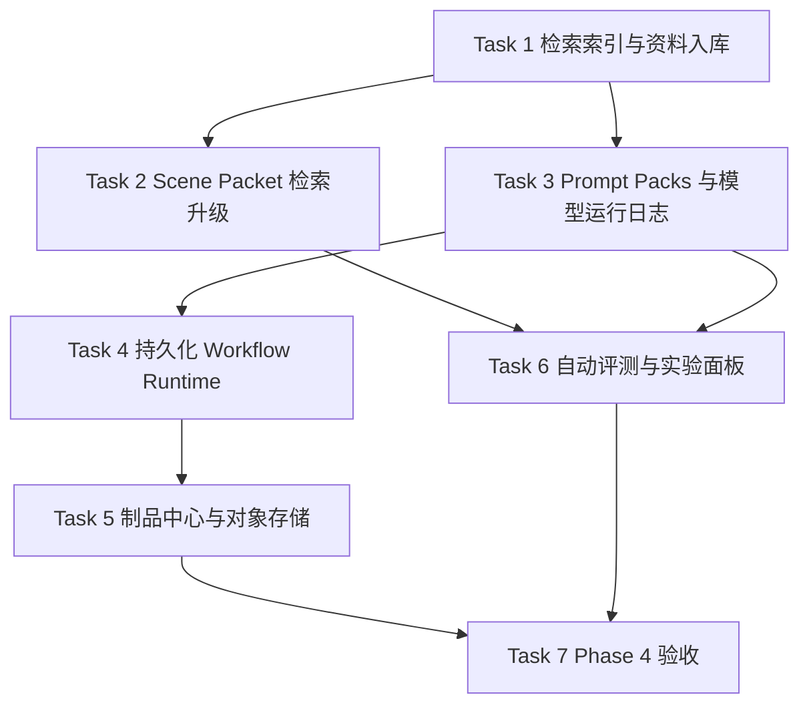

# StoryForge Phase 4 工程实施计划

> **面向代理执行者：** 实施本计划时继续采用“先写测试、确认红灯、再实现、再验证”的方式。每个任务执行前都应更新对应 `.codex/context-summary-*` 文件，并把关键决策记录到 `.codex/operations-log.md`。

**目标：** 在 Phase 1~3 已完成创作闭环、系列级记忆和平台外壳的基础上，交付真实检索、持久化工作流运行时、模型可观测性、对象存储制品中心和自动评测体系，让 StoryForge 从“本地可验证样机”升级为“可扩展生产内核”。

**架构：** 继续采用模块化单体：`apps/api` 作为业务真相源与控制面 API，`apps/workflow` 承载 LangGraph 长任务运行时，`apps/web` 提供检索、实验、制品与运行记录界面，`packages/shared` 保持跨端契约。Phase 4 不拆微服务，不引入独立事件总线平台，不让向量索引替代结构化真相源。

**技术栈：** FastAPI、Pydantic、SQLAlchemy 2.0、LangGraph、PostgreSQL + pgvector、Redis、S3 兼容对象存储、Next.js App Router、TypeScript、Node `node:test`、pytest、uv、pnpm。

---

## 0. 本阶段覆盖与不覆盖

### 0.1 覆盖

- 资料入库、分块、Embedding 刷新、重排与 Scene Packet 检索升级
- Prompt Packs、模型运行日志、用户意图约束和调用证据追踪
- 工作流 checkpoint 持久化、任务恢复、Provider 解析接入和 Job Center 联通
- 导出物、上传资料、快照等制品进入对象存储制品中心
- 自动评测、基准集、实验记录和阶段级验收看板

### 0.2 不覆盖

- 插件市场和第三方扩展框架
- 完整账单系统和真实付费结算
- 有声书、封面营销包、外部发行平台
- 全量微服务拆分和独立调度集群

---

## 1. 文件结构与责任边界

- `apps/api/app/domains/retrieval/`：资料源、分块、Embedding 任务和检索查询。
- `apps/api/app/domains/prompt_packs/`：Prompt Pack 版本化管理与作用域挂载。
- `apps/api/app/domains/model_runs/`：模型运行日志、成本、延迟、输入输出摘要。
- `apps/api/app/domains/artifacts/`：制品元数据、对象存储引用、快照与上传资料。
- `apps/api/app/domains/evaluations/`：评测集、评测运行、指标明细与实验记录。
- `apps/workflow/storyforge_workflow/runtime/`：真实运行时、任务恢复、Provider 调度、审计记录。
- `apps/web/app/retrieval/page.tsx`：检索与资料库中心。
- `apps/web/app/runs/page.tsx`：模型运行日志和任务恢复中心。
- `apps/web/app/artifacts/page.tsx`：导出物、上传资料和快照中心。
- `apps/web/app/evaluations/page.tsx`：评测和实验面板。
- `tests/e2e/phase4-contract.spec.ts`：Phase 4 的 OpenAPI 与源码证据契约。

---

## 2. 实施顺序



---

### Task 1：检索索引与资料入库

**Files:**
- Create: `apps/api/app/domains/retrieval/__init__.py`
- Create: `apps/api/app/domains/retrieval/models.py`
- Create: `apps/api/app/domains/retrieval/schemas.py`
- Create: `apps/api/app/domains/retrieval/service.py`
- Create: `apps/api/app/domains/retrieval/router.py`
- Create: `apps/api/tests/test_retrieval_index.py`
- Modify: `apps/api/app/models.py`
- Modify: `apps/api/app/main.py`

- [ ] **Step 1: 写检索索引失败测试**

  测试准备一本作品和一份参考资料，验证：

  - 可创建资料源
  - 可生成 chunk
  - 可创建 embedding 刷新任务
  - 可在 `book_id` 范围内返回稳定排序的命中结果

- [ ] **Step 2: 实现资料源、分块与刷新任务**

  资料源至少区分：

  - 用户上传资料
  - 批准后的章节正文
  - 系列级记忆快照
  - Prompt Pack 参考片段

  向量索引只保存加速字段与引用，不保存业务真相源。

- [ ] **Step 3: 实现检索查询服务**

  提供：

  - `POST /api/retrieval/sources`
  - `POST /api/retrieval/refresh-runs`
  - `POST /api/retrieval/search`

  查询结果必须返回 `source_ref`、`chunk_id`、`score`、`excerpt` 和 `book_id/series_id` 边界信息。

- [ ] **Step 4: 验证**

  Run:

  ```powershell
  cd apps/api
  uv run pytest tests/test_retrieval_index.py -q
  uv run python -m compileall app tests
  ```

---

### Task 2：Scene Packet 检索升级

**Files:**
- Modify: `apps/api/app/domains/scene_packets/schemas.py`
- Modify: `apps/api/app/domains/scene_packets/service.py`
- Create: `apps/api/tests/test_scene_packet_retrieval_upgrade.py`

- [ ] **Step 1: 写检索增强失败测试**

  测试验证 Scene Packet 不再依赖手工 `retrieval_snippets` 才有检索能力，而是可基于：

  - scene goal
  - 用户意图
  - 作品/系列范围
  - 当前章节约束

  自动拉取检索片段并保留证据链接。

- [ ] **Step 2: 实现查询规划和重排**

  Scene Packet 必须：

  - 先保留固定槽位
  - 再加入检索命中
  - 记录命中来源、得分、重排后顺序和预算占用

- [ ] **Step 3: 验证**

  Run:

  ```powershell
  cd apps/api
  uv run pytest tests/test_scene_packet.py tests/test_scene_packet_retrieval_upgrade.py -q
  ```

---

### Task 3：Prompt Packs 与模型运行日志

**Files:**
- Create: `apps/api/app/domains/prompt_packs/__init__.py`
- Create: `apps/api/app/domains/prompt_packs/models.py`
- Create: `apps/api/app/domains/prompt_packs/schemas.py`
- Create: `apps/api/app/domains/prompt_packs/service.py`
- Create: `apps/api/app/domains/prompt_packs/router.py`
- Create: `apps/api/app/domains/model_runs/__init__.py`
- Create: `apps/api/app/domains/model_runs/models.py`
- Create: `apps/api/app/domains/model_runs/schemas.py`
- Create: `apps/api/app/domains/model_runs/service.py`
- Create: `apps/api/app/domains/model_runs/router.py`
- Create: `apps/api/tests/test_prompt_packs.py`
- Create: `apps/api/tests/test_model_runs.py`
- Modify: `apps/api/app/models.py`
- Modify: `apps/api/app/main.py`

- [ ] **Step 1: 写 Prompt Pack 与模型日志失败测试**

  验证：

  - Prompt Pack 可创建、更新新版本、按作品或工作区挂载
  - 模型运行日志保存 provider、model、latency、token_usage、输入摘要、输出摘要、关联任务与证据

- [ ] **Step 2: 实现领域服务**

  Prompt Pack 必须支持：

  - system/user 模板槽位
  - 禁止表达
  - 使用场景标签
  - 版本历史

  模型运行日志必须支持：

  - 同一任务的多轮调用
  - 失败原因
  - provider 解析结果
  - Prompt Pack 来源

- [ ] **Step 3: 验证**

  Run:

  ```powershell
  cd apps/api
  uv run pytest tests/test_prompt_packs.py tests/test_model_runs.py -q
  pnpm openapi
  ```

---

### Task 4：持久化 Workflow Runtime 与 Job Center 联通

**Files:**
- Create: `apps/workflow/storyforge_workflow/runtime/__init__.py`
- Create: `apps/workflow/storyforge_workflow/runtime/runner.py`
- Create: `apps/workflow/storyforge_workflow/runtime/checkpoints.py`
- Create: `apps/workflow/storyforge_workflow/runtime/provider_execution.py`
- Create: `apps/workflow/tests/test_runtime_runner.py`
- Modify: `apps/workflow/storyforge_workflow/graph.py`
- Modify: `apps/api/app/domains/jobs/models.py`
- Create: `apps/api/tests/test_job_runtime_bridge.py`

- [ ] **Step 1: 写运行时桥接失败测试**

  验证：

  - 工作流启动后创建 `JobRun`
  - 节点推进会更新 checkpoint
  - interrupt 后可在同一 `thread_id` 恢复
  - provider 调用结果进入模型运行日志

- [ ] **Step 2: 实现运行时**

  工作流运行时必须记录：

  - `thread_id`
  - `job_run_id`
  - 当前节点
  - 输入摘要
  - 输出摘要
  - 审批状态
  - provider 解析结果

- [ ] **Step 3: 验证**

  Run:

  ```powershell
  cd apps/workflow
  uv run pytest tests/test_generation_graph.py tests/test_runtime_runner.py -q
  ```

---

### Task 5：制品中心与对象存储

**Files:**
- Create: `apps/api/app/domains/artifacts/__init__.py`
- Create: `apps/api/app/domains/artifacts/models.py`
- Create: `apps/api/app/domains/artifacts/schemas.py`
- Create: `apps/api/app/domains/artifacts/service.py`
- Create: `apps/api/app/domains/artifacts/router.py`
- Create: `apps/api/tests/test_artifacts.py`
- Modify: `apps/api/app/domains/exports/service.py`
- Modify: `apps/api/app/models.py`
- Modify: `apps/api/app/main.py`

- [ ] **Step 1: 写制品中心失败测试**

  验证：

  - Markdown/EPUB 导出可登记为 artifact
  - 上传资料可进入资料库
  - 工作流快照可写入 artifact 元数据
  - 同一对象支持版本和作用域归属

- [ ] **Step 2: 实现制品元数据与对象引用**

  至少覆盖：

  - export
  - upload
  - workflow_snapshot
  - evaluation_report

- [ ] **Step 3: 验证**

  Run:

  ```powershell
  cd apps/api
  uv run pytest tests/test_exports.py tests/test_artifacts.py -q
  ```

---

### Task 6：自动评测与实验面板

**Files:**
- Create: `apps/api/app/domains/evaluations/__init__.py`
- Create: `apps/api/app/domains/evaluations/models.py`
- Create: `apps/api/app/domains/evaluations/schemas.py`
- Create: `apps/api/app/domains/evaluations/service.py`
- Create: `apps/api/app/domains/evaluations/router.py`
- Create: `apps/api/tests/test_evaluations.py`
- Create: `apps/web/app/evaluations/page.tsx`
- Create: `apps/web/app/retrieval/page.tsx`
- Create: `apps/web/app/runs/page.tsx`
- Create: `apps/web/app/artifacts/page.tsx`
- Modify: `apps/web/app/page.tsx`
- Modify: `apps/web/tests/phase1-navigation.test.tsx`
- Modify: `apps/api/app/models.py`
- Modify: `apps/api/app/main.py`

- [ ] **Step 1: 写评测失败测试**

  验证：

  - 可定义 benchmark case
  - 可触发 evaluation run
  - 可输出一致性错误率、修复成功率、接受率、open loop 数量等指标

- [ ] **Step 2: 实现评测域与前端面板**

  前端至少提供：

  - 检索中心
  - 运行日志中心
  - 制品中心
  - 评测与实验面板

- [ ] **Step 3: 验证**

  Run:

  ```powershell
  cd apps/api
  uv run pytest tests/test_evaluations.py -q

  cd ../../
  pnpm --filter @storyforge/web test
  pnpm --filter @storyforge/web lint
  ```

---

### Task 7：Phase 4 契约验收

**Files:**
- Create: `tests/e2e/phase4-contract.spec.ts`
- Create: `docs/api/phase4-openapi-review.md`
- Modify: `scripts/run-e2e.mjs`
- Modify: `.codex/verification-report.md`
- Modify: `.codex/operations-log.md`

- [ ] **Step 1: 写 Phase 4 契约测试**

  契约检查至少确认以下端点存在：

  - `/api/retrieval/search`
  - `/api/retrieval/refresh-runs`
  - `/api/prompt-packs`
  - `/api/model-runs`
  - `/api/artifacts`
  - `/api/evaluations/runs`

- [ ] **Step 2: 执行全量验证**

  Run:

  ```powershell
  pnpm test
  pnpm e2e
  cd apps/api
  uv run python -m compileall app tests
  cd ../workflow
  uv run python -m compileall storyforge_workflow tests
  ```

- [ ] **Step 3: 更新验证报告**

  `.codex/verification-report.md` 必须记录：

  - 新增能力覆盖情况
  - 验证命令与结果
  - 风险与环境限制
  - 评分与建议

---

## 3. Phase 4 统一验收标准

只有在以下条件全部满足时，Phase 4 才算完成：

- 检索索引与 Scene Packet 自动检索闭环通过。
- Prompt Pack、模型运行日志、Provider 解析和任务记录能互相追溯。
- 工作流 checkpoint 可持久化，interrupt 后可恢复。
- 导出物、上传资料和快照进入统一制品中心。
- 自动评测能输出稳定指标并保存实验记录。
- `pnpm test`、`pnpm e2e`、`compileall` 均通过。
- `.codex/verification-report.md` 综合评分不低于 90，建议为“通过”。

---

## 4. 风险与控制

- **风险：向量索引侵入真相源。** 控制方式：所有检索结果只保存引用，结构化真相仍在业务表。
- **风险：工作流与 Web 会话耦合。** 控制方式：运行时只读写 Job、事件、模型日志和资产，不直接持有前端状态。
- **风险：评测变成不可复现分数。** 控制方式：评测集、输入快照、Prompt Pack 版本和 Provider 版本都要入库。
- **风险：对象存储成为黑箱。** 控制方式：所有对象必须有 artifact 元数据、作用域和谱系键。

---

## 5. Phase 5 预备范围（非本计划实施内容）

待 Phase 4 完成后，再进入更高阶平台阶段。当前建议的 Phase 5 候选主题：

1. 多模态资产与封面/插图生成。
2. 插件化扩展框架与第三方 Skill/Tool 接入。
3. 发布渠道集成（Markdown、EPUB 之外的站点和出版流）。
4. 更精细的成本治理、账单核对和策略实验。
5. 更完整的人类反馈学习与实验对比体系。
