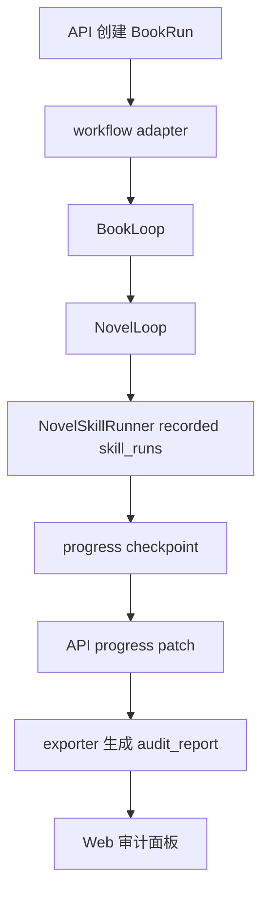

# Project Health Assessment Implementation Plan

> **给执行代理的要求：** 必须使用 `superpowers:subagent-driven-development`（推荐）或 `superpowers:executing-plans` 按任务执行。所有步骤使用复选框（`- [ ]`）跟踪。所有验证必须在本地完成，并写入 `D:\StoryForge\.codex\verification-report.md`。

**目标：** 对 StoryForge 当前主链路、架构边界、测试健康度和下一步路线图做一次限时决策型评估。

**架构：** 本计划只读取代码、运行本地验证、整理证据和输出评估报告，不修改业务代码。评估以 API BookRun 真相源、workflow 编排、audit/export 投影和 Web 审计展示为主链路，最终把发现按风险和收益排序，形成下一批可执行任务。

**Tech Stack:** Python 3.13、pytest、ruff、pnpm、Node contract tests、PowerShell、本地 `.codex` 评估文档。

---

## 文件职责总览

### 新增文件

- `D:\StoryForge\.codex\context-summary-project-health.md`
  - 职责：记录评估前上下文、相关文件、测试命令、主链路证据和已知风险。
- `D:\StoryForge\.codex\project-health-assessment.md`
  - 职责：记录完整项目健康评分、Top 风险、测试缺口和下一步路线图。

### 修改文件

- `D:\StoryForge\.codex\operations-log.md`
  - 职责：记录评估执行过程、命令、偏离项和补救措施。
- `D:\StoryForge\.codex\verification-report.md`
  - 职责：追加本轮本地验证结果、评分和结论。

### 只读参考文件

- `D:\StoryForge\docs\superpowers\specs\2026-06-01-project-health-assessment-design.md`
- `D:\StoryForge\docs\superpowers\plans\2026-06-01-bookrun-workflow-adapter-skill-runs.md`
- `D:\StoryForge\apps\workflow\storyforge_workflow\orchestrators\book_run_adapter.py`
- `D:\StoryForge\apps\workflow\storyforge_workflow\orchestrators\book_loop.py`
- `D:\StoryForge\apps\workflow\storyforge_workflow\orchestrators\novel_loop.py`
- `D:\StoryForge\apps\workflow\storyforge_workflow\skills\runner.py`
- `D:\StoryForge\apps\workflow\storyforge_workflow\skills\audit.py`
- `D:\StoryForge\apps\api\app\domains\book_runs\service.py`
- `D:\StoryForge\apps\api\app\domains\exports\book_markdown_exporter.py`
- `D:\StoryForge\apps\web\app\book-runs\audit.tsx`

### 明确不修改

- 不修改任何 `apps/**` 业务代码。
- 不恢复或删除已有 `stash`。
- 不引入新依赖。
- 不把 smoke 脚本改造成生产链路。

---

## Task 1：建立评估上下文与证据索引

**目标：** 先收集足够证据，避免凭印象做总评。

**Files:**

- Create: `D:\StoryForge\.codex\context-summary-project-health.md`
- Modify: `D:\StoryForge\.codex\operations-log.md`

- [ ] **Step 1：确认工作区和分支状态**

Run:

```powershell
cd D:\StoryForge
git branch --show-current
git status --short
git log --oneline -5
git stash list -n 5
```

Expected:

```text
当前分支可用于评估；工作区没有未解释的已暂存改动；stash 状态被记录但不恢复。
```

- [ ] **Step 2：搜索主链路文件**

Run:

```powershell
cd D:\StoryForge
rg -n "BookRun|book_run|run_book_run_with_skill_runner|run_book_loop|run_single_chapter_loop|skill_chain|audit_report" apps docs -g "*.py" -g "*.tsx" -g "*.ts" -g "*.md"
```

Expected:

```text
输出包含 workflow adapter、BookLoop、NovelLoop、API BookRun service、exporter、Web audit 和相关测试。
```

- [ ] **Step 3：读取并摘要至少 3 个相似实现或关键模块**

Read these files and record 5-8 bullet facts for each in `context-summary-project-health.md`:

```powershell
Get-Content D:\StoryForge\apps\workflow\storyforge_workflow\orchestrators\book_run_adapter.py
Get-Content D:\StoryForge\apps\workflow\storyforge_workflow\orchestrators\book_loop.py
Get-Content D:\StoryForge\apps\workflow\storyforge_workflow\orchestrators\novel_loop.py
Get-Content D:\StoryForge\apps\workflow\storyforge_workflow\skills\audit.py
Get-Content D:\StoryForge\apps\api\app\domains\book_runs\service.py
Get-Content D:\StoryForge\apps\api\app\domains\exports\book_markdown_exporter.py
Get-Content D:\StoryForge\apps\web\app\book-runs\audit.tsx
```

Expected:

```text
context-summary-project-health.md 包含主链路模块、职责、输入输出、测试入口和初步风险。
```

- [ ] **Step 4：记录操作日志**

Append to `D:\StoryForge\.codex\operations-log.md`:

```markdown
## 项目健康评估启动

时间：YYYY-MM-DD HH:mm:ss +08:00

- 当前分支：[branch]
- 最近提交：[hash subject]
- 本轮评估目标：主链路、架构边界、测试健康度和下一步路线图。
- 本轮不修改业务代码，不恢复历史 stash。
```

- [ ] **Step 5：提交上下文摘要**

Run:

```powershell
cd D:\StoryForge
git add .codex/context-summary-project-health.md .codex/operations-log.md
git diff --cached --check
git commit -m "记录 StoryForge 项目健康评估上下文"
```

Expected:

```text
提交成功，且 diff check 无尾随空白或格式错误。
```

---

## Task 2：验证主链路和测试健康度

**目标：** 用本地命令确认当前项目的基础健康度，并把 warnings 与失败项分类。

**Files:**

- Modify: `D:\StoryForge\.codex\project-health-assessment.md`
- Modify: `D:\StoryForge\.codex\verification-report.md`
- Modify: `D:\StoryForge\.codex\operations-log.md`

- [ ] **Step 1：运行 workflow lint 和测试**

Run:

```powershell
cd D:\StoryForge\apps\workflow
uv run ruff check .
uv run pytest -q
```

Expected:

```text
ruff 通过；pytest 输出通过数量。若失败，停止评估并记录失败命令、失败测试和最小复现。
```

- [ ] **Step 2：运行 API lint 和测试**

Run:

```powershell
cd D:\StoryForge\apps\api
uv run ruff check .
uv run pytest -q
```

Expected:

```text
ruff 通过；pytest 输出通过数量和 warning 数量。warning 必须分类为阻塞或非阻塞。
```

- [ ] **Step 3：运行 Web 审计相关测试**

Run:

```powershell
cd D:\StoryForge
pnpm --filter @storyforge/web test -- book-run-audit
```

Expected:

```text
BookRun 审计面板相关 contract tests 全部通过。
```

- [ ] **Step 4：运行主链路目标测试集合**

Run:

```powershell
cd D:\StoryForge\apps\workflow
uv run pytest tests/test_book_run_adapter.py tests/test_book_loop_three_chapters.py tests/test_skill_audit_summary.py tests/test_novel_skill_runner.py -v
cd D:\StoryForge\apps\api
uv run pytest tests/test_book_run_recorded_skill_runs_export.py tests/test_book_exporter.py tests/test_book_runs.py -v
```

Expected:

```text
workflow 与 API 主链路目标测试通过；输出写入评估报告。
```

- [ ] **Step 5：写验证记录**

Append to `D:\StoryForge\.codex\verification-report.md`:

```markdown
## StoryForge 项目健康评估验证记录

时间：YYYY-MM-DD HH:mm:ss +08:00

### 命令结果

- workflow ruff：[结果]
- workflow pytest：[结果]
- API ruff：[结果]
- API pytest：[结果]
- Web audit contract：[结果]
- 主链路目标测试：[结果]

### warning 分类

- 阻塞 warning：[列表，没有则写“无”]
- 非阻塞 warning：[列表和理由]
```

- [ ] **Step 6：提交验证记录**

Run:

```powershell
cd D:\StoryForge
git add .codex/project-health-assessment.md .codex/verification-report.md .codex/operations-log.md
git diff --cached --check
git commit -m "记录 StoryForge 项目健康验证结果"
```

Expected:

```text
提交成功。
```

---

## Task 3：评估架构边界和数据流风险

**目标：** 明确 API、workflow、audit/export、Web 的职责边界，找出会阻碍下一阶段真实接线的风险。

**Files:**

- Modify: `D:\StoryForge\.codex\project-health-assessment.md`
- Modify: `D:\StoryForge\.codex\operations-log.md`

- [ ] **Step 1：绘制主链路数据流**

在 `project-health-assessment.md` 写入以下章节，并按实际源码补充证据路径：

```markdown
## 主链路数据流



### 证据路径

- API 创建与 progress：[file:line]
- workflow adapter：[file:line]
- BookLoop checkpoint：[file:line]
- audit projection：[file:line]
- exporter：[file:line]
- Web 展示：[file:line]
```

Expected:

```text
章节包含 Mermaid 图和每个节点的源码证据路径。
```

- [ ] **Step 2：检查 API 与 workflow 边界**

Run:

```powershell
cd D:\StoryForge
rg -n "sqlalchemy|Session|app\.domains|FastAPI|APIRouter" apps\workflow apps\api\app\domains\book_runs apps\api\app\domains\exports
rg -n "run_book_run_with_skill_runner|BookRunAdapterRequest|BookRunAdapterPorts" apps
```

Expected:

```text
workflow 不直接依赖 API ORM；API service 不直接执行 workflow。若存在例外，写入风险表。
```

- [ ] **Step 3：检查 recorded/reconstructed 证据边界**

Run:

```powershell
cd D:\StoryForge
rg -n "recorded_skill_run|reconstructed|evidence_basis|recorded_event_count|reconstructed_event_count|full prompt|完整提示词|完整正文" apps\workflow apps\api apps\web
```

Expected:

```text
评估报告说明 recorded、reconstructed、mixed 的来源和 UI 展示方式。
```

- [ ] **Step 4：写风险表**

在 `project-health-assessment.md` 写入：

```markdown
## 架构风险表

| 编号 | 风险 | 证据 | 影响 | 修复成本 | 优先级 | 建议 |
| --- | --- | --- | --- | --- | --- | --- |
| R1 | [风险名] | [file:line 或命令] | 高/中/低 | 高/中/低 | P0/P1/P2 | [建议] |
```

至少包含这些候选项，按证据确认后排序：

- BookRun adapter 尚未接入真实生产触发路径。
- LangGraph 节点事件与章节 skill_runs 的边界需要继续保持隔离。
- phase9b_real_llm_smoke.py 仍是烟测工具，不应成为主线。
- source_refs 行号和静态定义可能腐烂。
- 诊断层对 recorded/reconstructed 的人类可见性需要持续验真。

- [ ] **Step 5：提交架构风险评估**

Run:

```powershell
cd D:\StoryForge
git add .codex/project-health-assessment.md .codex/operations-log.md
git diff --cached --check
git commit -m "评估 StoryForge 主链路架构风险"
```

Expected:

```text
提交成功。
```

---

## Task 4：形成评分和下一批路线图

**目标：** 把评估结论转化为下一批任务，不停留在问题清单。

**Files:**

- Modify: `D:\StoryForge\.codex\project-health-assessment.md`
- Modify: `D:\StoryForge\.codex\verification-report.md`

- [ ] **Step 1：按评分模型打分**

在 `project-health-assessment.md` 写入：

```markdown
## 健康评分

| 维度 | 分值 | 得分 | 证据 | 扣分原因 |
| --- | ---: | ---: | --- | --- |
| 主链路可验证性 | 25 | [得分] | [命令/文件] | [原因] |
| 架构边界清晰度 | 20 | [得分] | [命令/文件] | [原因] |
| 测试覆盖与本地门禁 | 20 | [得分] | [命令/文件] | [原因] |
| 审计与数据最小暴露 | 15 | [得分] | [命令/文件] | [原因] |
| 维护性与后续扩展成本 | 10 | [得分] | [命令/文件] | [原因] |
| 文档与操作留痕 | 10 | [得分] | [命令/文件] | [原因] |

综合评分：[总分]/100
结论：[可继续推进真实生产接线 / 可推进小范围功能但需先处理 Top 风险 / 建议先治理 / 暂停新功能]
```

Expected:

```text
每个得分都有证据和扣分原因，不允许空泛评分。
```

- [ ] **Step 2：写 Top 风险和测试缺口**

在 `project-health-assessment.md` 写入：

```markdown
## Top 5 架构风险

1. [风险]：证据 [file:line]，建议 [动作]。
2. [风险]：证据 [file:line]，建议 [动作]。
3. [风险]：证据 [file:line]，建议 [动作]。
4. [风险]：证据 [file:line]，建议 [动作]。
5. [风险]：证据 [file:line]，建议 [动作]。

## Top 5 测试或验证缺口

1. [缺口]：证据 [命令/文件]，补偿计划 [动作]。
2. [缺口]：证据 [命令/文件]，补偿计划 [动作]。
3. [缺口]：证据 [命令/文件]，补偿计划 [动作]。
4. [缺口]：证据 [命令/文件]，补偿计划 [动作]。
5. [缺口]：证据 [命令/文件]，补偿计划 [动作]。
```

Expected:

```text
风险和缺口按优先级排序，不重复表达同一问题。
```

- [ ] **Step 3：写下一批任务队列**

在 `project-health-assessment.md` 写入：

```markdown
## 下一批任务队列

### 必做

1. [任务名]
   - 目标：[目标]
   - 验收：[本地命令或报告]
   - 预计影响：[说明]

### 高收益

1. [任务名]
   - 目标：[目标]
   - 验收：[本地命令或报告]
   - 预计影响：[说明]

### 可延后

1. [任务名]
   - 延后理由：[理由]

### 不建议现在做

1. [任务名]
   - 不建议理由：[理由]
```

候选任务必须从评估证据中产生，不允许凭空添加。

- [ ] **Step 4：追加最终验证报告**

Append to `verification-report.md`:

```markdown
## StoryForge 项目健康评估结论

时间：YYYY-MM-DD HH:mm:ss +08:00

- 综合评分：[分数]/100
- 建议：[通过/需讨论/退回]
- 下一步推荐：[任务名]
- 本轮未解决风险：[列表]
```

- [ ] **Step 5：提交最终评估报告**

Run:

```powershell
cd D:\StoryForge
git add .codex/project-health-assessment.md .codex/verification-report.md
git diff --cached --check
git commit -m "形成 StoryForge 项目健康评估路线图"
```

Expected:

```text
提交成功。
```

---

## Task 5：收尾复核与交付

**目标：** 确认评估计划执行结果可复现、可审计，并准备进入下一份实现计划。

**Files:**

- Modify: `D:\StoryForge\.codex\operations-log.md`
- Modify: `D:\StoryForge\.codex\verification-report.md`

- [ ] **Step 1：检查报告完整性**

Run:

```powershell
cd D:\StoryForge
Select-String -Path .codex\project-health-assessment.md -Pattern "综合评分|Top 5 架构风险|Top 5 测试或验证缺口|下一批任务队列|不建议现在做"
Select-String -Path .codex\project-health-assessment.md -Pattern "TBD|TODO|待补|占位"
```

Expected:

```text
第一条命令能找到全部必需章节；第二条命令无结果。
```

- [ ] **Step 2：检查工作区和提交历史**

Run:

```powershell
cd D:\StoryForge
git status --short
git log --oneline -5
```

Expected:

```text
工作区干净；最近提交包含本轮评估上下文、验证记录、风险评估和路线图。
```

- [ ] **Step 3：写收尾日志**

Append to `operations-log.md`:

```markdown
## 项目健康评估收尾

时间：YYYY-MM-DD HH:mm:ss +08:00

- 评估报告：D:\StoryForge\.codex\project-health-assessment.md
- 验证报告：D:\StoryForge\.codex\verification-report.md
- 推荐下一步：[任务名]
- 未处理事项：[列表]
```

- [ ] **Step 4：提交收尾日志**

Run:

```powershell
cd D:\StoryForge
git add .codex/operations-log.md .codex/verification-report.md
git diff --cached --check
git commit -m "完成 StoryForge 项目健康评估收尾"
```

Expected:

```text
提交成功。
```

- [ ] **Step 5：向用户报告执行选项**

输出：

```text
项目健康评估完成。建议下一步执行：[任务名]。

两个执行选项：
1. 直接为推荐任务写 implementation plan
2. 先人工审阅评估报告并调整优先级
```
