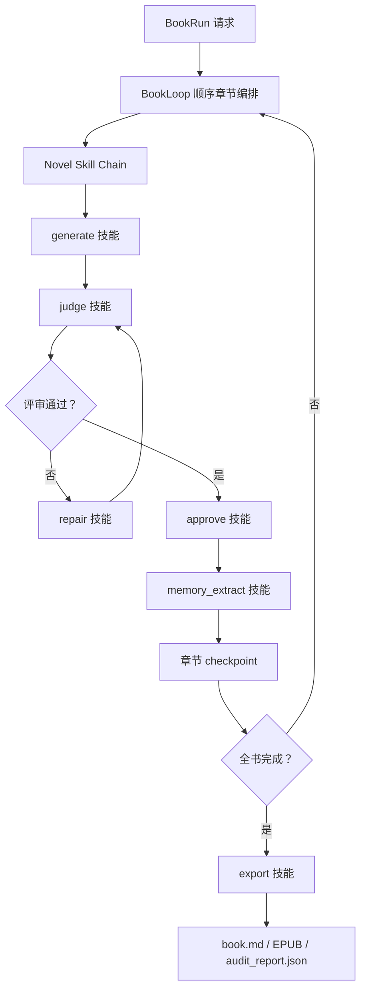

# StoryForge Novel Skill Framework 设计方案

生成时间：2026-05-31 02:20:00 +08:00

## 1. 背景与目标

StoryForge 当前已经具备本地可验证的长篇小说生产闭环：BookRun 从锁定的 Blueprint 出发，顺序驱动 NovelLoop 完成章节生成、评审、修复、批准、记忆抽取、checkpoint 和制品导出。现有事实源显示，系统已经能在本地 deterministic/mock provider 下生成 3 章最小可审计小说，并导出 `book.md` 与 `audit_report.json`；真实 LLM 长程稳定性仍属于后续验收范围。

本设计目标是借鉴 superpower agent 技能框架，把现有 BookRun 的固定步骤显式化为 StoryForge 自己的 **Novel Skill Framework**。第一批技能只映射现有能力，不新增动态插件、不引入多 Agent 并行、不改变 BookRun / NovelLoop 的完成状态契约。

第一批技能映射范围：

- `generate`：章节正文生成
- `judge`：章节质量与一致性评审
- `repair`：定向修复
- `approve`：批准写回
- `memory_extract`：记忆抽取与回写
- `export`：Markdown、EPUB 与审计报告导出

## 2. 设计原则

1. **技能化是显式契约，不是另起炉灶**：第一阶段只把已有 BookRun / NovelLoop 步骤声明成技能，底层仍复用现有端口、服务和测试。
2. **API 真相源不变**：`apps/api` 仍负责业务真相源；`apps/workflow` 仍负责长任务编排、checkpoint 和 provider 调用边界；`apps/web` 只展示已验证状态。
3. **引用优先于大对象**：技能运行记录保存 `book_id`、`chapter_id`、`scene_packet_id`、`compiled_context_id`、`model_run_id`、`judge_report_id`、`repair_patch_id`、`artifact_id` 等引用，不保存完整 prompt、完整 Scene Packet 或完整正文到 workflow checkpoint。
4. **硬门禁优先于模型自由发挥**：没有章节目标、上下文、评审结果或批准条件时，不允许跳到后续技能。
5. **版本化优先于隐式 prompt 变更**：每个技能必须有 `name`、`version`、`input_contract`、`output_contract` 和 `audit_fields`，方便追溯和回滚。
6. **本地可验证优先**：后续代码实现必须能在缺少真实 LLM 的情况下通过 deterministic pytest 验证，不把外部模型稳定性作为本地门禁前置条件。

## 3. 非目标

第一阶段明确不做：

- 不实现动态插件市场或用户自定义代码执行。
- 不引入新的多 Agent 仲裁、并行写作或复杂调度平台。
- 不替换现有 NovelLoopPorts、BookLoopRequest、BookLoopResult。
- 不改变 `NovelLoopResult.status == "approved"` 对 BookLoop 的章节完成语义。
- 不宣称真实 LLM 下稳定生产级长篇闭环。
- 不把 Studio 扩展成完整全步骤交互式编排器。

## 4. 总体架构

Novel Skill Framework 作为现有 BookRun 的契约层和审计层，位于 BookLoop / NovelLoop 之上、具体服务端口之下。



框架核心对象：

| 对象 | 职责 | 第一阶段实现方式 |
| --- | --- | --- |
| NovelSkillDefinition | 描述技能名、版本、触发条件、输入输出、门禁和审计字段 | 设计为静态 dataclass 或 YAML/Markdown 元数据，后续实现 |
| NovelSkillRegistry | 注册第一批技能并提供按名称读取 | 第一阶段建议静态注册，不做动态发现 |
| NovelSkillRun | 记录一次技能执行的输入引用、输出引用、状态、预算和错误摘要 | 后续可先放入 BookRun progress / audit payload |
| NovelSkillChain | 描述 BookRun 使用的技能顺序和失败分支 | 初始链固定为 generate → judge → repair? → approve → memory_extract → export |

## 4.1 现有代码事实基线（权威，截至 2026-05-31 核对源码）

> 本节直接来自 apps/workflow/storyforge_workflow/orchestrators/novel_loop.py 与 book_loop.py 的真实代码，是后续所有技能定义、状态映射和审计字段的唯一事实依据。技能描述若与本节冲突，以本节为准。

### NovelLoopPorts 真实端口签名

| 端口 | 签名 | 返回 | 默认 |
| --- | --- | --- | --- |
| compile_context | (NovelLoopRequest) -> str | context_id（字符串句柄） | 必注入 |
| generate_scene | (NovelLoopRequest, context_id) -> str | 草稿正文文本 | 必注入 |
| record_model_run | (NovelLoopRequest, draft) -> int | model_run_id | 必注入 |
| judge_scene | (draft, attempt) -> dict | 评审 report（含 status、judge_report_id、repair_patch_id 等键） | 必注入 |
| repair_scene | (draft, report, attempt) -> str | 修订后草稿文本 | 必注入 |
| approve_scene | (NovelLoopRequest, draft, refs) -> int | approved_scene_id | 必注入 |
| extract_memory | (NovelLoopRequest, draft, approved_scene_id) -> list[str] | memory_atom_ids | 默认 _skip（返回 []） |
| check_static_quality | (draft) -> Sequence[issue] | 静态质量问题列表 | 默认 _skip（返回 []） |

关键事实：

- judge 之前还有一道 **check_static_quality 静态质量门**（设计早期版本遗漏）：命中 high/critical/severe 严重度或 revision_strategy == "regenerate" 时，单章直接置 awaiting_review 并 break，不再进入 judge。
- repair_patch_id 实际来自 **judge_scene 返回的 report**（report.get("repair_patch_id")），不是 repair_scene 的产物；repair_scene 只返回修订后文本。
- generate_scene 当前返回**内存中的草稿文本**，尚无 artifact 化；draft_artifact_id 属于后续阶段目标，不是现状。
- extract_memory、check_static_quality 默认实现是 _skip，生产 adapter 或测试需显式注入真实实现。

### NovelLoopResult 真实字段

status、final_draft、source_model_run_id、judge_report_id、repair_patch_id、approved_scene_id、token_usage=0、elapsed_time_sec=0、cost_estimate=0.0、fallback_metadata=None、memory_atom_ids=[]。

### run_single_chapter_loop 真实终态（仅两种）

| 终态 status | 触发 |
| --- | --- |
| approved | judge report status == "pass"，approve_scene 写回成功 |
| awaiting_review | 静态质量高严重度命中，或 judge 未 pass 且 max_repairs 用尽 |

单章循环内部 report 的中间 status 取值为：pass、repair、awaiting_review。**不存在** repair_required、repair_limit_exceeded、provider_failed、budget_exceeded 这些单章终态。

### run_book_loop 真实终态

| 终态 status | 触发 | progress 关键键 |
| --- | --- | --- |
| completed | 全部章节 approved | completed_chapters、checkpoint、budget |
| awaiting_review | 某章 NovelLoopResult.status != "approved" | blocked_chapter、checkpoint、budget |
| paused_by_budget | token/time/chapter 预算触顶 | pause_reason ∈ {token_budget_exceeded, time_budget_exceeded, chapter_budget_exceeded} |
| paused_by_provider_degradation | 连续 fallback 次数达到 provider_fallback_pause_threshold | provider_degradation.consecutive_fallbacks |

关键事实：

- provider 降级**不是单章终态**，而是 BookLoop 按 NovelLoopResult.fallback_metadata 是否非空累积连续计数，达阈值才暂停。
- 预算暂停统一是 BookLoop 级 paused_by_budget，再用 pause_reason 区分维度，没有独立的 budget_exceeded 状态。
- checkpoint 条目只保存 chapter_index、model_run_id、judge_report_id、approved_scene_id 四个引用，技能运行记录必须沿用这种引用化粒度。

## 5. 第一批技能映射

### 5.1 generate：章节正文生成技能

| 字段 | 设计 |
| --- | --- |
| 现有映射 | NovelLoopPorts.generate_scene()、NovelLoopPorts.record_model_run()、provider runtime |
| 触发条件 | Blueprint 已锁定；存在 book_id、chapter_id、chapter_index、chapter_goal；上下文已完成编译 |
| 输入引用 | book_id、chapter_id、chapter_goal、scene_packet_id、compiled_context_id、prompt_pack_id |
| 输出引用 | 草稿正文文本（现状，内存对象）、model_run_id；draft_artifact_id 为后续 artifact 化目标，非现状 |
| 成功状态 | generated（技能阶段态，等价于"草稿已产出且已 record_model_run"） |
| 降级/失败语义 | generate 自身**不产生 BookRun 终态**。provider 调用降级写入 NovelLoopResult.fallback_metadata，由 BookLoop 累积连续计数后判定 paused_by_provider_degradation；预算触顶同样由 BookLoop 置 paused_by_budget。generate 本身只有 generated 或抛错两种结果。 |
| 硬门禁 | 缺少章节目标或上下文引用时不得生成；provider 连续降级达到阈值由 BookLoop 暂停，generate 不自行决定暂停 |
| 审计字段 | skill_name、skill_version、model_run_id、compiled_context_id、token_usage、elapsed_time_sec、fallback_metadata |

设计说明：generate 不直接批准内容，只产出候选草稿和 ModelRun 证据。它必须保持与现有 record_model_run() 一致，方便 Runs 页面继续展示模型运行摘要。注意现状 generate_scene 返回的是内存文本，draft_artifact_id 要等 artifact 化落地后才有，第一阶段技能记录里以草稿摘要/hash 记录，不把完整正文写入 checkpoint。

### 5.2 judge：章节评审技能

| 字段 | 设计 |
| --- | --- |
| 现有映射 | NovelLoopPorts.check_static_quality()（前置静态门）+ NovelLoopPorts.judge_scene()、Judge API |
| 触发条件 | 存在生成草稿、章节目标、上下文引用和质量约束 |
| 输入引用 | 草稿正文/摘要、scene_packet_id、compiled_context_id、character_bible_ref、timeline_ref、style_guide_ref |
| 输出引用 | judge report（含 judge_report_id、repair_patch_id、结构化 issues）、评分摘要、决策 |
| 成功状态 | pass、repair、awaiting_review（与代码 report.status 取值一致；repair 表示需修复重判，不是 repair_required） |
| 失败状态 | judge_failed（端口抛错） |
| 硬门禁 | check_static_quality 命中 high/critical/severe 或 revision_strategy==regenerate 时直接 awaiting_review，不进入 judge_scene；未评审不得进入 approve；高严重级别问题不得自动批准 |
| 审计字段 | skill_name、skill_version、judge_report_id、issue_count、max_severity、decision |

设计说明：judge 是质量门禁，不只是建议生成器。它由两道关组成——先是 check_static_quality 静态门（高严重度直接转人工审查），再是 judge_scene 评审。它可以整合 LLM Judge、Timeline Guard、Style Guard 和 Character Bible 约束，但输出必须结构化，便于 Repair 和审计页消费。注意 repair_patch_id 是 judge_scene 返回 report 里的键，不是 repair 技能产出的。

### 5.3 repair：定向修复技能

| 字段 | 设计 |
| --- | --- |
| 现有映射 | NovelLoopPorts.repair_scene(draft, report, attempt) -> 修订后草稿文本 |
| 触发条件 | judge report.status == "repair"（或静态质量门给出非高危 issues），且 attempt < max_repairs |
| 输入引用 | 草稿正文、judge_report_id、report 内问题列表、修订策略、上下文引用 |
| 输出引用 | 修订后草稿文本（现状）；repair_patch_id 实际由 judge_scene 的 report 携带，repair 技能记录应引用 source_judge_report_id 与该 patch_id，而非自行生成 |
| 成功状态 | repaired（技能阶段态：已产出修订草稿，回到 judge 重判） |
| 失败语义 | repair 自身不产生独立终态。max_repairs 用尽且仍未 pass 时，由 run_single_chapter_loop 统一返回 awaiting_review（**不存在 repair_limit_exceeded 这个状态**），BookLoop 据此置 blocked_chapter |
| 硬门禁 | 不能无问题单泛泛润色；不能覆盖健康片段；attempt 达到 max_repairs 后不再 repair，转人工审查 |
| 审计字段 | skill_name、skill_version、source_judge_report_id、repair_patch_id（来源于 judge report）、attempt、revision_strategy |

设计说明：repair 不应成为"重写整章"的默认逃生口。后续可按 line_edit、scene_patch、regenerate 分级（revision_strategy 字段已在代码 _issue_to_dict 中预留），但第一阶段只记录它与 Judge 的因果关系。注意修复用尽不是独立失败码，而是落到单章 awaiting_review。

### 5.4 approve：批准写回技能

| 字段 | 设计 |
| --- | --- |
| 现有映射 | NovelLoopPorts.approve_scene(request, draft, refs) -> approved_scene_id；Studio POST /api/studio/approve、批准回写服务 |
| 触发条件 | judge report.status == "pass"；存在可批准草稿和目标章节 |
| 输入引用 | request（book_id、chapter_id、chapter_index）、最终草稿、refs={source_model_run_id, judge_report_id}（与代码 approve_scene 调用一致） |
| 输出引用 | approved_scene_id、章节/场景/continuity 回写摘要 |
| 成功状态 | approved（唯一进入 NovelLoopResult.status=="approved" 的路径） |
| 失败语义 | 未 pass 则根本不调用 approve_scene；端口抛错时单章落到 awaiting_review，无独立 approve_failed 终态 |
| 硬门禁 | 未通过评审不得写回；目标章节不匹配不得写回 |
| 审计字段 | skill_name、skill_version、approved_scene_id、source_model_run_id、judge_report_id、repair_patch_id |

设计说明：approve 是从候选文本进入作品真相源的唯一门。BookLoop 仍以 NovelLoopResult.status=="approved" 和 approved_scene_id 判断章节完成，技能化不得改变该契约。

### 5.5 memory_extract：记忆抽取与回写技能

| 字段 | 设计 |
| --- | --- |
| 现有映射 | NovelLoopPorts.extract_memory(request, draft, approved_scene_id) -> list[str]（默认 _skip 返回 []）；Story Memory、Character Bible、Timeline Guard |
| 触发条件 | 章节/场景已 approved（approve 之后立即调用，见 run_single_chapter_loop 第 93 行） |
| 输入引用 | approved_scene_id、最终草稿、章节目标、当前 Story Memory / Character Bible / Timeline 引用 |
| 输出引用 | memory_atom_ids（回填 NovelLoopResult.memory_atom_ids）、timeline event 引用、人物状态变化摘要、伏笔状态变化摘要 |
| 成功状态 | memory_updated（注入了真实 adapter 且返回非空 atom_ids） |
| 区分状态 | memory_extract_skipped（默认 _skip 实现，返回 []，属正常跳过）、memory_extract_failed（真实 adapter 抛错） |
| 硬门禁 | 未 approved 内容不得污染长期记忆；_skip 跳过必须如实记为 skipped，不得标记为 updated |
| 审计字段 | skill_name、skill_version、approved_scene_id、memory_atom_ids、timeline_event_ids、character_state_delta |

设计说明：当前 NovelLoopPorts.extract_memory 默认实现 _skip_memory_extraction 返回空列表，生产 adapter 或测试可注入真实实现。技能化后必须区分三态——skipped（默认空实现）、updated（真实写入）、failed（抛错），避免审计页把"根本没抽取"误导成"已更新"。

### 5.6 export：全书导出与审计技能

| 字段 | 设计 |
| --- | --- |
| 现有映射 | BookRun Markdown / EPUB 导出、Artifacts、audit_report.json |
| 触发条件 | BookRun completed，或用户请求导出当前已批准章节 |
| 输入引用 | book_run_id、book_id、已批准章节列表、章节 checkpoint、技能运行记录 |
| 输出引用 | markdown_artifact_id、epub_artifact_id、audit_artifact_id |
| 成功状态 | exported |
| 失败状态 | export_failed |
| 硬门禁 | 不得把未批准章节作为正式成书正文；审计报告必须覆盖 generate/judge/repair/approve/memory_extract 链路 |
| 审计字段 | skill_name、skill_version、artifact_ids、chapter_count、audit_completeness |

设计说明：export 是 BookRun 级技能，不属于单章 NovelLoop。它应该把第一批技能运行记录汇总到 audit_report.json，使审计页能按章节回放创作链路。

## 6. 技能定义格式建议

第一阶段建议使用静态 Python dataclass 或 Markdown/YAML 元数据。为了贴近 superpower agent 技能框架，同时便于产品和提示词迭代阅读，可以采用文件化定义：

```text
D:\StoryForge\1-renovel-ai-ai-rag-tavern\apps\workflow\storyforge_workflow\skills\
├── generate\SKILL.md
├── judge\SKILL.md
├── repair\SKILL.md
├── approve\SKILL.md
├── memory_extract\SKILL.md
└── export\SKILL.md
```

每个 SKILL.md 使用统一结构：

```markdown
---
name: generate
version: 1.0.0
description: 当章节目标和上下文引用齐备时，生成候选章节正文并记录 ModelRun。
---

## 触发条件

## 输入契约

## 输出契约

## 硬门禁

## 审计字段

## 下一步
```

如果后续实现需要运行时类型安全，可在 Python 中生成或手写等价定义：

```python
@dataclass(frozen=True)
class NovelSkillDefinition:
    name: str
    version: str
    description: str
    required_inputs: tuple[str, ...]
    produced_outputs: tuple[str, ...]
    audit_fields: tuple[str, ...]
    next_skills: tuple[str, ...]
```

## 7. 技能运行记录设计

技能运行记录应当成为 BookRun 审计链的一等公民。建议最小结构如下：

```json
{
  "skill_name": "generate",
  "skill_version": "1.0.0",
  "status": "generated",
  "book_run_id": 1,
  "chapter_index": 1,
  "input_refs": {
    "chapter_id": 10,
    "scene_packet_id": 21,
    "compiled_context_id": 34
  },
  "output_refs": {
    "model_run_id": 55,
    "draft_artifact_id": 89
  },
  "budget": {
    "token_usage": 1200,
    "elapsed_time_sec": 18,
    "cost_estimate": 0.02
  },
  "error_summary": null
}
```

记录原则：

- input_refs 和 output_refs 只保存 ID、版本、摘要和 hash，不保存完整大对象。
- status 使用技能自己的阶段状态，同时映射到现有 BookRun status。
- error_summary 只保存可展示摘要，详细异常由运行日志或 ModelRun 失败记录承接。
- budget 可汇总到 BookLoop 当前已有 tokens_used、elapsed_time_sec、estimated_cost。

## 8. 与现有 BookRun 状态的映射

> 下表左列是技能阶段态（框架内部语义），右列是它们如何落到 §4.1 列出的**真实** NovelLoop / BookLoop 状态。技能态不得新造 NovelLoop/BookLoop 不存在的终态。

| 技能阶段态 | 落到的真实状态 / 行为 |
| --- | --- |
| generated | 草稿产出并 record_model_run，继续进入 judge；非终态 |
| static_gate_pass | check_static_quality 无高危 issue，进入 judge_scene；非终态 |
| static_gate_blocked | 静态门命中高危 → 单章 run 直接返回 **awaiting_review** 并 break |
| pass | judge report.status=="pass"，进入 approve；非终态 |
| repair | judge report.status=="repair"，attempt<max_repairs 时调用 repair_scene 后回到 judge；非终态 |
| 修复用尽未 pass | 单章 run 返回 **awaiting_review**（无 repair_limit_exceeded 状态）；BookLoop 置 blocked_chapter |
| approved | 单章 run 返回 **approved**；BookLoop 追加 completed_chapters 与 checkpoint |
| memory_updated | 回填 memory_atom_ids，不改变章节批准状态 |
| memory_extract_skipped | 默认 _skip 返回 []，如实记录跳过，不伪装为已更新 |
| exported | BookRun completed 后登记 Markdown / EPUB / audit artifacts（book 级，不入单章 run） |
| provider 降级 | 非单章终态：写入 NovelLoopResult.fallback_metadata；BookLoop 累计连续 fallback 达阈值 → **paused_by_provider_degradation** |
| 预算触顶 | 非单章终态：BookLoop 据 token/time/chapter 预算 → **paused_by_budget**（pause_reason 区分维度） |

对照 §4.1：单章 run 的真实终态只有 approved / awaiting_review 两种；book 级终态为 completed / awaiting_review / paused_by_budget / paused_by_provider_degradation 四种。技能记录的 status 字段必须能无损映射到这两组真实状态之一。

## 9. 分阶段落地路线

### 阶段一：静态技能定义与审计映射

目标：不改 BookRun 行为，只增加第一批技能定义和审计字段映射。

交付物（新增文件清单，纯新增、不动现有 novel_loop.py / book_loop.py 逻辑）：

| 路径 | 类型 | 内容 |
| --- | --- | --- |
| apps/workflow/storyforge_workflow/skills/{generate,judge,repair,approve,memory_extract,export}/SKILL.md | 新增 | 6 个技能的文件化定义，结构见 §6 |
| apps/workflow/storyforge_workflow/skills/__init__.py | 新增 | 包初始化 |
| apps/workflow/storyforge_workflow/skills/definitions.py | 新增 | NovelSkillDefinition dataclass + 6 个静态实例 + NovelSkillRegistry（按名取用） |
| apps/workflow/storyforge_workflow/skills/audit.py | 新增 | 从 BookLoopResult.progress（completed_chapters/blocked_chapter/checkpoint）派生 skill_chain 审计摘要的纯函数，**只读不改** progress |
| apps/workflow/tests/test_novel_skill_registry.py | 新增 | 注册表红绿测试 |
| apps/workflow/tests/test_skill_audit_summary.py | 新增 | 审计摘要派生测试 |

说明：阶段一 audit.py 是**旁路只读派生器**——输入现有 BookLoopResult.progress，输出 skill_chain 摘要，不写回 progress、不进 checkpoint，因此不触碰 §4.1 的真实状态契约。

测试红绿路径：

1. test_novel_skill_registry.py
   - 红：registry 尚未实现时 import 失败 / 6 技能缺失。
   - 绿：NovelSkillRegistry.get("generate"..."export") 全部返回定义；每个定义的 produced_outputs / audit_fields 与 §4.1、§5 一致；断言不存在虚构状态字符串（repair_required、repair_limit_exceeded、budget_exceeded、provider_failed 不得出现在任何 definition 的状态枚举里）。
2. test_skill_audit_summary.py
   - 红：传入一个含 approved 章 + 一个 blocked_chapter（awaiting_review）的 BookLoopResult.progress，summary 函数不存在。
   - 绿：派生出的 skill_chain 摘要中，approved 章包含 generate/judge/approve（有 memory adapter 时含 memory_extract），blocked 章状态落到 awaiting_review；断言摘要里的 status 全部 ∈ §4.1 真实状态集合；断言函数未修改输入 progress（深比较前后相等）。
3. 回归保护：现有 test_novel_loop_single_chapter.py、book_loop 相关测试**不修改**即应继续通过（本阶段未改其逻辑）。

回滚方式：

- 阶段一全部为新增文件，回滚 = 删除 skills/ 目录与两个新增测试文件，不留残留 import。
- audit.py 的调用点（若接入 BookRun 审计报告生成处）用单一开关包裹：未启用时审计报告与现状字节级一致；回滚只需移除该调用，不影响 completed_chapters/checkpoint/budget。
- 验证回滚干净：`cd apps/workflow && uv run pytest`（应与接入前同结果）+ `git status` 确认仅删除新增文件。

验收：

- 现有 NovelLoop / BookLoop 测试不需要任何改动即通过。
- audit_report.json（或审计摘要）可按章节展示 generate/judge/repair/approve/memory_extract/export 链路，且所有 status 取值都在 §4.1 真实状态集合内。
- 不改变已有 completed_chapters、checkpoint、budget 字段含义。

### 阶段二：Skill Runner 适配 NovelLoopPorts

目标：让 NovelLoop 可通过 Skill Runner 调用现有端口，但对外结果保持不变。

交付物：

- NovelSkillRunner
- NovelSkillRun 记录结构
- NovelLoopPorts 到技能执行的适配层
- repair 回路、awaiting_review、provider failure、budget pause 的回归测试

验收：

- run_single_chapter_loop() 结果与改造前等价。
- 每次端口调用都有对应技能运行记录。
- 失败路径能定位到具体技能。

### 阶段三：题材技能包与质量扩展

目标：在框架稳定后，为玄幻、悬疑、言情、群像等题材增加专用 judge/repair/memory 技能。

交付物示例：

```text
skills\genre_mystery\clue_fairness_judge\SKILL.md
skills\genre_xuanhuan\power_scale_guard\SKILL.md
skills\genre_romance\relationship_arc_judge\SKILL.md
```

验收：

- 题材技能包通过 registry 显式选择，不自动污染所有 BookRun。
- 题材扩展只能增加约束和审计，不破坏通用 generate/judge/repair/approve 链路。


## 9.1 阶段一接口契约（实施前冻结）

阶段一只允许新增旁路定义和只读审计派生，不允许改变 `run_single_chapter_loop()`、`run_book_loop()`、`BookLoopResult.progress` 的既有写入语义。后续实施计划必须以本节为验收契约。

### 9.1.1 NovelSkillDefinition 最小字段

```python
@dataclass(frozen=True)
class NovelSkillDefinition:
    name: str
    version: str
    description: str
    trigger_conditions: tuple[str, ...]
    required_inputs: tuple[str, ...]
    produced_outputs: tuple[str, ...]
    allowed_statuses: tuple[str, ...]
    audit_fields: tuple[str, ...]
    next_skills: tuple[str, ...]
```

字段约束：

- `name` 只能取 `generate`、`judge`、`repair`、`approve`、`memory_extract`、`export`。
- `version` 首版固定为 `1.0.0`，后续 prompt 或门禁语义变化必须升版本。
- `allowed_statuses` 是技能阶段态，不得包含 §4.1 已确认不存在的 NovelLoop / BookLoop 终态。
- `required_inputs` 与 `produced_outputs` 只描述引用、摘要或 hash；不得要求完整 prompt、完整 Scene Packet 或完整正文进入 checkpoint。

### 9.1.2 NovelSkillRegistry 行为

| 行为 | 契约 |
| --- | --- |
| `list()` | 按默认链路顺序返回 6 个定义：generate、judge、repair、approve、memory_extract、export |
| `get(name)` | 名称存在时返回定义；名称不存在时抛出 `KeyError`，错误信息包含技能名 |
| `names()` | 返回稳定 tuple，便于测试和审计报告排序 |
| 动态发现 | 阶段一禁止；不得扫描任意用户目录或执行外部技能代码 |

### 9.1.3 审计摘要派生函数

建议函数签名：

```python
def derive_skill_chain_summary(progress: Mapping[str, Any]) -> dict[str, Any]:
    """从 BookLoop progress 只读派生技能链审计摘要。"""
```

输入：现有 `BookLoopResult.progress`，包括 `completed_chapters`、`blocked_chapter`、`checkpoint`、`budget`、`pause_reason`、`provider_degradation` 等键。

输出：只读派生结构，建议包含：

```json
{
  "skill_chain_version": "bookrun-default-v1",
  "chapters": [
    {
      "chapter_index": 1,
      "status": "approved",
      "skills": [
        {"skill_name": "generate", "status": "generated", "model_run_id": 11},
        {"skill_name": "judge", "status": "pass", "judge_report_id": 12},
        {"skill_name": "approve", "status": "approved", "approved_scene_id": 13},
        {"skill_name": "memory_extract", "status": "memory_extract_skipped", "memory_atom_ids": []}
      ]
    }
  ],
  "book_status_projection": {
    "status": "completed",
    "pause_reason": null
  }
}
```

约束：

- 函数必须纯函数化，不修改输入 `progress`。
- 对 blocked chapter 只能映射为 `awaiting_review`，不得输出 `repair_limit_exceeded`。
- 对 provider 降级只能在 `book_status_projection` 里表达 `paused_by_provider_degradation`，不得伪造成 generate 技能失败终态。
- 对预算暂停只能表达 `paused_by_budget` 与 `pause_reason`，不得输出独立 `budget_exceeded` 终态。
- 缺失可选字段时输出 `null` 或空数组，不能编造 ID。

## 9.2 阶段一测试契约（红绿路径）

阶段一实施必须至少新增两组 deterministic pytest，并保持既有 NovelLoop / BookLoop 测试无需语义修改。

| 测试文件 | 必测内容 |
| --- | --- |
| `apps/workflow/tests/test_novel_skill_registry.py` | 6 个技能均存在；顺序稳定；每个技能有版本、输入、输出、审计字段；禁止出现虚构状态字符串 |
| `apps/workflow/tests/test_skill_audit_summary.py` | approved 章、blocked 章、预算暂停、provider 降级四类 progress 均可派生摘要；输入 progress 深比较不变 |
| `apps/workflow/tests/test_novel_loop_single_chapter.py` | 阶段一不应要求修改；现有 approved / awaiting_review 语义继续通过 |
| `apps/workflow/tests/test_book_loop_three_chapters.py` 与 `test_provider_degradation_pause.py` | BookLoop completed / awaiting_review / paused_by_budget / paused_by_provider_degradation 语义继续通过 |

禁止测试只验证“文件存在”。必须断言字段内容、状态集合和只读不变性。

## 9.3 阶段一完成定义

阶段一只有在以下条件同时满足时才可标记完成：

1. `NovelSkillRegistry.names()` 返回精确 6 个首批技能，顺序稳定。
2. 所有技能定义都有 `trigger_conditions`、`required_inputs`、`produced_outputs`、`allowed_statuses`、`audit_fields`。
3. 任意定义和审计摘要中均不出现 `repair_required`、`repair_limit_exceeded`、`provider_failed`、`budget_exceeded` 等虚构终态。
4. `derive_skill_chain_summary()` 对输入 progress 不产生原地修改。
5. workflow 定向测试通过：

```powershell
cd D:\StoryForge\1-renovel-ai-ai-rag-tavern\apps\workflow
uv run pytest tests/test_novel_skill_registry.py tests/test_skill_audit_summary.py tests/test_novel_loop_single_chapter.py tests/test_book_loop_three_chapters.py tests/test_provider_degradation_pause.py -v
```

6. 项目本地 `.codex/verification-report.md` 记录命令、结果、评分和结论。
## 10. 数据与审计边界

技能框架必须遵守已有引用化原则：

- Workflow checkpoint 只保存引用和摘要。
- API 业务表仍是真相源。
- Artifacts 承载导出制品和可下载摘要。
- ModelRun 承载模型调用证据。
- Judge / Repair / Approve 保持独立业务实体，不被技能记录吞并。

audit_report.json 后续建议增加：

```json
{
  "skill_chain_version": "bookrun-default-v1",
  "chapters": [
    {
      "chapter_index": 1,
      "skills": [
        { "skill_name": "generate", "status": "generated", "model_run_id": 55 },
        { "skill_name": "judge", "status": "pass", "judge_report_id": 66 },
        { "skill_name": "approve", "status": "approved", "approved_scene_id": 77 },
        { "skill_name": "memory_extract", "status": "memory_updated", "memory_atom_ids": ["m1"] }
      ]
    }
  ],
  "book_level_skills": [
    { "skill_name": "export", "status": "exported", "artifact_ids": [101, 102, 103] }
  ]
}
```

## 11. 风险与缓解

| 风险 | 影响 | 缓解 |
| --- | --- | --- |
| 技能框架变成第二套编排器 | 与 NovelLoop / BookLoop 事实源冲突 | 第一阶段只做定义和审计映射，第二阶段只通过 adapter 包装现有端口 |
| 技能运行记录保存完整正文或 prompt | checkpoint 膨胀、恢复变慢 | 严格保存引用、摘要和 hash |
| 过早引入题材 Agent | 质量不稳定、测试不可控 | 等第一批通用技能和审计闭环稳定后再扩展 |
| Judge 输出不结构化 | Repair 无法可靠消费 | 继续沿用结构化 issues、severity、decision |
| Memory 抽取失败被忽略 | 后续章节继承错误 | 明确区分 memory_extract_failed、memory_extract_skipped 和 memory_updated |
| 导出包含未批准章节 | 成书制品污染 | export 技能硬门禁：正式正文只使用已批准章节 |

## 12. 本地验证策略

设计文档阶段验证：

```powershell
cd D:\StoryForge\1-renovel-ai-ai-rag-tavern
Test-Path docs\superpowers\specs\2026-05-31-storyforge-novel-skill-framework-design.md
Select-String -Path docs\superpowers\specs\2026-05-31-storyforge-novel-skill-framework-design.md -Pattern "generate","judge","repair","approve","memory_extract","export"
Select-String -Path docs\superpowers\specs\2026-05-31-storyforge-novel-skill-framework-design.md -Pattern "未完成标记"
```

后续代码实现阶段建议验证：

```powershell
cd D:\StoryForge\1-renovel-ai-ai-rag-tavern\apps\workflow
uv run pytest tests/test_novel_loop_single_chapter.py -v
uv run pytest tests/test_runtime_runner.py -v

cd D:\StoryForge\1-renovel-ai-ai-rag-tavern\apps\api
uv run pytest tests/test_book_runs.py tests/test_exports.py -v

cd D:\StoryForge\1-renovel-ai-ai-rag-tavern
pnpm test
pnpm verify
pnpm e2e
```


## 13. 与实施计划的交接要求

本设计文档获准进入实现前，必须另行生成 `docs/superpowers/plans/2026-05-31-storyforge-novel-skill-framework.md`，且计划必须满足以下要求：

- 采用 TDD 顺序：先写 `test_novel_skill_registry.py` 与 `test_skill_audit_summary.py` 的失败用例，再实现定义和派生器。
- 每个任务只改一类文件：技能定义、注册表、审计派生、测试、文档更新分开提交。
- 不允许在同一阶段顺手重构 `novel_loop.py` 或 `book_loop.py`；若发现必须改动，应退回设计并新开阶段二计划。
- 所有本地验证必须由当前工作区执行，不能引用 CI、远程流水线或人工验证作为通过证据。
- 若本地工作区存在与本任务无关的未提交改动，实施前必须记录隔离策略或选择 worktree，避免污染既有变更。

## 14. 自审检查清单

- [x] 背景、目标、非目标和第一批技能范围已明确。
- [x] 现有 NovelLoop / BookLoop 真实状态与端口签名已列为权威事实基线。
- [x] 六个首批技能均给出触发条件、输入引用、输出引用、状态、门禁和审计字段。
- [x] 阶段一接口契约、测试契约和完成定义已写清楚。
- [x] 状态映射明确禁止虚构 NovelLoop / BookLoop 终态。
- [x] 数据边界坚持引用化，不把完整 prompt、完整 Scene Packet 或完整正文写入 checkpoint。
- [x] 本地验证命令可复制执行。
- [x] 后续实现必须先产出实施计划，不直接进入代码改造。
## 15. 决策建议

建议批准进入 **阶段一：静态技能定义与审计映射**。

理由：

- 与现有 BookRun / NovelLoop 架构一致，改造半径小。
- 能立即提升审计报告可读性和后续 prompt 版本追溯能力。
- 不依赖真实 LLM，不阻塞本地 deterministic 验证。
- 为后续题材技能包和质量提升计划提供稳定扩展点。

进入代码改造前，需要先产出实施计划，明确新增文件、测试红绿路径和回滚方式。


